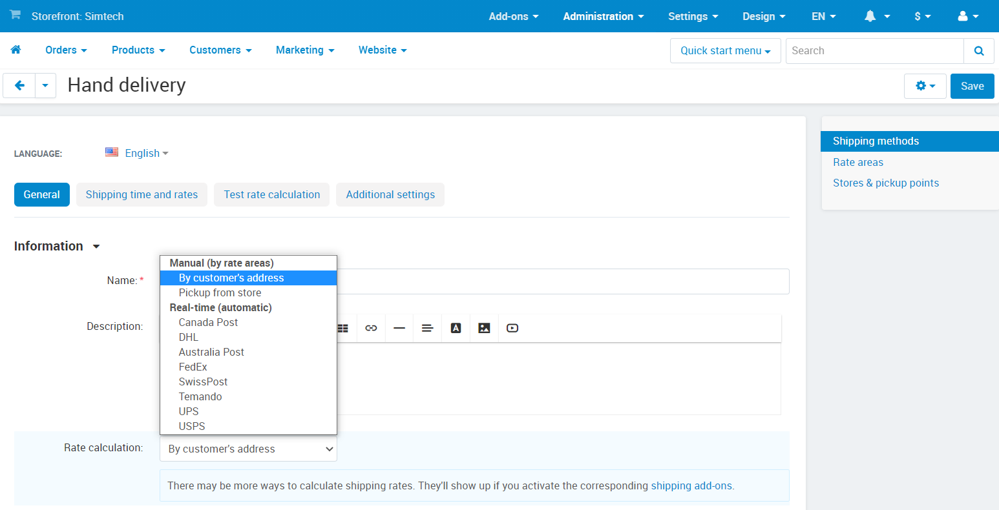
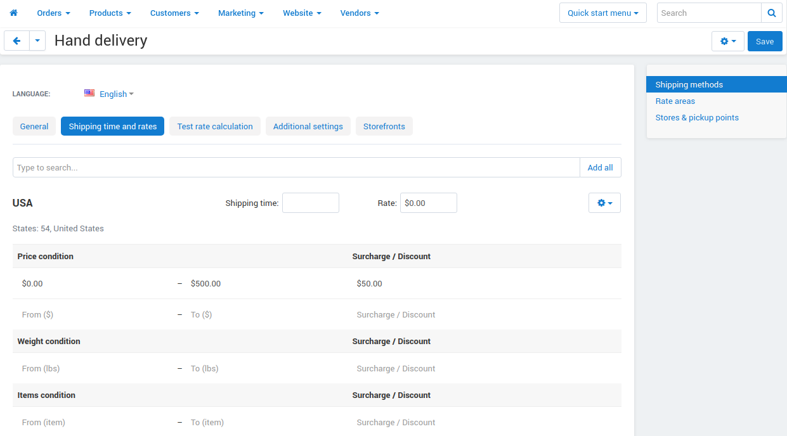

***************************************
How To: Set up a Manual Shipping Method
***************************************

To set up a manual shipping method depending on a location:

*   In the Administration panel, go to **Administration → Shipping & Taxes → Locations** and `create necessary locations <http://docs.cs-cart.com/4.4.x/user_guide/shipping_and_taxes/locations/set_location.html>`_.
*   Go to **Administration → Shipping & Taxes → Shipping methods**.
*   Add a new shipping method by clicking the **+** button or choose the existing one.
*   Choose *Manual* in the **Rate calculation** option in the **General** tab.

*   Open the **Shipping charges** tab.
*   Select a desired location in the **Show rates for location** box.
*   Define shipping rates for the shipping method based on the total cost of the ordered products `cost <http://docs.cs-cart.com/4.4.x/user_guide/shipping_and_taxes/shipping_methods/manual_shipping_methods/order_total.html>`_, their weight, or `quantity <http://docs.cs-cart.com/4.4.x/user_guide/shipping_and_taxes/shipping_methods/manual_shipping_methods/product_amount.html>`_.

.. note::

	The shipping rates values should be entered just as they are, i.e. for each new condition an integral value should be entered, but not an additional one. For example, for the *More than $0* condition value 40 is entered, and if you need the price for the *More than $30* value to be 55, you need to enter this very value, but not the additional value of 15.

*   Select another location in the **Show rates for location** box and define the desired shipping rates for it.
*   Click the **Save** button to add or update the rates.

