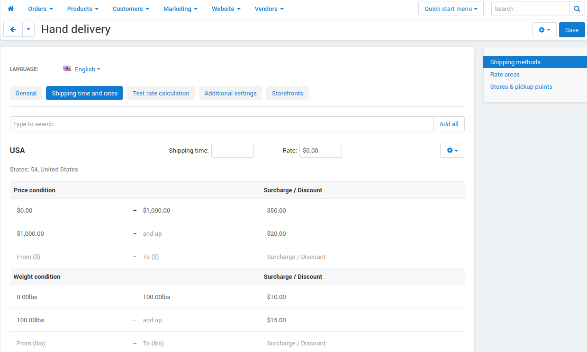
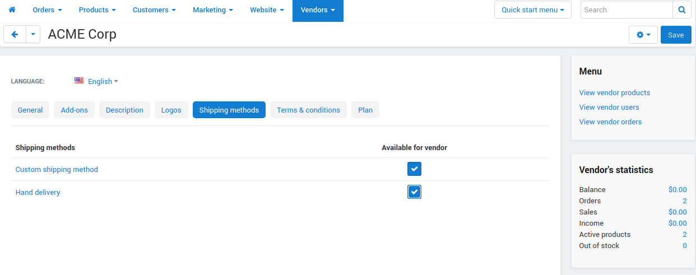

***************************************
Manual Shipping Method is Not Displayed
***************************************

If a `manual shipping method <http://docs.cs-cart.com/4.4.x/user_guide/shipping_and_taxes/shipping_methods/manual_shipping_methods/set_manual_shipping.html>`_ doesn't appear at checkout, follow these steps to find out the reason:

1. In the Administration panel, go to the **Administration → Shipping & Taxes → Locations** section and check whether a `location <http://docs.cs-cart.com/4.4.x/user_guide/shipping_and_taxes/locations/set_location.html>`_ is set up properly.

   * Check whether geographic areas (states or countries) of location zones do not intersect with each other.

   * Check whether the states (if they exist) are selected on the location detail page.

2. Go to **Administration → Shipping & Taxes → Shipping methods** and choose the desired shipping method. Switch to the **Shipping rates** tab and check if the necessary location is selected in the **Show rates for location** box and the rates are set up for it.

3. If you use Multi-Vendor, make sure that the shipping method is available to the vendor (or vendors): 

    * Go to **Vendors → Vendors**.

    * Click the name of the vendor.

    * Switch to the **Shipping methods** tab.

    * Tick the checkboxes of the shipping methods you want to make available for the vendor.

    * Click **Save and close**.

.. note::

    Vendor-specific shipping methods do not appear on this list. Usually, :doc:`vendor's administrators <../../../users/vendors/index>` create them for their vendor. In the Administration panel these methods have the name of the vendor written under their names.

