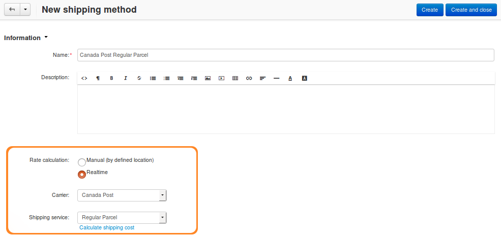

*************************************
How To: Set up Canada Post in CS-Cart
*************************************

Follow these steps to set up a shipping method that uses `Canada Post <https://www.canadapost.ca/web/en/home.page>`_:

================================
Step 1. Create a Shipping Method
================================

1.1. In the Administration panel, go to **Administration → Shipping & Taxes → Shipping methods**.

1.2. Create a new shipping method or click the name of an existing shipping method.

1.3. Set **Rate calculation** to *Realtime*.

1.4. Set **Carrier** to *Canada Post*.

1.5. Choose the desired **Shipping service**.

1.6. Configure other general settings as you see fit.

.. hint::

    Make sure to set the **Status** to *Active*, or the shipping method won't appear at checkout.

=====================================
Step 2. Configure the Shipping Method
=====================================

2.1. (optional) Switch to the **Shipping charges** tab and define shipping charges. These charges will be added to the ones calculated by Canada Post.

2.2. Switch to the **Configure** tab.

.. hint::

    If you don’t see any tabs, then the shipping method probably hasn't been created yet. Click **Create**, and the tabs should appear.

2.3. To work properly, this shipping method requires API keys. Other parameters are optional:

* **API keys**

  * **Username** (required)—production username.

  * **Password** (required)—production password.

    .. hint::

        Learn how to get the API keys at `Canada Post website <https://www.canadapost.ca/cpo/mc/business/productsservices/developers/services/gettingstarted.jsf>`_.

    .. image:: img/canada_post_api_keys.png
        :align: center
        :alt: You can get API keys by joining Canada Post Developer Program.

  * **Test mode**—you can tick this checkbox if you would like to test the shipping method without actually shipping products. If you plan to use the Test mode, make sure to use development API keys with it. 

* **Business account information**

  * **Customer number**—this field is required for commercial customers and `Solutions for Small Business <https://www.canadapost.ca/web/en/pages/buserv/default.page?ecid=murl|pdn|jb|6>`_ members to get discounted rates if a parcel is mailed on behalf of customer.

  * **Contract ID**—this field is required to obtain discounted rates for commercial customers when the *Customer number* is specified. 

    If you are a `Solutions for Small Business <https://www.canadapost.ca/web/en/pages/buserv/default.page?ecid=murl|pdn|jb|6>`_ member or general business user, leave this field empty.

* **Delivery options**

  .. important::

      Some of the options below may require additional fee. Learn more about delivery settings at the `Canada Post manual <https://www.canadapost.ca/tools/pg/manual/PGpscanada-e.asp>`_.

  * **Signature**—tick this checkbox if you want recipients to confirm delivery by giving their signatures.

  * **Coverage**—determines whether you require additional `liability coverage <https://www.canadapost.ca/cpo/mc/personal/productsservices/atoz/parcelservice.jsf#Liability>`_. 

    .. note::

        If you tick the **Coverage** checkbox, make sure to specify **Coverage amount**.

  * **Coverage amount**—the amount of insurance to be purchased.

  * **Collect on Delivery**—when the recipient gets the parcel, Canada Post will collect the payment and forward it to you automatically by cheque. Learn more about `Collect on Delivery <https://www.canadapost.ca/cpo/mc/personal/productsservices/receive/cod.jsf?LOCALE=en>`_.

  * **Proof of Age Required - 18** or **Proof of Age Required - 19**—if the recipient appears to be less than 25 years old, they must provide Proof of Age photo identification at the time of delivery.

  * **Card for pickup**—the addressee will receive the Delivery Notice Card, and the item will be forwarded to the designated post office.

  * **Do not safe drop**—this option may apply when delivery at the door is attempted. If nobody is at home, and the item doesn't fit in the mail receptacle, the item will be available for pickup at the designated post office, and a Delivery Notice Card will be left.

  * **Leave at door - do not card**—this option may apply when delivery at the door is attempted. If nobody is at home, and the item doesn't fit in the mail receptacle, a `safe drop <https://www.canadapost.ca/web/en/kb/details.page?article=learn_what_delivere&cattype=kb&cat=receiving&subcat=tracking>`_ is attempted. If it's not possible, the item will be available for pickup at the designated post office, and a Delivery Notice Card will be left.

.. image:: img/canada_post_438.png
    :align: center
    :alt: Canada Post settings. Username and password are required.

=================================
Step 3. Test Your Shipping Method 
=================================

3.1. Once you've configured the shipping method, click **Save**.

3.2. Return to the **General** tab.

3.3. Click **Calculate shipping cost** link.

3.4. Enter the desired value into the **Weight (lbs)** input field, and click the **Test** button to make a test calculation of shipping charges.

.. image:: img/test_canada_post_rate.png
    :align: center
    :alt: After you configure the shipping method, return to the General tab and test the calculation of shipping cost.
