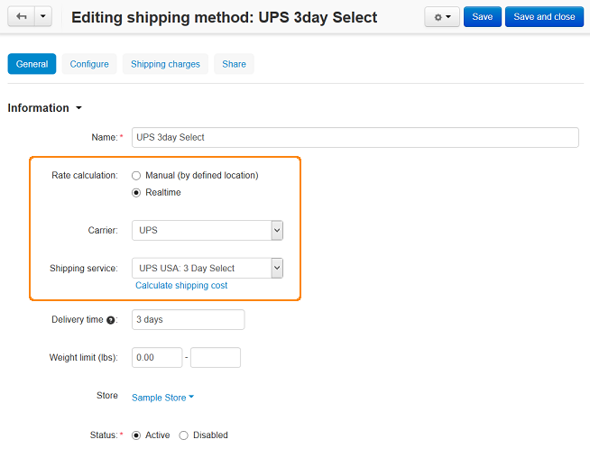

*******************************
How To: Set up CS-Cart with UPS
*******************************

*   In the Administration panel, go to **Administration → Shipping & Taxes → Shipping methods**. There is the **UPS 3day Select** shipping method defined by default in standard CS-Cart (if the default CS-Cart configuration has not been changed yet).
*   Select *Active* for this shipping method in the select box in the **Status** column.
*   Click on the name of this shipping method to modify it.
*   Select *Realtime* in the **Rate calculation** field, select *UPS* in the **Carrier** field, and *UPS USA: 3 Day Select* in the **Shipping service** field.
*   Click the **Save** button to save the changes.

*   Open the **Configure** tab.
*   Fill your UPS credentials in the `UPS Rates Access Key <http://docs.cs-cart.com/4.3.x/user_guide/shipping_and_taxes/shipping_methods/realtime_shipping_methods/ups_key.html>`_, **Username**, and **Password** fields. For testing purposes select the *Daily pickup* value in the **Pickup type**, the *Package* value in **Package type**, and enter *10* in each **Width**, **Height**, and **Length** fields.
*   Click the **Save** button to save the changes.

.. image:: img/ups_02.png
    :align: center
    :alt: UPS

*   Open the **General** tab, click the **Calculate shipping cost** link, enter the necessary value into the **Weight (lbs)** input field, and click the **Test** button to make a test calculation of shipping charges.

.. important::

	Use real recipient and sender addresses for testing (UPS uses address verification system).

	Sender address = company address, that you are able to edit on the **Settings → Company** page in your Administration panel.
	Recipient address = customer shipping address. In case of testing shipping charges in the Administration panel the address defined under the **Default location** section on the **Settings → General** page is used as a customer address.

*   Open the **Shipping charges** tab and define shipping charges which will be added to ones returned by real-time shipping service if it is needed.
*	Click the **Save** button to save the changes.

.. important::

	In order to use UPS real-time shipping calculations, there must be `PHP's Curl support <http://php.net/manual/en/book.curl.php>`_ on your server. Check whether there is PHP's CURL support installed on your server.

	Only some specific requests for retrieving shipping costs work properly if the *Test* mode option is enabled.