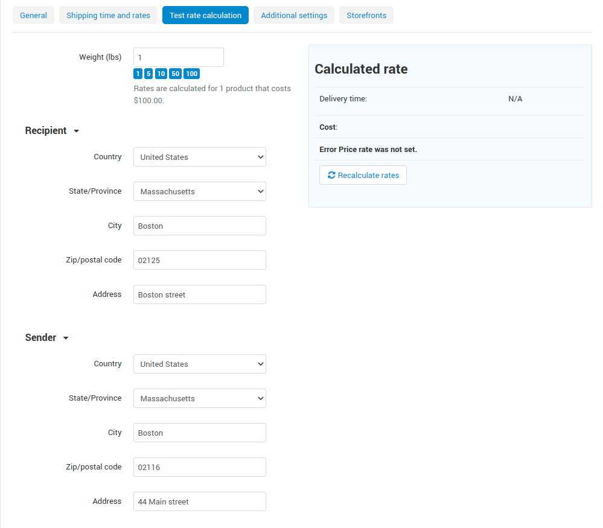

**************************
Shipping Method Properties
**************************

All shipping methods can be split into 2 groups, depending on how the rates are calculated:

* :doc:`Manual (by defined rate area) methods </user_guide/shipping_and_taxes/shipping_methods/manual_shipping_methods/index>` calculate rates based on the rules you specify manually in the Administration panel.

* :doc:`Real-time shipping methods </user_guide/shipping_and_taxes/shipping_methods/realtime_shipping_methods/index>` send the relevant order data to third-party services when a customer proceeds to checkout. If the service ships to the specified destination, the shipping method will be available to the customer.

* :doc:`Pickup from store </user_guide/shipping_and_taxes/shipping_methods/realtime_shipping_methods/pickup>` — shipping time and rates are calculated by the chosen rate area.

=======
General
=======

* **Name**—the name of the shipping method as it appears on the storefront.

* **Description**—detailed description of the shipping method.

* **Rate calculation**—the way how the shipping cost will be calculated:
  
  * **Manual calculation** is based on the tables with charges and rates. You define those rates in the **Shipping time and rates** tab on the shipping method editing page (appears for shipping methods that have been already created).
  
  * **Realtime calculation** is based on the rates that your store receives from a third-party service. The rates are received in real time at the moment when the order is being placed.
  
  * **Pickup from store**—shipping time and rates are calculated by the chosen :doc:`rate area </user_guide/shipping_and_taxes/locations>`.

  .. note::

        Carrier-specific settings are defined in the **Configure** tab.
		
* **Delivery time**—the time it takes to deliver an order.  This info is displayed on the storefront, so that customers can decide if the delivery time meets their requirements.

* **Status**—the status of the shipping method: **Active** or **Disabled**.

* **Weight limit**—the minimum and maximum weight of the order that can be delivered via this method. If an order doesn’t meet the weight requirements, then this shipping method won’t be offered to the customer.

* **User groups**—the user groups, the members of which will be able choose this shipping method at checkout.

* **Carrier**—the online service or a carrier API that will be used for rate calculation. This select box is available only if rate calculation is set to **Realtime**.

* **Shipping service**—shipping services provided by the carrier.

=========
Configure
=========

This tab appears only if you have selected **Realtime rate calculation** on the **General** tab. It means that the rates will be requested from a third-party service depending on the order data when a customer proceeds to checkout. 

Here you should specify the settings of the selected shipping service. Such settings vary depending on the shipping service provider. So, if you do not know how to configure it, please refer to the carrier’s help pages and :doc:`our documentation </user_guide/shipping_and_taxes/shipping_methods/realtime_shipping_methods/index>`.

.. hint::

    Once you have configured the settings, click **Save**. Then you’ll be able to go back to the **General** tab and test the rate calculation as described above.

=======================
Shipping time and rates
=======================

You need to decide where your shipping method will be offered. To do this, choose the rate areas from the dropdown list. If there is a rate area in the store which you did not include in the shipping method, orders will not be delivered in this area.

.. important::

    If a certain rate area does not exist in your store, you can :doc:`add it  </user_guide/shipping_and_taxes/locations/set_location>`. This is only necessary if you need to add different conditions and availability/unavailability of delivery to this area.

If you receive rates from a shipping service provider in real time, the charges from this section will be simply added to the received rates. You can use this to compensate for your actual expenses if they exceed the values returned by the carrier (e.g., packing, insurance, etc.)

You can specify price, weight or items conditions for each rate area. Once you’re done specifying them, click **Save**.

.. image:: manual_shipping_methods/img/dependencies.png 
    :align: center
    :alt: Conditions in CS-Cart shipping methods
    
* **From**—the minimum value starting from which the specified surcharge/discount is applied.

* **To**—the maximum value up to which the specified surcharge/discount is applied.

* **Surcharge / discount** — the amount of money that will be added to the base **Rate** or reduced from it. To make a discount just add the “-” (minus) sign to the entered value.

.. important::

    If you do not specify the **Rate** value or any price/weight/items conditions for the :doc:`rate areas </user_guide/shipping_and_taxes/locations>` you have added, delivery to those rate areas will be free. 

=====================
Test rate calculation
=====================

Click the **Recalculate rates** button to find out the shipping cost. The calculation considers the weight that you specify in the form, as well as the :doc:`company address and default customer address </user_guide/shipping_and_taxes/address>`.

===================
Additional settings
===================

* **Icon**—an image to represent the shipping method.

  You can upload an icon from your computer, find it on the server, or provide a URL to the image.  Make sure to enter the alternative text that’ll appear when the icon is missing or can’t be displayed. Specifying alternative texts is good for `SEO <https://en.wikipedia.org/wiki/Search_engine_optimization>`_.

  Images must be of one of the following formats only: JPEG, GIF, PNG. The maximum size of an uploaded image depends on your server configuration.  As a rule, it should not exceed 2 MB.

  .. note::

      Shipping method icons appear on the storefront in a special **Shipping methods** block. You can create this block on the **Design → Layouts page**.
	  
* **Taxes**—the tax rates that apply to the shipping method.

* **Customer must specify his/her address**—tick the box if you want customers to specify their addresses.

* **Use for free shipping**—tick the box so that the products with the **Free shipping** option enabled are not included in the calculation 

.. meta::
   :description: The full list of settings that a shipping methods can have in CS-Cart or Multi-Vendor ecommerce platforms.
