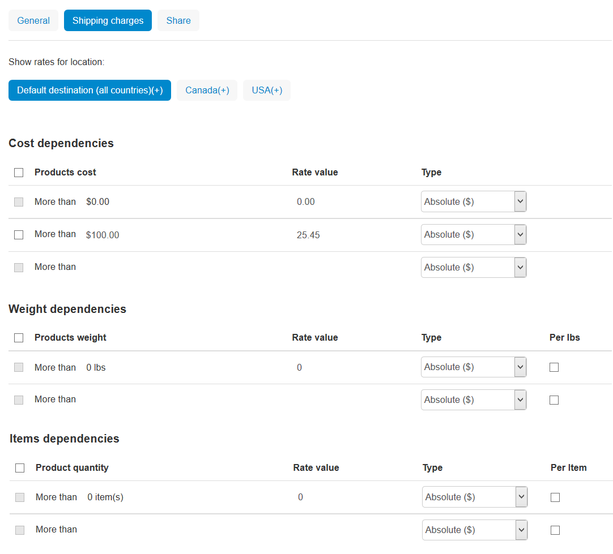

**************************
Shipping Method Properties
**************************

All shipping methods can be split into 2 groups, depending on how the rates are calculated:

* :doc:`Manual shipping methods </user_guide/shipping_and_taxes/shipping_methods/manual_shipping_methods/index>` calculate rates based on the rules you specify manually in the Administration panel.

* :doc:`Real-time shipping methods </user_guide/shipping_and_taxes/shipping_methods/realtime_shipping_methods/index>` send the relevant order data to third-party services when a customer proceeds to checkout. If the service ships to the specified destination, the shipping method will be available to the customer.

=======
General
=======

* **Name**—the name of the shipping method as it appears on the storefront.

* **Store**—the storefront to which the shipping method belongs.

* **Icon**—an image to represent the shipping method.

  You can upload an icon from your computer, find it on the server, or provide a URL to the image. Make sure to enter the alternative text that'll appear when the icon is missing or can't be displayed. Specifying alternative texts is good for `SEO <https://en.wikipedia.org/wiki/Search_engine_optimization>`_.

  Images must be of one of the following formats only: JPEG, GIF, PNG. The maximum size of an uploaded image depends on your server configuration. As a rule, it should not exceed 2 MB.

  .. note::

      Shipping method icons appear on the storefront in a special **Shipping methods** block. You can create this block on the **Design → Layouts** page.

* **Delivery time**—the time it takes to deliver an order. This info is displayed on the storefront, so that customers can decide if the delivery time meets their requirements.

* **Weight limit**—the minimum and maximum weight of the order that can be delivered via this method. If an order doesn't meet the weight requirements, then this shipping method won't be offered to the customer.

* **Rate calculation**—the way how the shipping cost will be calculated: 

  * **Manual** calculation is based on the tables with charges and rates. You define those rates in the **Shipping time and rates** tab on the shipping method editing page.

  * **Realtime** calculation is based on the rates that your store receives from a third-party service. The rates are received in real time at the moment when the order is being placed.

    .. note::

        Carrier-specific settings are defined in the **Configure** tab.

* **Shipping service**—the online service or a carrier API that will be used for rate calculation. This select box is available only if rate calculation is set to *Realtime*.

* **Test**—click the **Calculate shipping cost** link to see a special form to test the selected real-time shipping rate estimation service. Test estimation considers the weight that you specify in the form, as well as :doc:`the company address and default customer address </user_guide/shipping_and_taxes/address>`.

* **Taxes**—the tax rates that apply to the shipping method.

* **User groups**—the :doc:`user groups </user_guide/users/user_groups/index>`, the members of which will be able choose this shipping method at checkout.

* **Status**—the status of the shipping method: *Active* or *Disabled*.

=========
Configure
=========

This tab appears only if you have selected *real time rate calculation* on the **General** tab. It means that the rates will be requested from a third-party service depending on the order data when a customer proceeds to checkout. 

Here you should specify the settings of the selected shipping service. Such settings vary depending on the shipping service provider. So, if you do not know how to configure it, please refer to the carrier's help pages and :doc:`our documentation </user_guide/shipping_and_taxes/shipping_methods/realtime_shipping_methods/index>`.

.. hint::

    Once you have configured the settings, click **Save**. Then you'll be able to go back to the **General** tab and test the rate calculation as described above.

================
Shipping Charges
================

.. important::

    If you use a manual shipping method, make sure to add at least one shipping charge :doc:`for each rate area </user_guide/shipping_and_taxes/locations/index>` where you want it to be available. Otherwise the shipping method won't appear to customers at checkout.

The rates that you define here are used to calculate the shipping cost, regardless of whether you use real-time shipping rate estimation or not.

If you receive rates from a shipping service provider in real time, the charges from this section will be simply added to the received rates. You can use this to compensate for your actual expenses if they exceed the values returned by the carrier (e.g., packing, insurance, etc.)

The rates can depend on the product cost, weight or quantity, and on customer's rate area. Once you're done specifying the rates, click **Save**.

.. hint::

   A **(+)** next to the rate area name means that you have specified the rates, and the shipping method will be available to the customers who specified the address matching that rate area.

* **Product cost/Weight/Quantity**—the minimum value when the rate must apply.

* **Rate value**—the shipping rate itself.

* **Type**—the type of the rate: an absolute value or a percentage.

.. hint::

    If you want to make a manual shipping method free, you still need to add at least one shipping charge for the desired rate area, or the shipping method won't appear at checkout. You can set it up as described below.

.. list-table::
    :widths: 10 10 10
    :header-rows: 1

    *   -   Products cost 
        -   Rate value
        -   Type
    *   -   More than $0.00
        -   0
        -   Absolute ($)
    *   -   More than $1.00
        -   0
        -   Absolute ($)

=====
Share
=====

Other storefronts that share this shipping method. :doc:`Learn more about sharing objects. </user_guide/stores/sharing>`

.. meta::
   :description: The full list of settings that a shipping methods can have in CS-Cart or Multi-Vendor ecommerce platforms.
