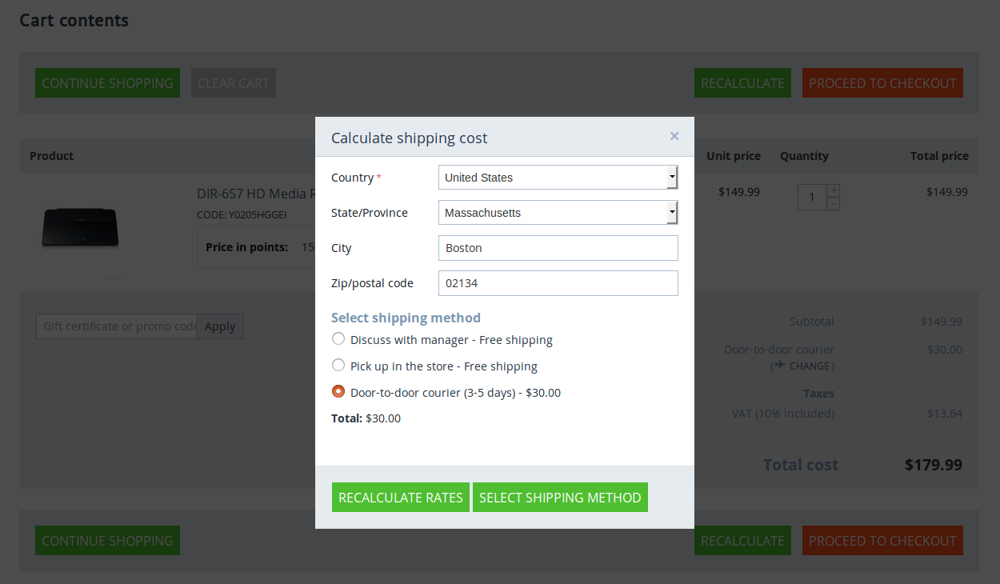
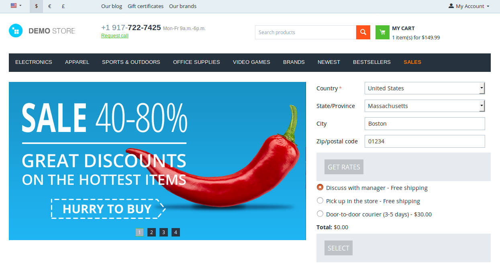
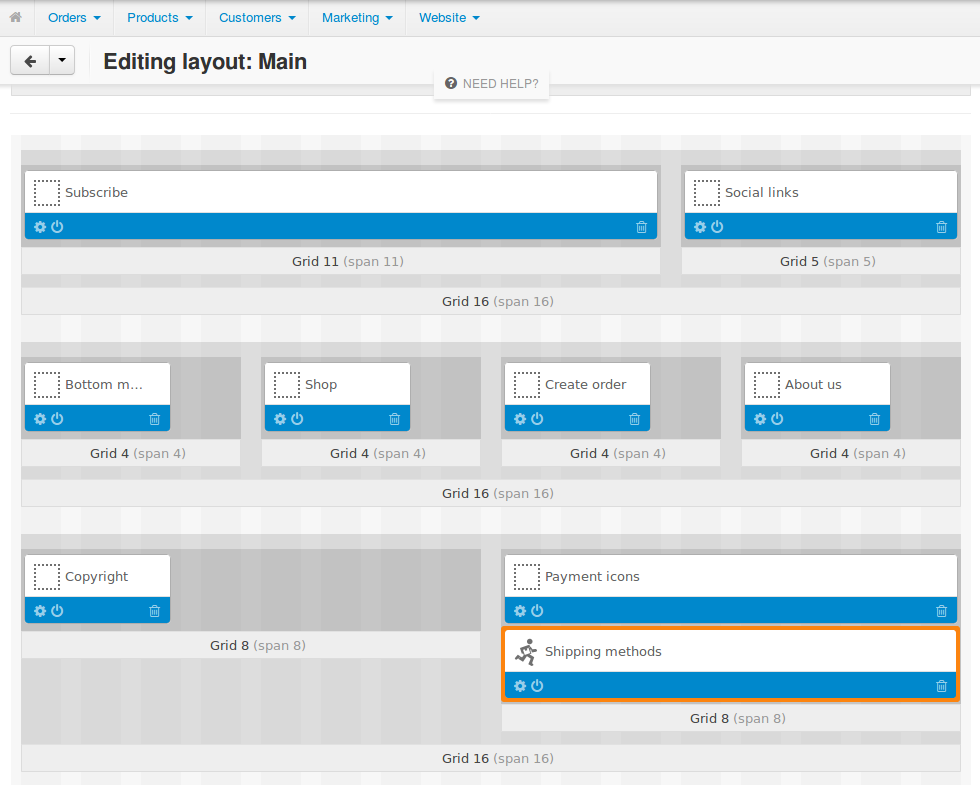

**************************************
How Shipping Appears on the Storefront
**************************************

.. contents::
    :local: 
    :backlinks: none
    :depth: 2

========
Checkout
========

Customers can select the desired shipping method at the 3rd step of checkout; that step is called **Shipping Options**.

.. image:: img/shipping_at_checkout.png
    :align: center
    :alt: Selecting the shipping method at checkout in CS-Cart.

=========
Cart Page
=========

The cart page allows you to calculate shipping rates.

=========================
Shipping Estimation Block
=========================

You can add a block for estimating the shipping cost of all the products currently in the cart to any page of the store.

To do that:

#. Go to **Design → Layouts**.

#. Select the :doc:`layout page </user_guide/look_and_feel/layouts/layout_pages/index>` and the place for the block.

#. :doc:`Add a new block </user_guide/look_and_feel/layouts/blocks/actions_on_blocks>` of the **Template** type with the *Shipping estimation* template.

#. Place that block anywhere you want.

   .. image:: img/adding_shipping_estimation_block.png
       :align: center
       :alt: Adding the "Template" block for shipping estimation.

======================
Shipping Methods Block
======================

You can add a **Shipping methods** block that displays the logos of the available shipping methods to any page of the store you'd like.

