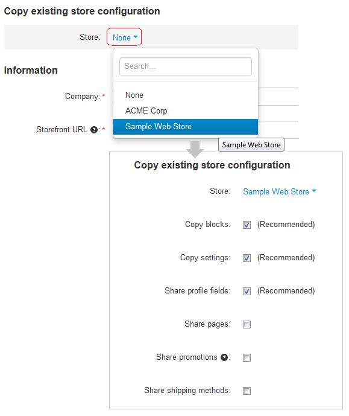

*******************************
How To: Create a New Storefront
*******************************

.. important::

    This article applies only to CS-Cart, not Multi-Vendor.

1. Go to the Administration panel of your CS-Cart installation.

2. Make sure to select **All stores** in the store selector.

.. image:: img/switch_modes.png
    :align: center
    :alt: Select "All stores" to switch to the root administrator mode.

3. Go to **Administration → Stores** and click the **+** button to open the storefront creation form.

4. If you already have storefronts, you can copy or share objects from one of them for the new storefront.

5. Specify the properties of the new storefront.

6. Click **Create and close** to create the new storefront and close the form.

.. note::

    To manage multiple storefronts with one administration panel, `purchase additional storefront licenses <http://www.cs-cart.com/cs-cart-storefront-license.html>`_ or specify the desired number of storefronts when you `buy a CS-Cart license <http://www.cs-cart.com/cs-cart-license.html>`_. Starting with version 4.4.2, there is also `CS-Cart Ultimate <https://www.cs-cart.com/cs-cart-ultimate-license.html>`_, which offers an unlimited number of storefronts.

