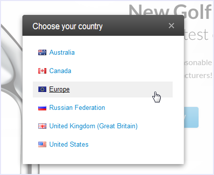
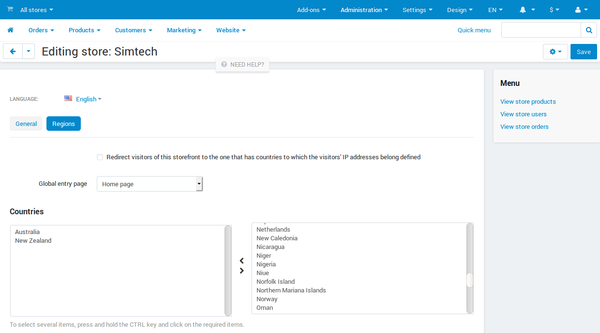

***************************************************
How To: Configure Global Entry Point for Your Store
***************************************************

=========================
About Global Entry Points
=========================

The global entry point is a popup window that your visitors see when they open a storefront for the first time. This window contains a list of countries and regions. Every item in the list is linked to some specific storefront. Visitors choose a country or a region from the list, then they get redirected to the respective storefront.

This feature comes in handy when you want to create several localized storefronts with different products for specific countries or regions.

.. hint::
    For example, you have a flagship web store *www.example.com* that is intended mainly for visitors from the US. Its localized version *www.example.ru* targets the Russian market. And four other web stores *www.example.au*, *www.example.ca*, *www.example.eu* and *www.example.co.uk* contain information specific to Australia, Canada, the European Union and the UK, respectively.

    In this case the global entry point becomes an initial point of contact between the bunch of your websites and your visitors, ensuring that all of them find the necessary web store.

.. important::
    The global entry point does not detect the location of visitors: they are free to choose their region or country themselves.

===================================
How to Create a Global Entry Point?
===================================

A global entry point is generated automatically based on the properties of the individual stores. To add a global entry point, follow these steps:

1. Go to **Administration → Stores**.

2. Click the name of the store you want to add a global entry point for.

3. Switch to the **Regions** tab.

4. Specify the global entry point settings:

* Enable the global entry point

You can choose whether to activate the global entry point on the home page only, or on any storefront pages. The second option is useful when a visitor opens a specific page through a direct link.

.. important::
    Even if you do not enable the global entry point for a particular store, you can still link this store to a region or a country in the list. To do so, assign regions and countries to the store.

* Assign regions and countries to specific stores

The list box on the right contains the list of all available countries and regions; the list box on the left contains the list of countries and regions assigned to this store. If no countries and regions are selected, then the global entry point won't direct visitors to this store.

To move items from one list to the other one, use the twin horizontal arrows between the lists. To select multiple items, press and hold the **Ctrl** or **Shift** key while selecting.

.. note::
    To adjust the list of countries supported in your store, go to **Administration → Shipping & Taxes → Countries**.

5. Repeat step 4 for all the stores you need.

.. note::

    CS-Cart imposes no limitations on the set of countries and regions that you can assign to a store. If you assign a country/region to two or more stores, the corresponding list item of the global entry point will point to the first store you assigned this country/region to.
