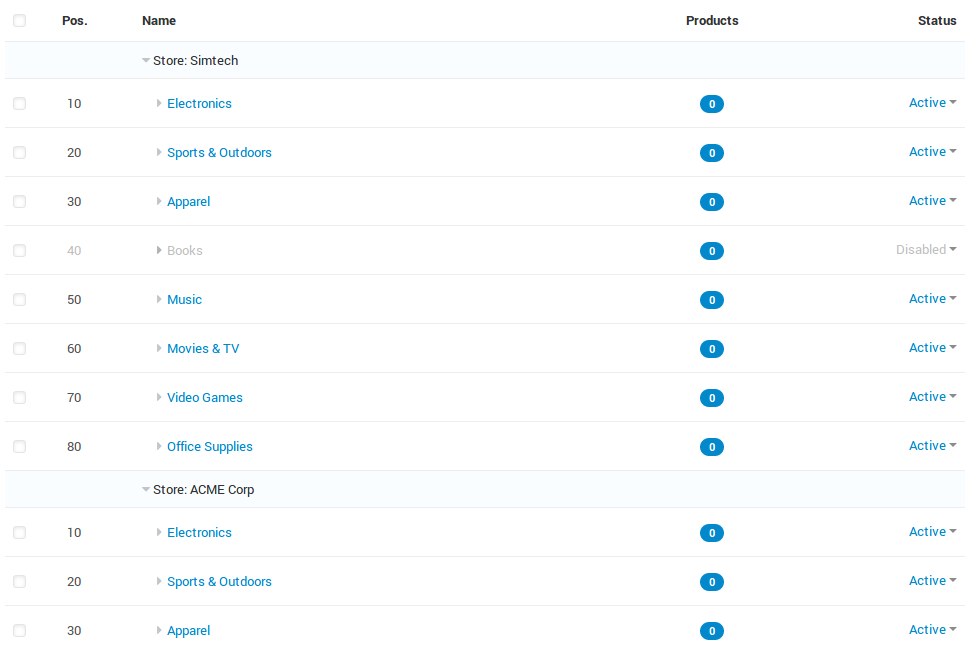

****************************************
Product Catalog and Multiple Storefronts
****************************************

.. important::

    This article applies only to CS-Cart, not Multi-Vendor.

CS-Cart uses a common product catalog for all storefronts. The catalog has a tree structure: the root nodes represent storefronts; the child nodes inside a root node represent product categories and subcategories assigned to the corresponding storefront.

A single category cannot be assigned to more than one storefront at once. A product must always belong to a category or subcategory. That way a product is automatically assigned to a particular storefront depending, on the storefront to which the product's category is assigned.

However, an individual product can be assigned to multiple product categories at once. That way the same product can appear on several storefronts at once.

.. important::
    Every shared product can have a number of storefront-specific properties, including the product name, description, price, etc. That way the same product can have different descriptions and prices, depending on the storefront.

.. meta::
   :description: How do products and categories in CS-Cart online store work with multiple storefronts?
