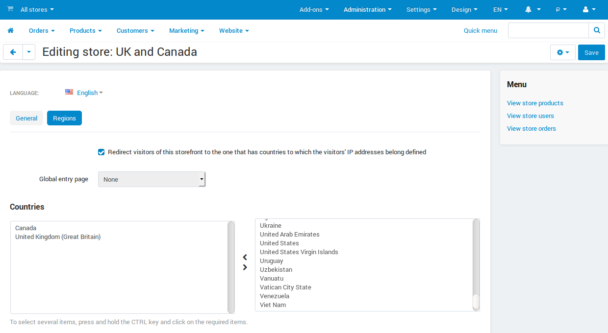
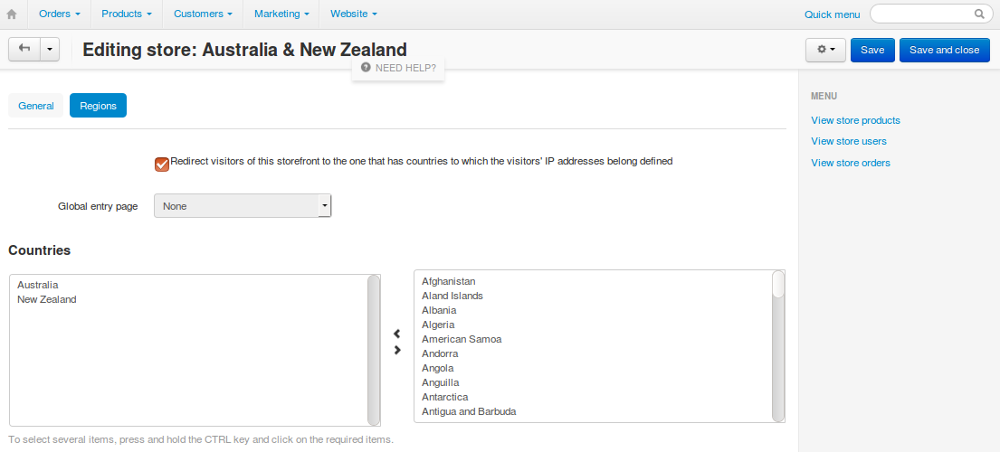

*************************************************************************
How To: Redirect Customers from Specific Regions to the Right Storefronts
*************************************************************************

.. important::

    This article applies only to CS-Cart, not Multi-Vendor.

You can redirect customers to a separate storefront created for a particular region. Let's assume that you have two storefronts:

* one for the UK and Canada;

* the other for Australia and New Zealand.

Let's make sure the visitors from those countries get to the right storefront.

1. In the CS-Cart Administration panel, go to **Administration → Stores**.

2. Click the name of the storefront you want to edit. Let's edit the storefront for the UK and Canada first.

3. Switch to the **Regions** tab.

4. Tick the **Redirect visitors of this store to the one that has countries to which the visitors' IP addresses belong defined** checkbox.

   .. hint::

       If you leave the checkbox unticked, people won't be redirected from this storefront automatically, even if you have another dedicated storefront for their country.

5. Choose the countries from the list. In our case that's *Canada* and *United Kingdom (Great Britain)*.

6. Click **Save**.

Now visitors will be redirected to this storefront from your other storefronts, but only if both of the following conditions are met: 

   * The IP address of the visitor is associated with one of the chosen countries.

   * The storefront opened by the visitor supports redirecting to other storefronts.

7. Configure your other storefronts according to steps 1 - 6, but choose other countries. In our case it's *Australia* and *New Zealand*.

   .. note::

       CS-Cart imposes no limitations on the set of countries and regions that you can assign to a storefront. If you assign a country to two or more storefronts, the customers will be redirected to the first storefront you assigned this country to.

Congratulations! Now the visitors from the chosen countries will be redirected to the appropriate stores. 

