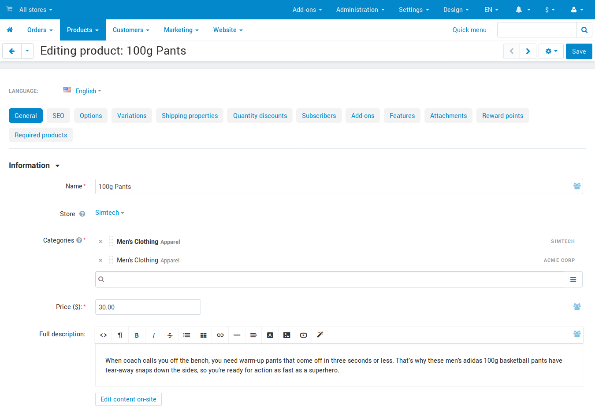
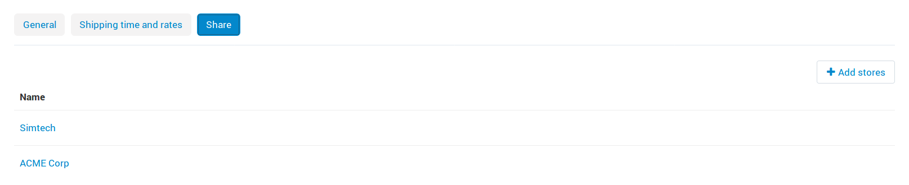

**********************************
How To: Share Objects Among Stores
**********************************

.. important::

    This article applies only to CS-Cart, not Multi-Vendor.

======================
How Does Sharing Work?
======================

When you create an object (product, page, promotion, shipping method, etc.) in CS-Cart, you must assign it to a particular storefront. However, you can share objects among different storefronts.

.. note::

    You can't share categories, because :doc:`categories determine the storefronts to which products belong. <many_stores_one_catalog>`

CS-Cart supports two types of sharing rules depending on the object type:

* **Invariable sharing**: objects are shared among storefronts without any changes. This rule applies to such objects as product features and filters, global product options, promotions, CMS content, languages, currencies, and shipping methods.

* **Configurable sharing**: objects are shared among storefronts and can have different properties on each storefront. For example, when you share a product, you can define a different price, description, and other properties for different storefronts.

.. note::

    CS-Cart also allows to :doc:`share customer accounts among storefronts. <customer_accounts>`

CS-Cart has a number of global objects that apply to all storefronts and cannot have unit-specific values. These include the tax calculation rules, order statuses, locations, states and countries, user groups, user profile fields, etc.

=================================
Sharing Objects Among Storefronts
=================================

-------------------------------------
Share Products (Configurable Sharing)
-------------------------------------

1. Switch to the **root administrator mode**: select **All stores** in the store selector in the top left corner.

.. image:: img/switch_modes.png
    :align: center
    :alt: Select all stores to switch to the root administrator mode.

2. Open the product details page: go to **Products → Products** and click the product you want to share.

3. On the **General** tab, click the **+** button (*Add categories*). This will open the common category tree.

4. Select one or more categories (highlighted in green) under a different storefront (highlighted in red.)

5. Click **Add categories** and close to close the form.

6. Click **Save** to apply the changes.

The product will appear on the storefront under the selected categories. Now you can switch to the store administrator mode and define the storefront-specific properties for the product.

----------------------------------------
Share Other Objects (Invariable Sharing)
----------------------------------------

1. Switch to the **root administrator mode**: select **All stores** in the store selector in the top left corner.

.. image:: img/switch_modes.png
    :align: center
    :alt: Select all stores to switch to the root administrator mode.

2. Use the top navigation menu to browse to the object that you need to share. For example, go to **Administration → Shipping & Taxes → Shipping methods** to share a shipping method.

3. Click the **gear** button of the object. This opens the object configuration page.

4. Switch to the **Share** tab. This opens a list of storefronts that already share the object (if any).

.. note::
    You won't see the **Share** tab if you only have one storefront: in that case there is nothing to share.

5. Click the **+** button (*Add stores*) to open a list of all storefronts.

6. From the list, select the storefronts that will share the object. Then click **Add stores and close** to update the list of stores that should share the object.

7. Click **Save** to apply the changes.
