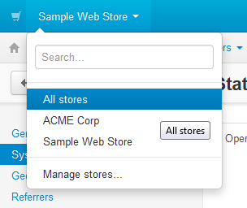

*****************************
How To: Switch between Stores
*****************************

Once you :doc:`configure multiple stores <../../install/storefronts/index>`, you'll be able to switch between the operation modes in the administration panel to manage objects of all stores as **root administrator**, or only the objects of the specific specific store as a **storefront administrator**. Objects include products, categories, pages, etc.

To switch between the modes, use the select box in the top left corner of the administration panel. Select **All stores** to act as **root administrator**, or select the name of the store to act as a **storefront administrator**.

.. note::
    If you have only one store, you don't need to switch between the modes: there is only one mode, and the storefront administrator acts as the root administrator.

