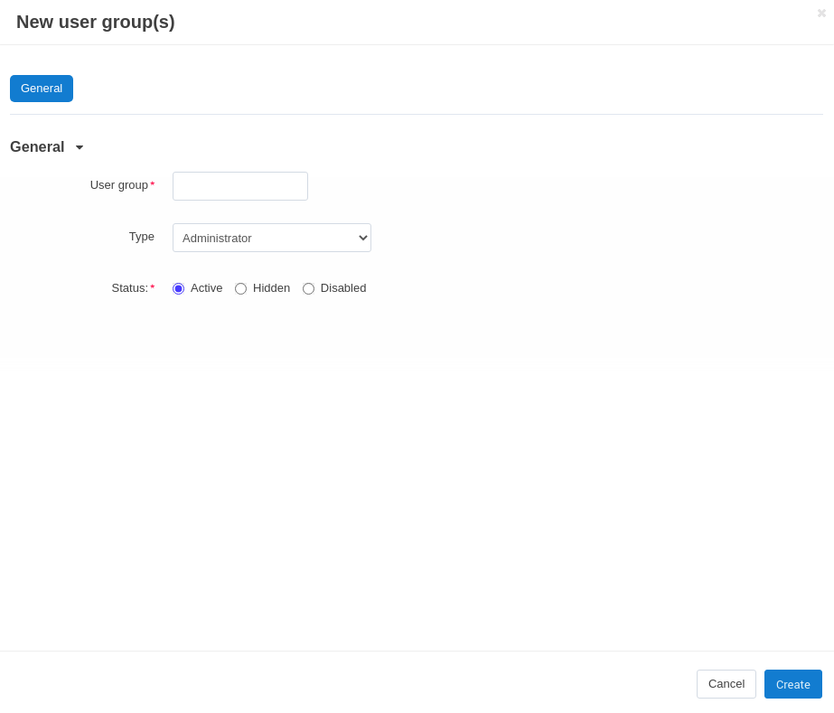
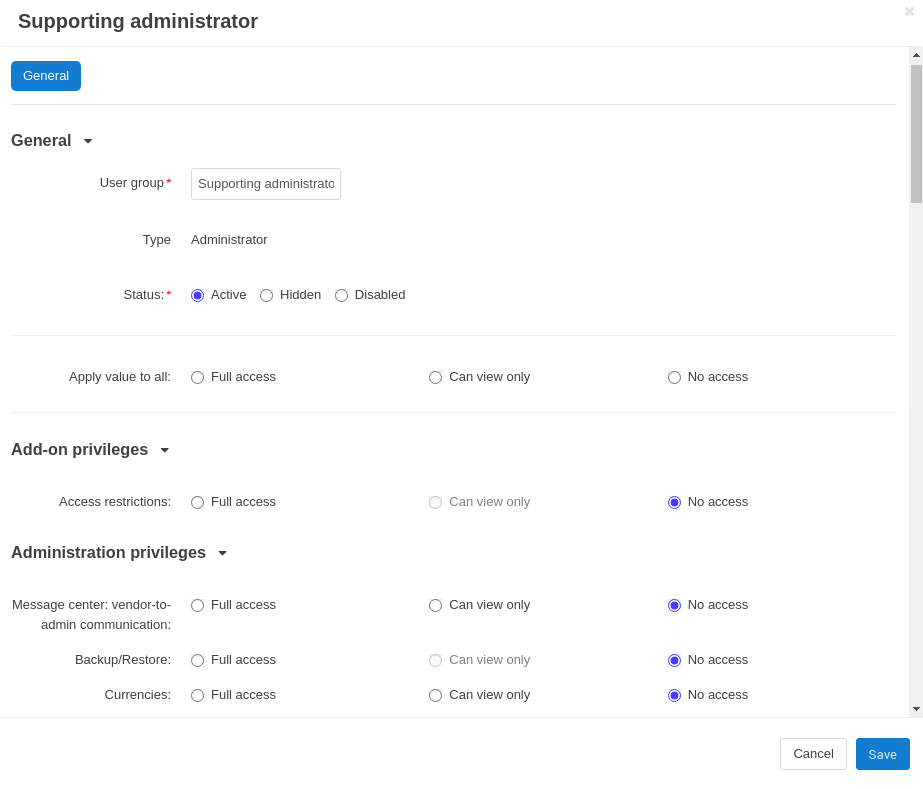

****************************************
How To: Create a New Administrator Group
****************************************

You may want to limit what a certain administrator can do. This can be done by creatin a new administrator group with limited rights and assigning it to the administrator.

===========================
Step 1. Create a User Group
===========================

1.1. In the Administration panel go to **Customers → User groups**.

1.2. Click the **+** button on the right.

1.3. Enter the name of your user group in the **User group** field.

1.4. Set the **Type** to **Administrator**.

1.5. Click the **Create** button.

1.6. Open the newly created administrator group.

1.7. Go to the **Privileges** tab. 

1.8. Tick the checkboxes next to the privileges you want to enable for the group.

1.9. Click the **Save** button.

=======================================
Step 2. Add Administrators to the Group
=======================================

2.1. Go to **Customers → Administrators**.

2.2. Click the desired name to open the user's profile.

2.3. Switch to the **User groups** tab. 

2.4. Set the status to **Active** for the group you've just created.

.. important::

    After this administrator logs in, he/she will have the privileges enabled for his/her user group only.
