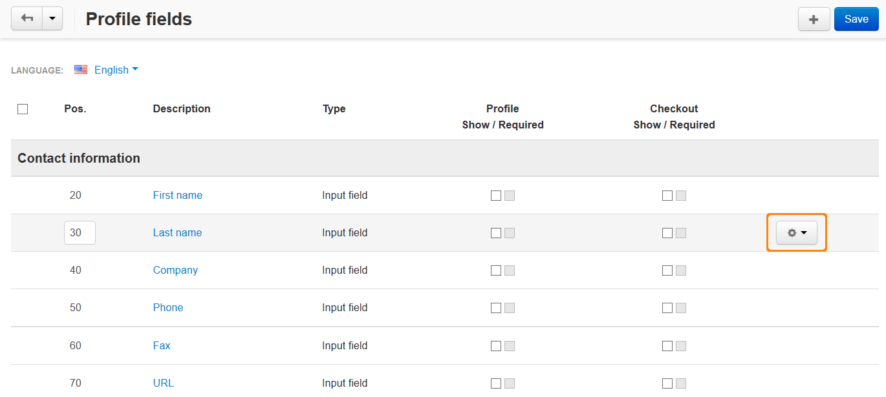

*****************************
How To: Manage Profile Fields
*****************************

You can add, edit, and delete the fields that users can fill in at checkout or in their profile. Some fields can be made mandatory.

=======================
Editing a Profile Field
=======================

1. In the Administration panel go to **Administration → Profile fields**.

2. Click the **gear** button next to the desired profile field and choose **Edit**.

3. Make your changes.

4. Click the **Save** button to save the changes.

======================
Adding a Profile Field
======================

1. Go to **Administration → Profile fields**.

2. Click the **+** button on the right.

3. Enter the information about the new profile field.

4. Click the **Create** button.

.. image:: img/add_profile_field.png
    :align: center
    :alt: Specify the properties fo the profile field.
