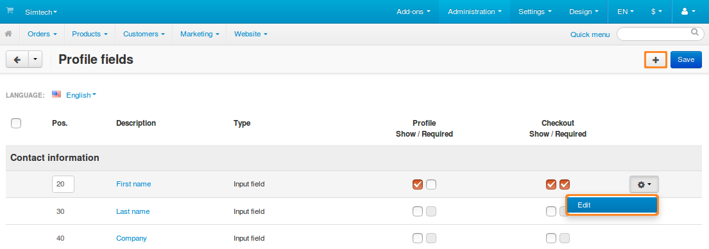
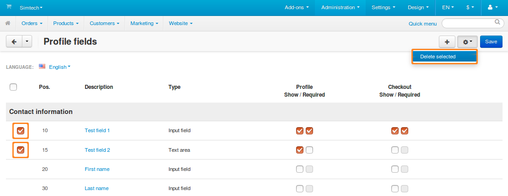

*****************************
How To: Manage Profile Fields
*****************************

Profile fields contain various information about a user. Users can fill in those fields when registering an account, in their profile, or at checkout. Some fields can be made mandatory.

The list of profile fields is available under **Administration → Profile fields**. On that page you can:

.. contents::
   :backlinks: none
   :local:

.. image:: img/profile_fields.png
    :align: center
    :alt: The list of profile fields in the administration panel.

=======================
Add/Edit Profile Fields
=======================

1. To add a profile field, click the **+** button in the top right corner. To edit an existing profile field, click the **gear** button next to the desired field and choose **Edit**.

2. You'll see a window where you'll be able to specify the properties of the profile field:

   * **Description**—the name of the field as it appears to customers and administrators.

   * **Position**—the position of this profile field on the list relative to other fields.

   * **Type**—the type of the profile field. It determines what kind of values can be entered or selected in the field. If you choose *Radio group* or *Multiple checkboxes*, you'll have to specify the possible variants on the **Variants** tab.

     .. important::

         Once you create a profile field, you won't be able to change the type of that field.

   * **Section**—determines whether this field is a part of user's contact information or billing/shipping address. If you choose *Billing/Shipping address*, the field will be created both for billing and shipping address. However, you'll be able to hide fields or make them required separately for each address type.

   * **User-defined CSS class**—allows you to assign a custom CSS class to this field.

   * **Profile (Show/Required)**— ticking the first checkbox will make this field appear during profile creation or editing. Ticking the second checkbox will make this field required—a user won't be able to create or update a profile without filling in this field.

   * **Checkout (Show/Required)**—ticking the first checkbox will make this field appear at checkout. Ticking the second checkbox will make this field required—a user won't be able to complete checkout without filling in this field.

3. Once you've specified everything you needed, click **Create** (or **Save**, if you're editing an existing field).

.. image:: img/add_profile_field.png
    :align: center
    :alt: Specify the properties of the profile field.

=================================
Hide Fields or Make Them Required
=================================

The profile field list has two columns that determine the areas where a field should appear: **Profile** and **Checkout**. 

Each area has two checkboxes:

* **Show**—if you tick this checkbox, the field will appear in the corresponding area. 

  .. hint::

      If you want to hide a certain field without deleting it entirely, just untick the **Show** checkboxes for both **Profile** and **Checkout**.

* **Required**—if you tick this checkbox, the field will have to be filled in. Otherwise, depending on the area where the field is required, a user won't be able to register a new account, save changes in the edited account, or submit an order.

.. image:: img/shown_and_required_fields.png
    :align: center
    :alt: Tick the corresponding checkboxes to determine where the field should appear.

Once you configure the visibility of the profile fields, click **Save** in the top right corner. After that the changes should take effect.

.. important::

    If you don't click **Save**, your changes will be lost when you leave the page.

.. image:: img/shown_and_required_fields_in_profile.png
    :align: center
    :alt: Ticking or unticking the checkboxes will affect the corresponding pages.

=====================
Delete Profile Fields
=====================

.. warning::

    Deleting a profile field will also delete the data that users entered in that profile field earlier. If you don't want that, just hide the profile field as described above.

Fields that exist by default can't be deleted. You can only delete custom profile fields:

* To delete one profile field, hover over it, click the **gear** button, and choose **Delete**.

* To delete multiple profile fields:

  1. Tick the checkboxes next to the fields you want to delete.

  2. Click the **gear** button in the top right corner.

  3. Choose **Delete selected**.

.. important::

     If a profile field belongs to the *Billing/Shipping address* section, then the checkboxes and the **Delete** action will only appear under **Shipping address**. A field deleted from shipping address also gets deleted from billing address.

