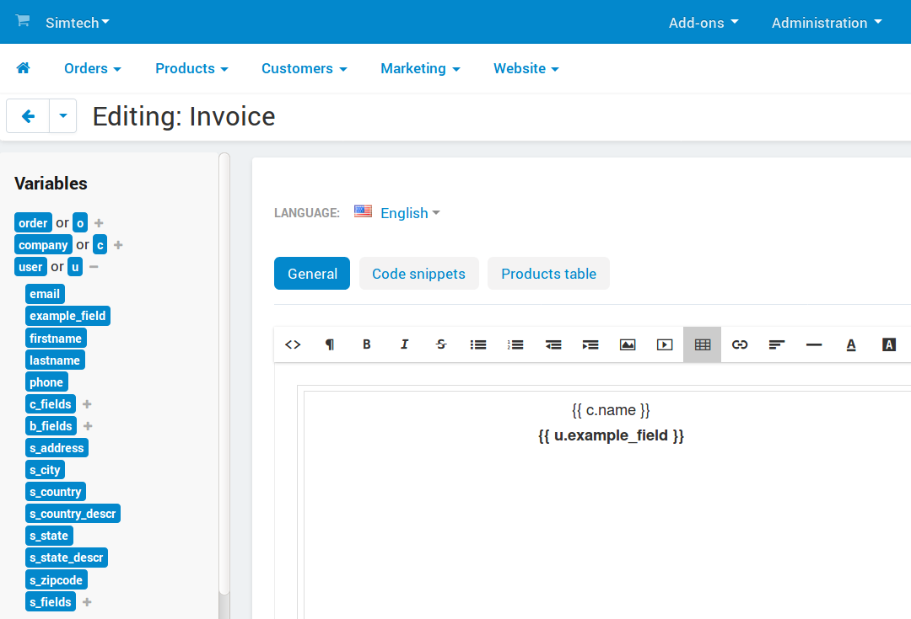

*****************************
How To: Manage Profile Fields
*****************************

Profile fields contain various information about a user. Users can fill in those fields when registering an account, in their profile, or at checkout. Some fields can be made mandatory.

The list of profile fields is available under **Administration → Profile fields**. On that page you can:

.. contents::
   :backlinks: none
   :local:

.. image:: img/profile_fields.png
    :align: center
    :alt: The list of profile fields in the administration panel.

=======================
Add/Edit Profile Fields
=======================

#. To add a profile field, click the **+** button in the top right corner. To edit an existing profile field, click the **gear** button next to the desired field and choose **Edit**.

#. You'll see a window where you'll be able to specify the properties of the profile field:

   * **Name**—the name of the field as it appears to customers and administrators.

   * **Code**—the character sequence unique for each profile field. It serves to identify the field and can be :ref:`used as a variable in the document editor. <profile-field-in-document>`

   * **Position**—the position of this profile field on the list relative to other fields.

   * **Type**—the type of the profile field. It determines what kind of values can be entered or selected in the field. If you choose *Radio group* or *Selectbox*, you'll have to specify the possible variants on the **Variants** tab. Once you create a profile field, you won't be able to change its type.

   * **Section**—determines whether this field is a part of user's contact information or billing/shipping address. If you choose *Billing/Shipping address*, the field will be created both for billing and shipping address. However, you'll be able to hide fields or make them required separately for each address type.

   * **User-defined CSS class**—allows you to assign a custom CSS class to this field.

   * **Profile (Show/Required)**—ticking the first checkbox will make this field appear during profile creation or editing. Ticking the second checkbox will make this field required—a user won't be able to create or update a profile without filling in this field.

     .. important::

         To show a profile field on the checkout page or make it required there, go to **Design → Layouts** and switch to the **Checkout** tab. You'll be able to add them in the settings of blocks, such as *Address* and *Customer information*.

#. Once you've specified everything you needed, click **Create** (or **Save**, if you're editing an existing field).

.. _profile-field-in-document:

=====================================
Use Profile Fields in Document Editor
=====================================

Starting with version 4.4.1, CS-Cart and Multi-Vendor come with :doc:`the document editor </user_guide/look_and_feel/documents/index>` that allows to customize invoices, packing slips, and other documents. Profile fields can be found in the ``user`` group of variables. Simply click on the field name, and it will be added to the place where you last left the cursor in the document template.

.. important::

    A profile field's identifier (**Field name**) will appear among available variables only if the profile field appears on the checkout page. Read the section above to learn how to achieve this.

If the field belongs to the *Billing/Shipping address* section, it will be represented by 2 variables with different prefixes: ``b_`` (billing address) and ``s_`` (shipping address).

You can also refer to that profile field by its name manually. For example, if the field name is ``s_example_field``, put ``{{ u.s_example_field }}`` to where you want the content of the field to appear in the document.

=====================
Delete Profile Fields
=====================

.. warning::

    Deleting a profile field will also delete the data that users entered in that profile field earlier. If you don't want that, just don't show the profile field instead.

Fields that exist by default can't be deleted. You can only delete custom profile fields:

* To delete one profile field, hover over it, click the **gear** button, and choose **Delete**.

* To delete multiple profile fields:

  1. Tick the checkboxes next to the fields you want to delete.

  2. Click the **gear** button in the top right corner.

  3. Choose **Delete selected**.

If a profile field belongs to the *Billing/Shipping address* section, then the checkboxes and the **Delete** action will only appear under **Shipping address**. A field deleted from shipping address also gets deleted from billing address.

.. meta::
   :description: Documentation about custom profile fields in CS-Cart online stores and Multi-Vendor online shopping malls.
