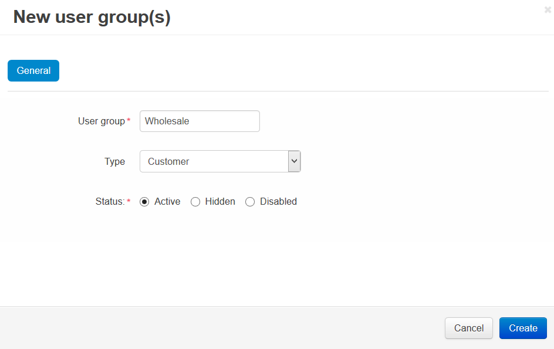

*********************************************
How To: Create a New User Group for Customers
*********************************************

Customers can be split into different user groups with various privileges. For example, you can set different product prices for members of different groups. You can also determine what shipping methods, payment methods and discounts are available to different user groups.

.. hint::

    To set different product prices for different user groups, go to **Products → Products**, click on the name of the desired product, and switch to the **Quantity discounts** tab. 

===========================
Step 1. Create a User Group
===========================

1.1. In the Administration panel go to **Customers → User groups**.

1.2. Click the **+** button on the right.

1.3. Enter the name your user group in the **User group** field.

1.4. Set the **Type** to **Customer**.

1.5. Click the **Create** button.

==================================
Step 2. Add Customers to the Group
==================================

2.1. Go to **Customers → Customers**.

2.2. Click the desired name to open the profile.

2.3. Switch to the **User groups** tab.

2.4. Set the status to **Active** for the group you've just created.

.. important::

    Customers will see prices of the corresponding user group only if they are a part of the group and are logged in to their accounts.

.. image:: img/add_customer_to_group.png
    :align: center
    :alt: Add a customer to the group.
