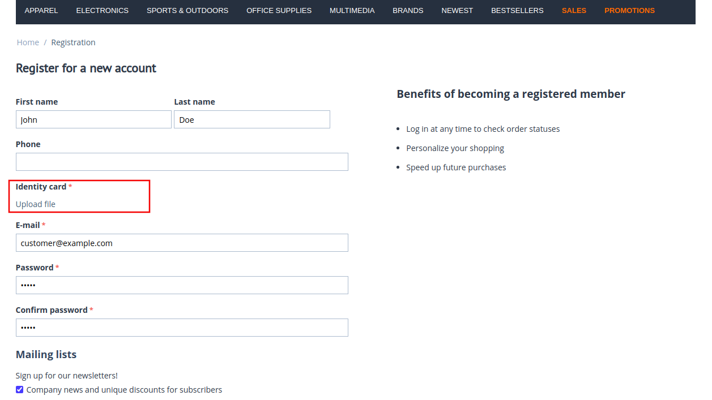

*******************************************
How To: Allow Customers to Upload Documents
*******************************************

Let's say you want customers to upload their documents (for example, IDs) when creating new accounts in your store.

To do this:

#. Go to **Administration → Profile fields**.

#. Click the **+** in the upper right corner to create a new profile field.

#. Add the :doc:`new profile field </user_guide/users/customers/change_profile_fields>`.

#. In the **Type** field select *File*.

#. Click **Create**.

#. Tick the **Profile (Show)** checkbox. You can also make the uploading of documents a required thing to do when creating a new account. To do this, tick the **Profile (Required)** checkbox.

#. Click the **Save** button.

   .. image:: img/docs_profile_fields.png
       :align: center
       :alt: Profile field for uploading documents
