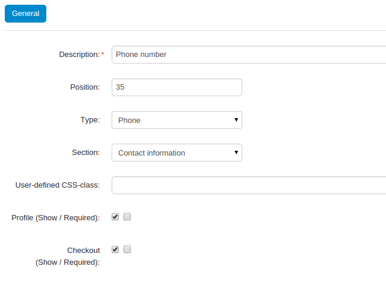
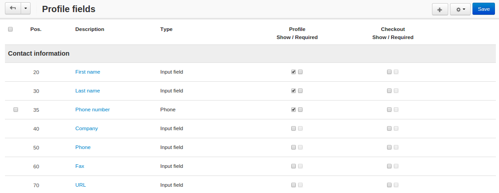

*******************************************
How To: Define Specific Phone Number Format
*******************************************

By default, users can enter any combinations of letters, digits and other symbols as their phone numbers. But you can configure an input mask for the corresponding profile field, so that users would have to enter their phone numbers in a specific format.

To set up the mask that prevents users from entering random sequences of characters as their phone numbers, follow these steps:

==========================
Step 1. Enable Input Masks
==========================

Make some changes to the code to enable input masks: 

1.1. Go to your CS-Cart installation directory.

1.2. Open the **scripts.tpl** file in the *design/themes/responsive/templates/common* directory.

.. note::

    Replace **responsive** in the path to **scripts.tpl** with the name of your active theme, if you use any theme other than **Responsive**.

1.3. Find this line:

::

  {script src="js/lib/appear/jquery.appear-1.1.1.js"} 

1.4. Once you have found the line, add the following line right below it:

::

  {script src="js/lib/inputmask/jquery.inputmask.min.js"}

1.5. Find this code:

::

  {if $config.tweaks.anti_csrf} 
   ... 
  {/if}

1.6. Once you have found the code, add the following line right below it:

::

  $(":input").inputmask();

1.7. Open the **profile_fields.tpl** file in the *design/themes/responsive/templates/views/profiles/components* directory.

.. note::

    Replace **responsive** in the path to **profile_fields.tpl** with the name of your active theme, if you use any theme other than **Responsive**.

1.8. Find the following code:

::

  {else}  {* Simple input *}
        <input {if $field.autocomplete_type}x-autocompletetype="{$field.autocomplete_type}"{/if} type="text" id="{$id_prefix}elm_{$field.field_id}" name="{$data_name}[{$data_id}]" size="32" value="{$value}" class="ty-input-text {if !$skip_field}{$_class}{else}cm-skip-avail-switch{/if} {if $smarty.foreach.profile_fields.index == 0} cm-focus{/if}" {if !$skip_field}{$disabled_param nofilter}{/if} />
    {/if}

1.9. Add the ``{if $field.field_type == "P"} data-inputmask="'mask': '(999) 999-9999'" {/if}`` condition to the code, so that it would look like this:

::

  {else}  {* Simple input *}
        <input {if $field.field_type == "P"} data-inputmask="'mask': '(999) 999-9999'" {/if}{if $field.autocomplete_type}x-autocompletetype="{$field.autocomplete_type}"{/if} type="text" id="{$id_prefix}elm_{$field.field_id}" name="{$data_name}[{$data_id}]" size="32" value="{$value}" class="ty-input-text {if !$skip_field}{$_class}{else}cm-skip-avail-switch{/if} {if $smarty.foreach.profile_fields.index == 0} cm-focus{/if}" {if !$skip_field}{$disabled_param nofilter}{/if} />
    {/if}

Now this input mask will apply to all input fields that have **Phone** as their type.

.. note::

    The input mask we have specified is **(999) 999-999**; it means that users will only be able to enter digits, and only in the specified format. You can create input masks that allow letters and optional parts—`learn more at jquery.inputmask documentation page <https://github.com/RobinHerbots/jquery.inputmask>`_.

================================================
Step 2. Add New Profile Fields for Phone Numbers
================================================

Default profile fields for phone numbers have the **Input field** type, so the input mask won't apply to them. We need to create new profile fileds with the **Phone** type.

2.1. Log in to the administration panel of your store.

2.2. Go to **Administration → Profile fields**.

2.3. Click the **+ button** to add a new field.

2.4. Enter the information about the new profile field. I named the field *Phone number* to avoid having two different *Phone* fields. 

.. important::

    Make sure to set **Type** to *Phone*, so that the input mask would apply to this field.

2.5. Click the **Create** button.

2.6. Tick the checkboxes to determine which fields to show, and where to show them. Click **Save** to save your changes.

2.7. Check how the mask works: open your store and try to register as a customer or to edit your own data in the customer area. When you try to fill in the **Phone number** field, you should see the input mask.

.. important::

    If you can't see any changes, try clearing the cache: delete the *var/cache* directory of your store and refresh the page in your browser.

.. image:: img/input_mask_in_action.png
    :align: center
    :alt: The input mask prevents customers from entering the random sequences of characters in the Phone Number field.

.. note::

    If you want to use the same phone number format in the **Billing/Shipping Address** section, create additional input field with **Type** set to *Phone* and **Section** set to *Billing address/Shipping address*. Show this new field instead of the existing **Phone** field.
