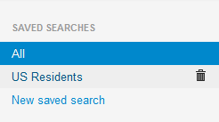
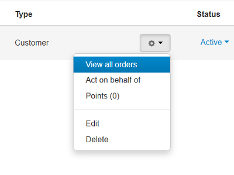

*****
Users
*****

The **Customers** section of the administration panel allows you to manage the *user accounts* of your store.

A **user account** is a record in the store database that identifies a registered user and associates the user with the related data: order statistics, personal info, subscriptions, etc. 

You can split users into groups to add various restrictions or privileges for them.

.. toctree::
    :maxdepth: 2
    :titlesonly:
    :glob:

    */index

==================
User Account Types
==================

CS-Cart has the following types of user accounts:

* **Administrator**—can log in to both the storefront and the administration panel. Depending on their privileges, administrators can view and/or manage the store contents and configuration.

* **Customer**—can log in to the storefront and buy products in your store. Although the storefront is normally available to non-registered users as well, registered users are supposed to enjoy greater privileges. Besides, even registered users with a customer account may have different opportunities depending on the user group that they belong to.

* **Supplier**—cannot access the storefront or the administration panel. Supplier accounts are used in the database to flag products that belong to third-party providers. Products from different suppliers can have different shipping methods.

.. note::

    Suppliers appear only if you install and enable the **Suppliers** add-on. Multi-Vendor has another user type: :doc:`vendor's administrators. <vendors/index>`
 
Filter the user accounts with the search form to the right of the list. Click **Advanced search** to access more filtering criteria. 

If you filter accounts against a particular search pattern regularly (e.g., to list users from a certain country), you will find it convenient to save the pattern and add it to the list of predefined patterns appearing in the top right corner.

=============
Quick Actions
=============

When you search through the list of users with your mouse pointer, the **gear buttons** appear near the user statuses. Under this button you can find a drop-down list of quick actions, that can be done with the accounts. The set of applicable actions depends on the type of the account.

* **View all orders**—shows all the orders placed by the user.

* **Act on behalf of**—takes you to the storefront as if you are logged in as the selected user.

* **Points**—shows the customer's reward points log.

* **Edit**—allows you to the edit the user account.

* **Delete**—permanently deletes the user account.

.. warning::

    Account deletion can't be undone without restoring a database backup. We recommend to disable accounts instead of deleting them.

* **View supplier products**—takes you to the list of products by this supplier

================================
Enable and Disable User Accounts
================================

Availability of a user account is controlled through the account status. To enable or disable an account, change its status to **Active** or **Disabled**, respectively—click on the current status and select the new status from the list.

=============
Adding a user
=============

To add a new user, click the **+** button in top right corner of a page. This will open a form with the user account details.

The exact set of fields may vary depending on the account type and the profile configuration, which is managed in **Administration → Profile fields**.

.. note::

    A user's shipping address and billing address can be different from each other.

After the new account is created, click the **gear** button and choose **Edit** to configure additional parameters.

* specify the customer's age on the **Add-ons** tab (if the **Age verification** add-on is installed).

* assign the account to one of the available user groups on the **User groups** tab. A user's membership in a user group is managed by the statuses:

  * **Active**—user belongs to the group.

  * **Pending**—user has applied for the groups and is waiting for approval.

  * **Available**—group is available for application.

  * **Declined**—user's application was declined.

.. meta::
   :description: Articles about working with users and user groups in CS-Cart and Multi-Vendor ecommerce software.
