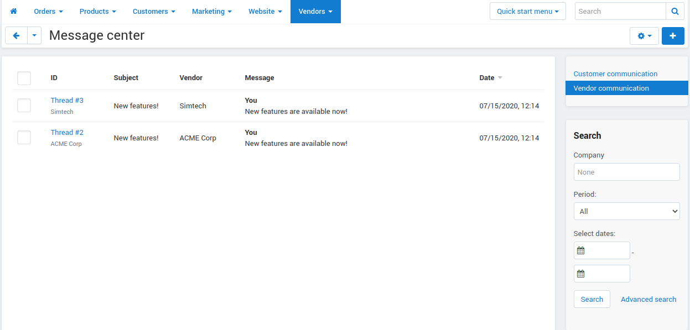

**********************************************
How do vendors communicate with administrators
**********************************************

The :doc:`Message center </user_guide/addons/customer_to_vendor_communication/index>` add-on allows vendors and marketplace owners to communicate with each other on the **Vendors →  Message center** page. This is useful in case if:

* a vendor has a question to the administrator; 

* the admin has any comments or suggestions on how the product in the vendor's store should be filled, and he wants to show him what needs to be fixed;

* the marketplace owner wants to tell his vendors some important news.

.. contents::
    :backlinks: none
    :local:

How Do Vendors Contact the Marketplace Owner?
=============================================

The Message center add-on allows vendors to contact the administrator:

* from the page of any product in the store;

* from the page of any order;

* from the page of any import preset.

To send a message to the administrator, the vendor has to click the gear button in the upper-right corner and select **Contact administrator**.

.. image:: img/contact_admin.png
       :align: center
       :alt: The Contact administrator button on the product's page

How Does the Admin Contact His Vendors?
=======================================

Let's say you want to contact a specific vendor. To do this:

#. Go to the **Vendors → Message center** page.

#. Click the **+** button to contact the vendor. 

#. Enter the **Subject** and choose the vendor in the **Vendor** field. 

#. Enter your message and click the Send button.

.. image:: img/message_to_vendor.png
       :align: center
       :alt: Sending a message to a vendor

How to Contact Multiple Vendors?
================================

If you want to send a message to multiple vendors, for example, to tell them about some new add-ons or features you have added to their stores:

#. Create a new message as desribed above.
    
#. Enter the **Subject** and the message text.
    
#. Specify the vendors who you want to send your message to in the list. If you want to send the message to all the vendors in your marketplace, tick the box **All**.
    
#. Click **Send**.
    
The add-on will send your message to each vendor separately. You can look through every dialogue, and answer the messages from vendors on the **Vendors → Message center** page.

