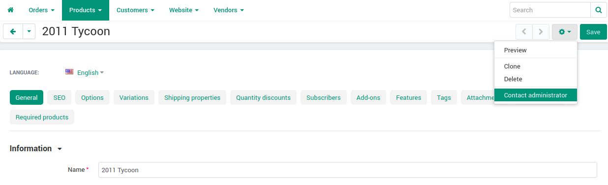
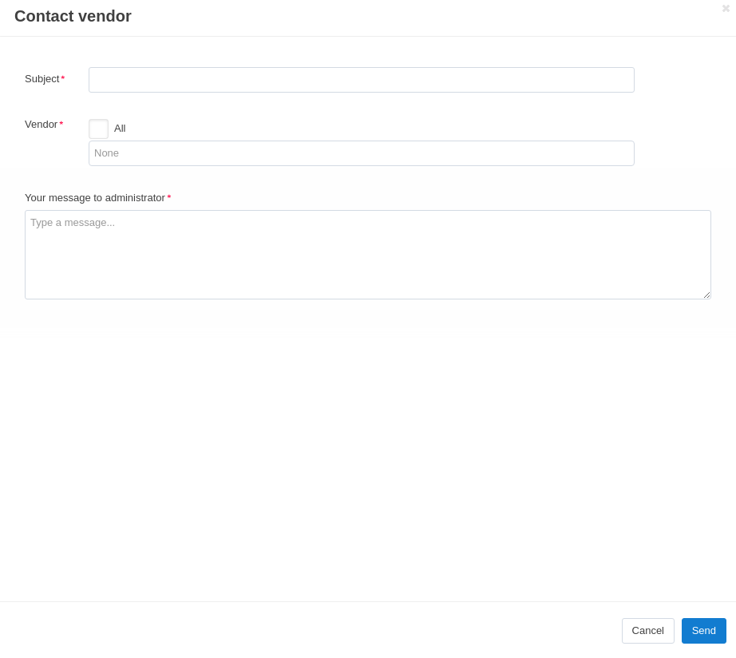

**********************************************
How do Vendors Communicate with Administrators
**********************************************

The :doc:`Message center </user_guide/addons/customer_to_vendor_communication/index>` add-on allows vendors and marketplace owners to communicate with each other on the **Vendors →  Message center** page. This is useful in case if:

* a vendor has a question to the administrator; 

* the admin has any comments or suggestions on how the product in the vendor's store should be filled, and he wants to show him what needs to be fixed;

* the marketplace owner wants to tell his vendors some important news.

.. contents::
    :backlinks: none
    :local:

How Do Vendors Contact the Marketplace Owner?
=============================================

The **Message center** add-on allows vendors to contact the administrator:

* from the page of any product in the store;

* from the page of any order;

* from the page of any import preset.

To send a message to the administrator, the vendor has to click the gear button in the upper-right corner and select **Contact administrator**.

How Does Marketplace Administration Contact Vendors?
====================================================

Let's say you want to contact a specific vendor. To do this:

#. Go to the **Vendors → Message center** page.

#. Click the **+** button to contact the vendor. 

#. Enter the **Subject** and choose the vendor in the **Vendor** field.

   .. hint::
   
       If you want to send the message to all the vendors in your marketplace, tick the box **All**. The add-on will send your message to each vendor separately.

#. Enter your message and click the **Send** button.

