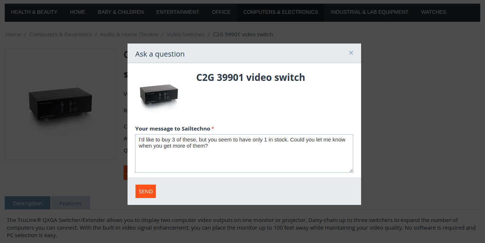

**************
Message Center
**************

.. important::

    This functionality is a part of the :doc:`Ask Seller a Question </user_guide/addons/customer_to_vendor_communication/index>` add-on.

Whenever a customer sends a message by using the *Ask a question* button, a new thread is created. A **thread** is a sequence of messages in the communication between a customer and a seller (administrator or vendor).

Messages and threads are saved to the database and can be viewed in the **Message Center**, both in the admin panel and on the storefront. This allows customers, administrators, and vendors to see communication history and continue their conversations in the relevant threads.

=============================================
Message Center for Administrators and Vendors
=============================================

The **Customers → Message center** page is available to administrators and vendors' administrators in their respective administration panels. That page allows them to:

* View threads started by customers. For convenience, the threads with new messages from customers that haven't been checked by either an administrator or a vendor's administrator are highlighted.

* Send new messages in existing threads. Just click on the ID of the thread, type your message, and click **Send**.

* Delete threads by hovering over a thread, clicking the gear button and choosing **Delete**.

  .. important::

      In Multi-Vendor, threads can only be deleted by global (non-vendor) administrators.

  .. image:: img/message_center_for_admins.png
      :align: center
      :alt: Message center in the admin panel.

============================
Message Center for Customers
============================

The **My Account → Messages** page allows customers to:

* View their own threads. For convenience, the threads with new messages from vendors are highlighted.

* Send new messages in their own threads. Just click on the ID of the thread, type the message, and click **Send**.

  .. image:: img/message_center_for_customers.png
      :align: center
      :alt: Message center on the storefront.

.. meta::
   :description: Where to manage questions asked by customers in CS-Cart and Multi-Vendor ecommerce platforms?
