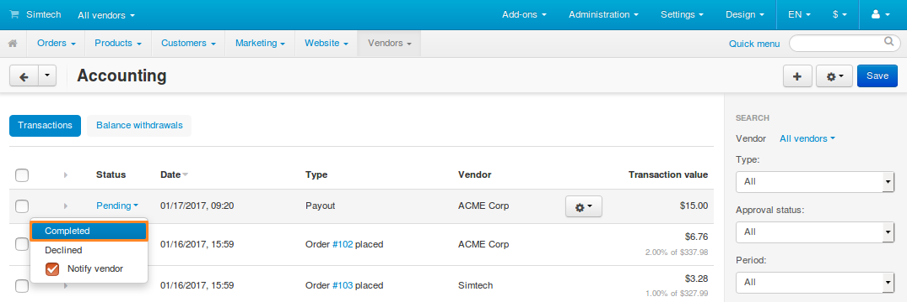
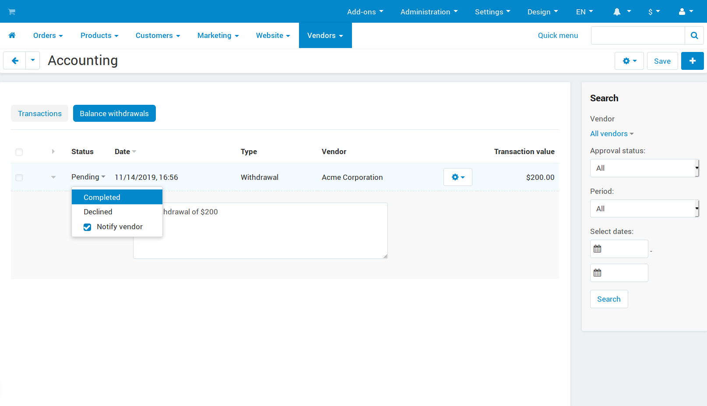

**********
Accounting
**********

.. important::

    The **Accounting** page first appeared in **Multi-Vendor 4.5.1** to replace the old **Account balance** page from `4.4.x <http://docs.cs-cart.com/4.4.x/user_guide/users/vendors/account_balance.html>`_ and `4.3.x <http://docs.cs-cart.com/4.3.x/user_guide/users/vendors/account_balance.html>`_. 

Multi-Vendor has a page that helps marketplace owners and vendors to keep track of their income and transactions. To access that page, go to **Vendors → Accounting**. Here's the list of actions that the page takes into account:

* Creating an order.

* Changing an order in a way that affects order total.

* Issuing a refund via the :doc:`/user_guide/addons/paypal_payments/index`, :doc:`/user_guide/addons/paypal_commerce_platform/index`, :doc:`/user_guide/addons/stripe_connect/index` or :doc:`/user_guide/addons/vendor_plans/index` add-on.

* Issuing a :ref:`payout <payout>`.

* Requesting a :ref:`withdrawal <withdrawal>`.

  .. image:: img/account_balance.png
      :align: center
      :alt: The Accounting page in Multi-Vendor.

The table on the **Accounting** page consists of the following columns:

* **Status**—the status of the transaction; it applies only to :ref:`payouts <payout>` and :ref:`withdrawals <withdrawal>`. There are three possible statuses:

  * *Pending*—a transaction gets this status by default. This status means that a payment should be made.
	
  * *Completed*—marketplace administrators set this status when a payment is made and confirmed.

  * *Declined*—marketplace administrators set this status when a payment gets declined or isn't made in full.

  .. note::

      Vendor's administrators can't change the statuses of transactions on the **Accounting** page. Only marketplace administrators can do that.

* **Date**—the date and time when the transaction appeared on the list.

* **Type**—the type of the transaction.

* **Vendor**—the vendor associated with the transaction. Vendor's administrators can't see this column—they only see the transactions relevant to their vendor.

* **Transaction value**—a positive value means that the money was received during this transaction; a negative value means that the money was spent.

.. note::

    If you enable the :doc:`/user_guide/addons/vendor_plans/index` add-on, you'll also see the transaction fees in this column.

=======================
Payouts and Withdrawals
=======================

In earlier versions of Multi-Vendor (`4.4.x <http://docs.cs-cart.com/4.4.x/user_guide/users/vendors/account_balance.html>`_, `4.3.x <http://docs.cs-cart.com/4.3.x/user_guide/users/vendors/account_balance.html>`_) we used the term **payout** in 2 cases:

* When a vendor made a payment to the marketplace owner.

* When the marketplace owner made a payment to a vendor.

Since Multi-Vendor 4.5.1 there are 2 separate terms for these cases: **payout** and **withdrawal** respectively.

.. _payout:

-------
Payouts
-------

Marketplace owners issue **payouts** to collect money from vendors. When a marketplace owner issues a payout, the vendor is supposed to make the payment. The marketplace owner then receives the money and sets the status of the payout to *Completed*.

.. note::

    Vendor's administrators can't issue a payout or change its status. Only marketplace administrators can do that.

In some cases, payouts can be issued and even completed automatically: 

* The :doc:`/user_guide/addons/vendor_plans/index` add-on issues payouts with the *Pending* status. This is done to request one-time and periordic payments from vendors for being subscribed to a certain plan. 

* The :doc:`/user_guide/addons/stripe_connect/index` add-on can change the status of payouts to *Completed*. This is done when you allow the add-on to collect payouts from vendors automatically.

To issue a payout manually:

1. Go to **Vendors → Accounting**.

2. Click the **+** button in the top right corner.

3. A pop-up window with the payout creation form will open. There you can:

   * Select a vendor to request money from.

   * Specify the amount of money in the primary currency of your marketplace.

   * Enter a commentary, if necessary.

   * Tick the checkbox if you want to notify the vendor about this payout by email.

   .. image:: img/issue_payout.png
       :align: center
       :alt: Fill in the fields in the payout creation pop-up.

4. Click **Create**. A new payout will appear on the list of transactions.

Once the vendor makes the payment, marketplace administrator can change the status of the payout from *Pending* to *Completed*. It is a way to confirm that the money has been received.

.. _withdrawal:

-----------
Withdrawals
-----------

By default, all the money from purchases goes to the marketplace owner. The **Accounting** page keeps track of :ref:`how much money a vendor can withdraw from the marketplace. <mve-income-and-balance>` To collect money from marketplace owners, vendors request **withdrawals**.

In some cases, withdrawals can be requested and completed automatically. For example, the :doc:`/user_guide/addons/paypal_commerce_platform/index` and the :doc:`/user_guide/addons/stripe_connect/index` add-ons can automatically distribute money among vendors. When the add-on does that, it creates *Completed* withdrawals automatically to keep the **Accounting** page up to date.

.. note::

    Vendor's administrators can create withdrawal requests, but can't delete them or change their status.

To request a withdrawal, a vendor must:

#. Go to **Vendors → Accounting** and switch to the **Balance withdrawals** tab.

   .. hint::

       A marketplace administrator can do it on behalf of vendor. To do that, use the account menu in the top right corner of the page and choose to log in as vendor.

#. Click the **+** button in the top right corner.

#. A pop-up window with the withdrawal creation form will open. There you can:

   * Specify the desired amount of money in the marketplace's primary currency.

   * Enter a commentary, if necessary.

     .. image:: img/request_withdrawal.png
        :align: center
        :alt: Fill in the fields in the withdrawal creation pop-up.

#. Click **Create**. A new withdrawal with the *Pending* status will appear on the list of transactions.

Once a withdrawal is requested, the marketplace owner has 2 options:

* Pay the vendor and change the status of the withdrawal to *Completed* to confirm the transaction.

* Decline the withdrawal and change the status to *Declined*.

.. _mve-income-and-balance:

==================
Income and Balance
==================

When working with the **Accounting** page, it's important to understand two terms:

* **Balance**—the total amount of money that a vendor can :ref:`withdraw <withdrawal>`.

  .. note::

      An order affects a vendor's balance only if the status of that order has the **Charge to vendor account** checkbox ticked.

* **Income**—the earnings of a vendor or a marketplace owner. Here is how it is calculated:

  * Vendor’s income = payments for orders - (commissions + payouts)

  * Marketplace owner’s income = commissions + payouts
