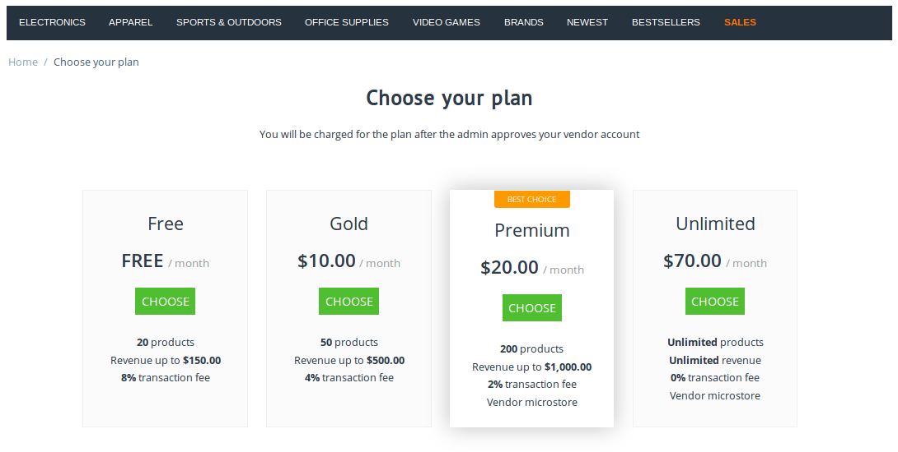

*****************************************
How To: Allow Customers to Become Vendors
*****************************************

.. important::

    **Vendors** are available only in **Multi-Vendor**.

=====================================================
Step 1. Allow Customers to Apply for a Vendor Account
=====================================================

1.1. In the Administration panel, go to **Settings → Vendors**.

1.2. Tick the **Allow users to apply for vendor account** checkbox.

1.3. Allow automatic creation of vendor's administrator accounts for approved vendors, if necessary.

1.4. If you want users to accept your terms and conditions before they can apply for a vendor account, tick the **Applying vendors must agree to the terms & conditions** checkbox.

     .. note::

         The text of the terms and conditions is stored the language variable called ``vendor_terms_n_conditions_content``. :doc:`Learn how to work with language variables. <../../look_and_feel/languages/translate>`

.. image:: img/settings_vendors.png
    :align: center
    :alt: If you allow users to apply for vendor accounts, you can also make them accept terms and conditions.

1.5. Click the **Save** button.

==============================================
Step 2. Provide a Link to the Application Form
==============================================

After you complete **Step 1**, the vendor application form will be available via a URL like *http://example.com/index.php?dispatch=companies.apply_for_vendor*. You'll only need to replace *http://example.com* with the actual URL of your store.

Once a customer fills out the form and clicks **Submit**, the administrator of the store can activate the newly created vendor account.

.. image:: img/vendors_application_form.png
    :align: center
    :alt: A customer has to fill in the form to apply for a vendor account.

There are multiple ways to take your customers to the vendor application form. For example, `Multi-Vendor demo <http://demo.mv.cs-cart.com>`_ includes the **Quick Links** menu with the **Become a seller** link. 

You can create your own menu item that would lead to the application form. The menu item must have the following URL: ``dispatch=companies.apply_for_vendor``.

.. image:: img/apply_for_vendor.png
    :align: center
    :alt: A registered customer can apply for a vendor account using a link in the menu.

The :doc:`Vendor Plans <../../addons/vendor_plans/index>` add-on also provides the list of available plans. That list appears on a separate page that has a URL like *http://example.com/index.php?dispatch=companies.vendor_plans*. Customers can get to the application form by using the **Choose** button on that page.

You can create your own menu item that would lead to the list of vendor plans. The menu item must have the following URL: ``dispatch=companies.apply_for_vendor``.

.. hint::

    :doc:`This article <../../look_and_feel/menus/index>` describes working with menus and menu items in more detail.

===============================
Step 3. Approve the Application
===============================

3.1. Go to **Vendors → Vendors**.

3.2. Find the vendor account you want to activate.

     .. hint::

         The vendor accounts that haven't been activated or disabled yet have the **New** status. 

3.3. Change the status of the desired account to **Active** or **Pending**.

     .. hint::

         Active and pending vendors can access the administration panel and manage their products. However, customers won't be able to see pending vendors and their products on the storefront. :doc:`Learn more about vendor statuses. <vendor_statuses>`

.. image:: img/change_vendor_status.png
    :align: center
    :alt: Find the vendor account you want to activate and change its status to Pending or Active.

Once you set the status to **Active** or **Pending**, the new vendor will receive an email notification, and vendor's administrators will be able to log in to vendor's administration panel. The content of the notification depends on what you did in step 1.3:

* If you allowed automatic creation of a vendor's administrator account, the email notification will include the account details and the login URL for vendor's administration panel.

* If you didn't allow automatic creation of a vendor's administrator account, the new vendor will simply be notified that the application for a vendor account has been approved.

  You'll have to create a vendor's administrator account manually. When you create the account, you can choose whether or not to send an email notification with login credentials and URL.
