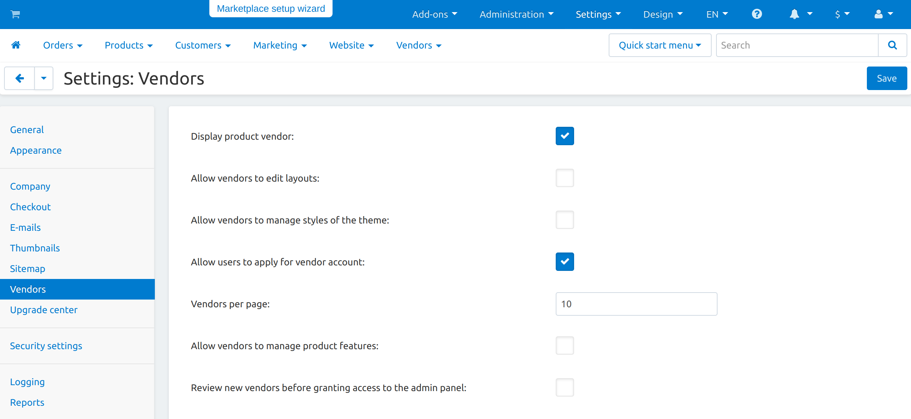
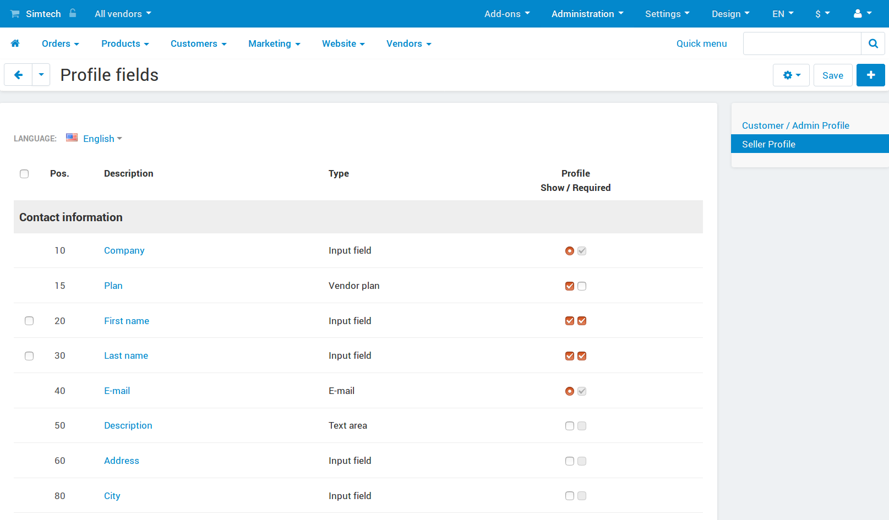
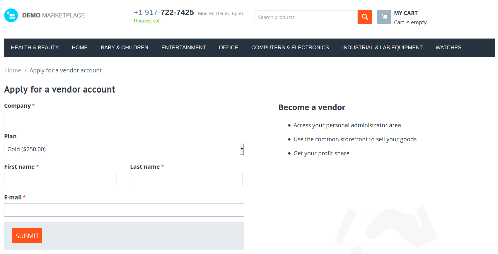
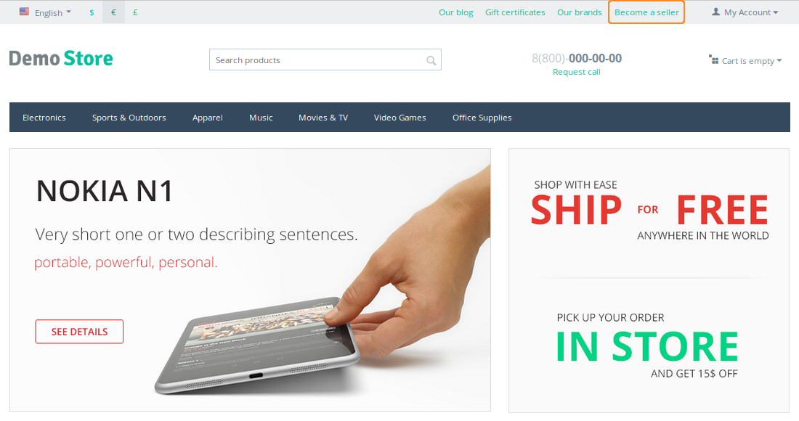
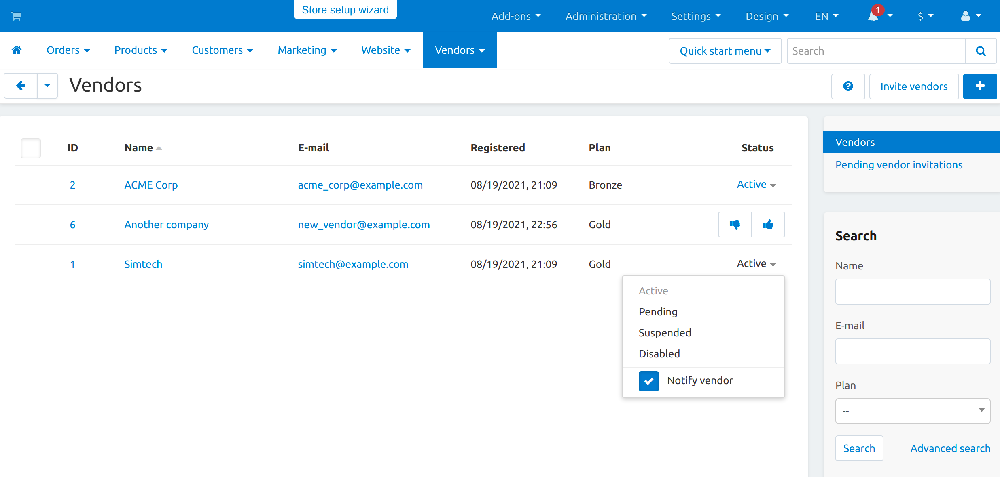

*****************************************
How To: Allow Customers to Become Vendors
*****************************************

.. important::

    Vendors are available only in Multi-Vendor.

=====================================================
Step 1. Allow Customers to Apply for a Vendor Account
=====================================================

1.1. In the Administration panel, go to **Settings → Vendors**.

1.2. Tick the **Allow users to apply for vendor account** checkbox.

1.3. If necessary, allow automatic creation of vendor's administrator accounts for approved vendors on the same page. That way you won't need to manually create a vendors' administrator accounts before vendors can access their admin panels.

1.4. Click the **Save** button.

.. note::

    At this point, it is a good idea to :doc:`set up a user group for vendors' administrators </user_guide/users/vendors/vendor_group>` if you want to limit what those administrators can see or do in their admin panels.

======================================
Step 2. Configure the Application Form
======================================

.. note:

    This functionality first appeared in Multi-Vendor 4.9.1.

2.1. In the Administration panel, go to **Administration → Profile fields**.

2.2. Switch to the **Seller Profile** in the section on the right side of the page.

2.3. Now you'll be able to edit the vendor registration form: add or remove fields, make them required (or not required), change the order of fields, etc. This works the same way as :doc:`editing the profile fields available to customers </user_guide/users/customers/change_profile_fields>`.

.. hint::

    The form has a field with the **Vendor terms and conditions** type. When you edit that field, you can change the text of the agreement that vendors must accept when they register.

==============================================
Step 3. Provide a Link to the Application Form
==============================================

After you complete step 1, the vendor application form will be available via a URL like *http://example.com/index.php?dispatch=companies.apply_for_vendor*. You'll only need to replace *http://example.com* with the actual URL of your store.

----------

There are multiple ways to take your customers to the vendor application form. For example, `Multi-Vendor demo <http://demo.mv.cs-cart.com>`_ includes the **Quick Links** menu with the **Become a seller** link. You can create your own menu item that would lead to the application form. The menu item must have the following URL: ``dispatch=companies.apply_for_vendor``.

.. hint::

    Here's more info on :doc:`how to work with menus and menu items </user_guide/look_and_feel/menus/index>`.

----------

The :doc:`Vendor Plans </user_guide/addons/vendor_plans/index>` add-on also provides the list of available plans. That list appears on a separate page that has the following URL: ``dispatch=companies.vendor_plans``. Customers choose the plan and get redirected to the application form.

.. image:: /user_guide/addons/vendor_plans/img/vendor_plans.png
    :align: center
    :alt: A registered customer can apply for a vendor account using a link in the menu.

=========================================================
Step 4. Grant a New Vendor Access to Vendor's Admin Panel
=========================================================

4.1. Go to **Vendors → Vendors**.

4.2. Find the vendor you want to activate. The vendor accounts that haven't been activated yet have the *New* status.

4.3. Change the status of the desired account to *Active* or *Pending*.

.. hint::

    Active and pending vendors can access the administration panel and manage their products. However, customers won't be able to see pending vendors and their products on the storefront. :doc:`Learn more about vendor statuses. <vendor_statuses>`

Once you set the status to *Active* or *Pending*, the new vendor will receive an email notification, and vendor's administrators will be able to sign in to vendor's administration panel. The content of the notification depends on what you did in step 1.3:

* If you allowed automatic creation of a vendor's administrator account, the email notification will include all the necessary information for signing in.

* If you didn't allow automatic creation of a vendor's administrator account, the new vendor will simply be notified that the application for a vendor account has been approved.

  You'll have to create a vendor's administrator account manually. When you create the account, you can choose whether or not to send an email notification with all the necessary information for signing in.
