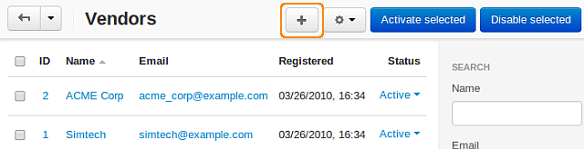
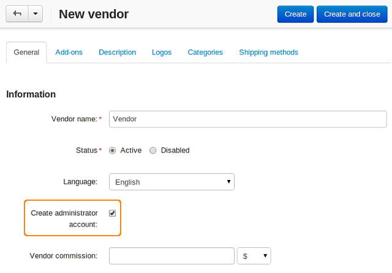

*******************************
How To: Create a Vendor Account
*******************************

.. important::

    **Vendors** are available only in **Multi-Vendor**.

To create a vendor account, complete the following steps:

1. Open the Administration panel of your store and go to **Vendors → Vendors**.

2. Click the **+** button in the right part of the page.

3. Fill in the form on the **General** tab and specify vendor profile attributes.

4. Tick the **Create administrator account** checkbox to create a new user of the administrator type.

.. note::

    The created administrator account will be associated with the vendor account and will be able to log in to the administrator panel to manage this vendor's settings and products.

5. Click the **Create** button. The new vendor account will appear in the list among the other vendors.
