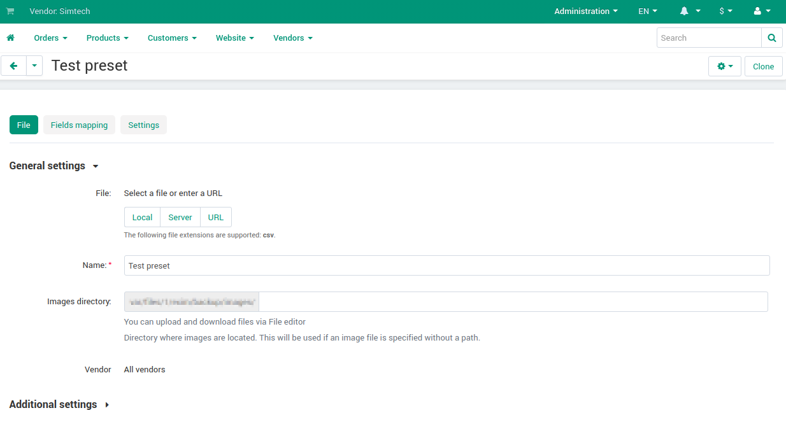

**************************************
How To: Make Import Easier for Vendors
**************************************

The quickest way for vendors to upload their products to marketplace is to import a file that contains those products. Different files may have the different structure. You can configure Multi-Vendor to recognize different files—this is what import presets are made for.

Offer vendors that sell on other marketplaces (for example, Etsy or Ebay) to upload their products on yours. To help them to do it, configure the import presets. With them every vendor can quickly upload the file and import his products.

How to Create Import Presets for Vendors
========================================

#. Go to **Administration → Import Data → Products**.

#. Create a :doc:`new import preset </user_guide/manage_products/import_export/advanced_product_import>`.

#. The new preset will appear in the **Marketplace presets** section.

How Do Vendors Import Products via Marketplace Presets
======================================================

When import presets are already configured by marketplace owner, importing is a very easy process. Vendor does not have to configure anything, or even open the preset. Everything that is left to do for vendors is to click the **Choose** button to upload the file and import the products.

       
Despite the fact that there are **Marketplace presets**, the vendor can adjust them to his own needs. Let's say, the vendor wants to upload the same file with products to different marketplaces, but set his own prices (for example, add 10% to the product prices). To do this, he has to **Clone** the marketplace preset—this will allow the vendor to make changes to preset. After the cloning, he has to configure a modifier on the **Fields mapping** tab. For more information about how modifiers work, check :doc:`this article </user_guide/manage_products/import_export/advanced_product_import>`.

Vendors can always delete the presets from the **Vendor presets** section. Also they have the ability to create their own presets if needed.

