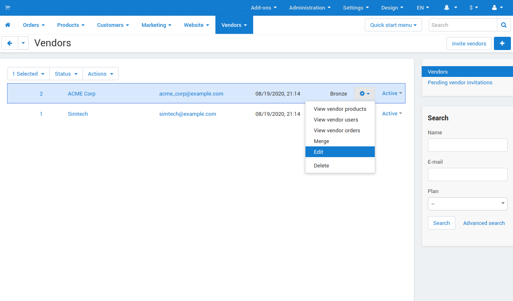

*******
Vendors
*******

.. important::

    **Vendors** are available only in **Multi-Vendor**.

**Vendors** are independent companies that sell their own products in your store. Every vendor has its own administration area, and can manage its own settings and products, configure shipping methods, etc.

View the list of the vendors in the Multi-Vendor administration panel under **Vendors → Vendors**.

.. toctree::
    :maxdepth: 2
    :titlesonly:
    :glob:

    account_balance
    manage_vendor_plans
    allow_customers_to_apply_for_vendor_account
    create_vendor_account
    merge_vendors
    product_approval
    vendor_categories
    vendor_statuses

.. toctree::
    :maxdepth: 2
    :hidden:

    extend_vendor_permissions

===================================
Vendors and Vendor's Administrators
===================================

A vendor is an independent company with a separate administration panel. This panel can be accessed by the administrators associated with the vendor. These administrators are called **vendor's administrators**; they can fill the catalog with the vendor's products, manage the vendor's sales, orders, shipping methods, control personal earnings and payout balance.

To view the list of vendor's administrators, go to **Customers → Vendor's administrators**. This section works as described :doc:`in this document <../index>`.

If you are the root administrator, you can assign a **vendor's administrator** account to a vendor: 

* Go to **Customers → Vendor's administrators**.

* Click the name of the desired account. 

* Specify the associated vendor in **Vendor** select box. 

* Save your changes with the **Save** button.

.. important:: 
    For a vendor to be able to log in to the administration panel, there must be at least one vendor's administrator account associated with this vendor.
