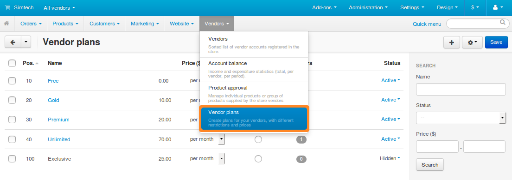
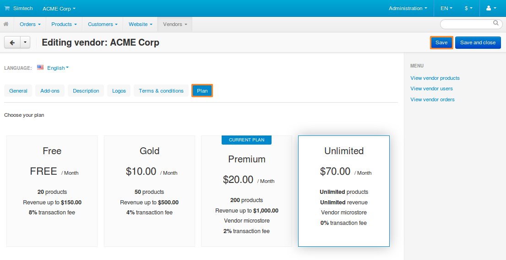

***************************
How To: Manage Vendor Plans
***************************

.. note::

    This functionality first appeared in **Multi-Vendor 4.4.1** as a part of the :doc:`Vendor Plans </user_guide/addons/vendor_plans/index>` add-on.

Vendor plans allow you to set conditions for vendors who sell products in your store. For example, you can specify how much and how often your vendors have to pay you, which categories they can use, and so on.

To manage vendor plans, go to **Vendors → Vendor plans** in the Administration panel of your store. Everything we do in this tutorial will be done on this page.

.. note::

    To see how all the plans will look on the storefront together, click the **gear** button in the top right corner and choose **Preview**.

.. contents::
   :backlinks: none
   :local:

======================
Add/Edit a Vendor Plan
======================

Way 1: From a Vendor Settings Page
++++++++++++++++++++++++++++++++++++

#. Go to **Vendors → Vendors**.

#. Click the vendor's name to open the settings.

#. Go to the **Plan** tab.

#. Choose a plan from the list of already existing plans, or create a new one. To do this, enter the name of the new vendor plan and click **Add**.

#. Fill in the filds for the new plan.

#. Click the **Create** button.

   .. image:: img/new_plan_vendor.png
       :align: center
       :alt: Creating a new vendor plan from the page of vendor settings
       
   .. note::
       
       Click the **Advanced plan creation** button to procced to create the plan from the **Vendor plans** add-on page.

Way 2: From the Vendor Plan's List
++++++++++++++++++++++++++++++++++

#. Go to **Vendors → Vendor plans**.

#. To add a plan, click the **+** button in the upper right part of the page. To edit a plan, click on the plan’s name in the list.

#. A pop-up window with multiple tabs will open. Configure the plan’s properties on those tabs:

   * **General:**

     * **Name**—the name of the plan as it appears in the Administration panel and on the storefront.

     * **Offer as the best choice**—tick this checkbox to highlight this plan among other plans. The *Best Choice* bar will appear above the plan’s name.

     * **Description**—add a brief description of the plan, that potential vendors will see when choosing a plan from the list.
 
     * **Position**—the position of the plan relative to other plans, both on the storefront and in the Administration panel.

     * **Status**—one of the three possible statuses of the plan:

       * *Active*—the plan is visible on the storefront and in the Administration panel.

       * *Hidden*—the plan is visible only to those vendors who use that plan. Other vendors can’t switch to it.

       * *Disabled*—the plan is not visible to vendors and can’t be used by any of them. You can disable a plan only if none of the vendors use it.

       .. note::

           The visibility of plans to also depends on whether or not you :doc:`allow vendors to switch to other plans </user_guide/addons/vendor_plans/vendor_plans_settings>`.

     .. image:: img/new_plan_general.png
         :align: center
         :alt: The "General" tab of a vendor plan.

   * **Commission:**

     * **Price**—determines how much and how often a vendor has to pay for using this plan.

     * **Transaction fee**—a commission from the sales that a vendor has to pay to the marketplace owner.

       .. note::

           The :doc:`/user_guide/addons/commissions_by_category/index` add-on allows you to set commissions that depend on the main category of a product.

     .. image:: img/new_plan_commission.png
           :align: center
           :alt: The "Commission" tab of a vendor plan.

   * **Restrictions:**

     * **Max. products**—the maximum number of products a vendor can have on this plan at a single time. This includes all products, regardless of their status. To allow an unlimited number of products, leave this field empty.

     * **Revenue up to**—the maximum amount of revenue a vendor can get per month. To offer unlimited revenue, leave the field empty.

       .. important::

           When a vendor has a larger revenue than allowed by the plan, an email will be sent to notify the marketplace owner about it. A vendor can still continue to work as usual, and it’s up to the marketplace owner how to handle this situation.

     * **Vendor microstore**—tick the checkbox to allow vendors to have a microstore. It is a section of the store that includes only the products, categories, and filters of a specific vendor. The search in that section is also limited to the assets of a specific vendor.

     .. image:: img/new_plan_restrictions.png
          :align: center
          :alt: The "Restrictions" tab of a vendor plan.

   * **Categories**—create a list of categories to which vendors can add their products. By default, all the categories are available.

     .. image:: img/new_plan_categories.png
         :align: center
         :alt: The "Categories" tab of a vendor plan.

     .. hint::

         Learn more about vendors and categories in :doc:`a dedicated article. <vendor_categories>`
       
   * **Storefronts**—specify the storefronts where this plan will be available.
   
     .. image:: img/new_plan_storefronts.png
         :align: center
         :alt: The storefronts tab of a vendor plan

#. Click the **Create** or **Save** button.

====================
Delete a Vendor Plan
====================

* To delete one plan, click the **gear** button of the plan and choose **Delete**.

* To delete multiple plans:

  #. Tick the checkboxes of the plans you want to delete.

  #. Click the **gear** button in the top right corner.

  #. Choose **Delete selected**.

  .. important::

      A plan won’t be deleted if at least one vendor uses it.

.. _switch-between-vendor-plans:

====================
Switch Between Plans
====================

#. In the Administration panel, go to **Vendors → Vendors**.

#. Click the name of the desired vendor.

#. Switch to the **Plans** tab.

#. Choose the desired plan.

   * Store administrators see a dropdown list with all *Active* and *Hidden* plans that exist in the store.

   * Vendor’s administrators see all *Active* plans (and the *Hidden* plan, if it is used by the vendor) with their limitations and prices, just like when :doc:`applying for a vendor account. <allow_customers_to_apply_for_vendor_account>`

     .. important::

         Vendor’s administrators can move their vendors to other plans only if it’s allowed in :doc:`the Vendor Plans add-on settings. </user_guide/addons/vendor_plans/vendor_plans_settings>` Otherwise they will only see their own plan.

#. Click the **Save** button in the top right corner. After that the payment for the new plan will be immediately subtracted from the vendor’s account balance.

.. note::

    Vendors receive a special :doc:`email notification </user_guide/look_and_feel/email_templates/index>` telling them that they’ve been moved to another plan.

