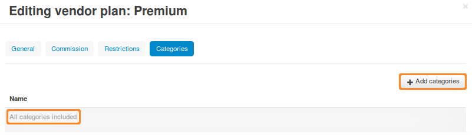

**********************
Vendors and Categories
**********************

.. important::

    **Vendors** are available only in **Multi-Vendor**.

By default, vendors can create products in all the categories of a store. However, you can make a list of categories available to a certain vendor. Then the vendor will be able to add products to those categories only.

.. note::

    Since **Multi-Vendor 4.4.1**, the categories available for vendors are determined by their plans (i.e., the **Vendor plans** add-on).

===========================================
Change the Categories Available to a Vendor
===========================================

1. In the administration panel, go to **Vendors → Vendor plans**.

2. Click the plan you want to edit.

3. Switch to the **Categories** tab.

4. Use the **Add categories** button to add the categories to the list.

5. Click **Save** for the changes to take effect.

.. important::

    If there are no categories on the list, then the vendor will have access to all the categories of the store.

===================================
Categories in a Vendor's Microstore
===================================

Multi-Vendor has a feature called **vendor's microstore**, that shows the products of a specific vendor only. A vendor's microstore only displays the categories that have products.

.. important::

    A category will show up in a vendor's microstore even if it has hidden and/or disabled products only. The workaround is to move hidden/disabled products to a special hidden/disabled category created for that purpose.
