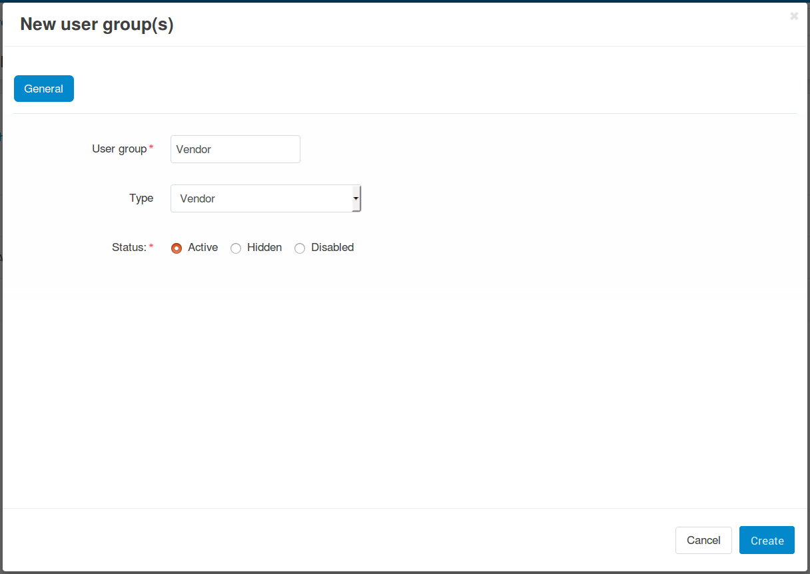
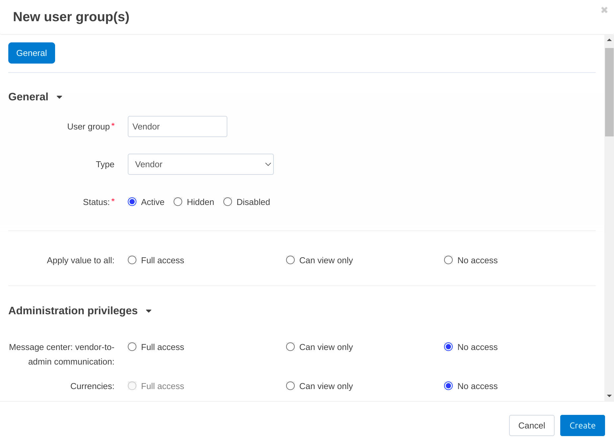
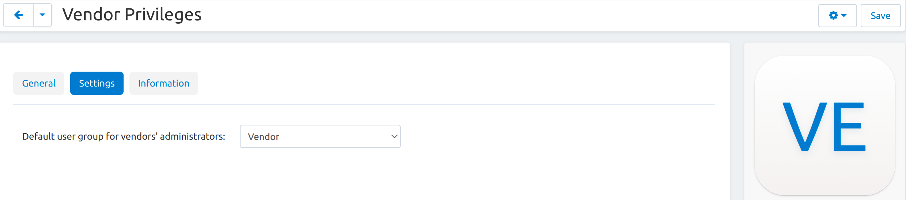
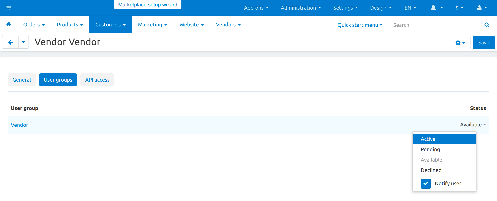

***********************************************************
How To: Create a New User Group for Vendors' Administrators
***********************************************************

.. note::

    This functionality first appeared in Multi-Vendor 4.9.1. It is available only in Multi-Vendor Plus.

Marketplace owners can determine what :doc:`vendors' administrators </user_guide/users/vendors/index>` can do in their admin panels. To this end, they can:

* Create user groups with limited privileges for vendors' administrators.

* Set the user group as default, so that all newly-created vendors' administrators would end up in that group.

  .. hint::

      This change won't affect existing administrators. You can assign user groups to them manually, if necessary. That's why Step 3 in this instruction is optional.

===========================
Step 1. Create a User Group
===========================

1.1. In the Administration panel, go to **Customers → User groups**.

1.2. Click the **+** button on the right.

1.3. Enter the name your user group in the **User group** field.

1.4. Set the **Type** to *Vendor*.

1.5. Click the **Create** button.

1.6. Open the newly-created group.

1.7. Go to the **Privileges** tab.

1.8. Tick the checkboxes next to the privileges you want to enable for the group.

1.9. Click the **Save** button.

=======================================================
Step 2. Set a Default Group for Vendors' Administrators
=======================================================

2.1. Go to **Settings → Vendors**.

2.2. Find the **Default user group for vendors' administrators** setting. It automatically assigns all newly-created vendor administrators to the user group of your choice. That way you won't need to do that manually every time someone creates a vendor's administrator.

2.3. Once you've selected the user group, click **Save**.

=================================================
Step 3. Add a Group to Vendor Manually (Optional)
=================================================

3.1. Go to **Customers → Vendor's administrators**.

3.2. Click the desired name to open the profile.

3.3. Switch to the **User groups** tab.

3.4. Set the status to **Active** for the group you've just created.

.. note::

    Only the root administrator can assign user groups to other administrators. The root administrator is the administrator that is created by the system after the Multi-Vendor installation process is finished.

