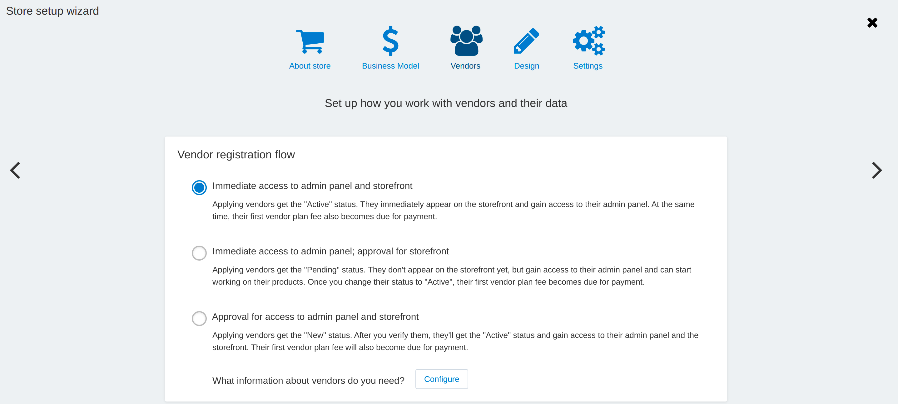

****************************************************
How To: Manage Vendor Onboarding on the Marketplace
****************************************************

Starting from the version 4.14.x, the administrator can quickly change the access level of the new vendors to the store. Depending on the chosen scenario,  vendors after registration will either immediately work in the store, or will have limited access, or won't work at all until the administrator approves them.

To set up access for new vendors:

#. Go to the **Marketplace setup wizard**.

#. On the **Vendors** tab, select one of three three options that define the work of new vendors.

.. contents::
   :backlinks: none
   :local:

================================================
Interaction Options of New vendors And the Store
================================================

The setup wizard speeds up manual setup. Therefore, any chosen interaction option automatically turns on the necessary addon and changes the values ​​of the settings in the admin panel.

After selecting the scenario, the appropriate settings will be applied. But you can always change the option of vendor onboarding via the **Marketplace setup wizard** or manually.

Option 1.  Immediate Full Access to Admin Panel and Storefront
==============================================================

.. list-table::
    :header-rows: 1
    :widths: 25 35

    *   -   Vendor
        -   Administrator
    *   -   * Gets access to the Vendor panel.
            * Appears on the storefront.
            * :doc:`The Active status </user_guide/users/vendors/vendor_statuses>`.
            * Gets payment for the vendor plan fee. 
        -   * The :doc:`/user_guide/addons/vendor_data_premoderation/index` addon—installed and activated.
            * The **Approval of newly-created vendors** setting in the addon—*"Isn't required"*.
            * The **Review new vendors before granting access to the admin panel** setting on the **Settings → Vendors** page—disabled.

Option 2. Immediate Access to Admin Panel, Approval for Storefront
==================================================================

.. list-table::
    :header-rows: 1
    :widths: 25 35

    *   -   Vendor
        -   Administrator
    *   -   * Gets access to the Vendor panel.
            * Won't appear on the storefront until the administartor's approval.
            * The *Pending* status.
            * Gets payment for the vendor plan fee after approval and getting *Active* status. 
        -   * Vendor data premoderation addon—installed and activated.
            * The **Approval of newly-created vendors** setting in the addon—*"Required for all vendors"*.
            * The **Review new vendors before granting access to the admin panel** setting on the **Settings → Vendors** page—disabled.

Option 3. Approval for Access to Admin Panel And Storefront
===========================================================

.. list-table::
    :header-rows: 1
    :widths: 25 35

    *   -   Vendor
        -   Administrator
    *   -   * Won't get access to the admin panel until the administartor's approval.
            * Won't appear on the storefront until the administartor's approval.
            * The *New* status.
            * Gets payment for the vendor plan fee after approval and getting *Active* status. 
        -   * Vendor data premoderation addon—the status doesn't change;
            * The **Approval of newly-created vendors** setting in the addon—*"Isn't required"*;
            * The **Review new vendors before granting access to the admin panel** setting on the **Settings → Vendors** page—enabled.

