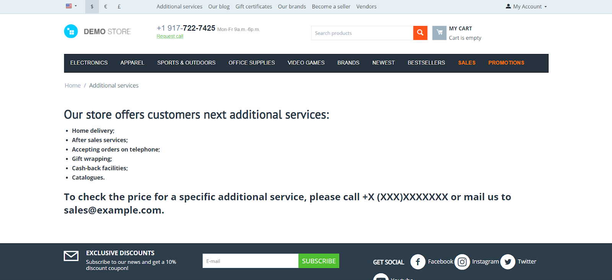

*******************************************
How To: Create a Page with Custom Structure
*******************************************

.. contents::
   :backlinks: none
   :local:

This article explains how to create service pages in the store (for example, return policy, etc.) and how to change their appearance.

=======================
Step 1. Create the Page
=======================

Let's imagine you want to publish new content, but there is no suitable page for it in your store. CS-Cart and Multi-Vendor let you create new pages:

#. Go to **Website → Pages**.

#. Click the **+** button at the top right corner and select **Add Page**.

#. Fill in the required fields. :doc:`There are many fields, </user_guide/website/pages/page_properties>` but the main ones are “Name” and “Description”.

#. Click **Create**.

===============================================
Step 2. Сustomize the Look and Feel of the Page
===============================================

In CS-Cart, a layout page determines the structure of a certain page, the arrangement of blocks on it, etc. That’s why we’ll :doc:`add a layout page </user_guide/look_and_feel/layouts/layout_pages/actions_on_pages>` for our newly-created page.

#. Click the gear button next to the layout page name. This will open the settings of the layout page.

#. On the **General** tab, set **Dispatch** to *View page*.

   .. image:: img/new_layout_page.png
       :align: center
       :alt: Creating a layout page.

#. Add the page created in  Step 1 via the **+ Add pages** button on the **Pages** tab.

#. Configure other settings of the **General** tab as you see fit.

Now start customizing the look and feel of the page. To make your page clear and user-friendly for customers, :doc:`add blocks </user_guide/look_and_feel/layouts/blocks/actions_on_blocks>` and arrange them correctly.

.. important::

    Customers will immediately see all changes made in the main layout. To avoid this create a test layout and edit pages there. Upon completion of the changes, make the test layout the main (default) one. 

It is important to add the **Main Content** block to the new layout page, because it is responsible for the key content of the page. Other blocks you can add include **Breadcrumbs**, **Recently Viewed**, etc. Arrange blocks as you need—the changes will appear only on your page. This will help users to navigate your store faster and easier.

================================
Step 3. Add the Page to the Menu
================================

The page has been created and customized. But until we provide a link to it, the buyer won’t be able to find it. You need to decide where it is better to place the page.

Depending on the page’s content, it can refer to different elements of the store and be part of different menus. Here is one of the ways to add an item to the menu:

#. Go to **Design → Menus**.

#. Choose any of the existing menus. Add an item to the menu via the **+** button at the top right corner.

#. Enter the name of the page.

#. In the **Generate submenu** setting, select **Page**, then click **+** and add created page.

#. Tick the "**Use the "Link text" and "URL" values from this item in the storefront**" checkbox.

#. Click **Create**.

The screenshot shows how our page (titled “Additional Services”) might look like in the **Quick links** menu.

