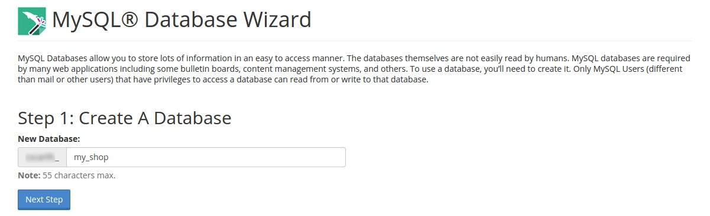
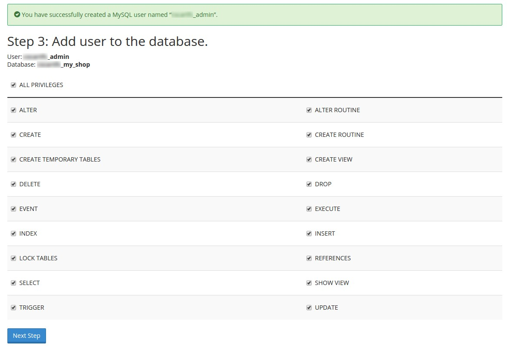
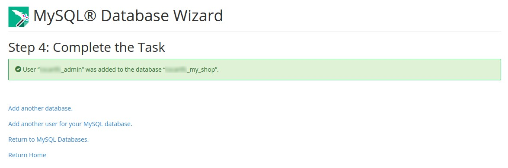
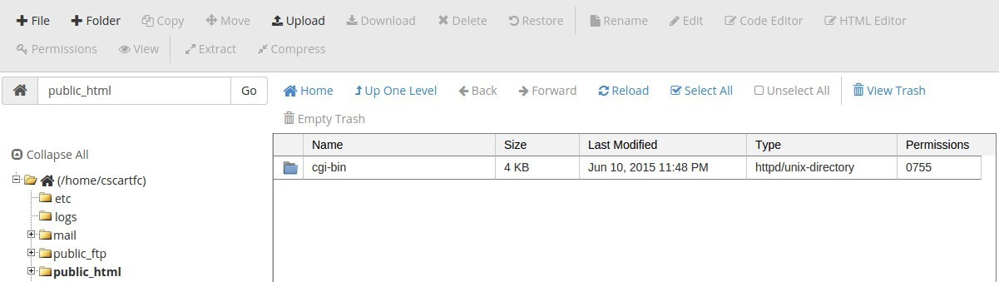
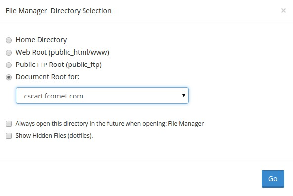

*********************************************
How To: Install CS-Cart on a Host with cPanel
*********************************************

.. note::

    **Tutorial Difficulty: 1 / 3**

In this tutorial, you will learn how to install CS-Cart on a virtual host with cPanel in 4 easy steps. cPanel is one of the most popular hosting control panels. 

Even if your host offers another control panel, you may still find this tutorial useful.

.. note::

    CS-Cart works on any host that supports MySQL and PHP. You can learn about the minimum requirements `here <http://www.cs-cart.com/requirements.html>`_.

Step 1. Create a MySQL Database
===============================

1.1. The easiest way to set up your first database is to use a wizard. Go to **cPanel → Databases → MySQL Database Wizard**. 

.. note::

    If the cPanel provided by your web hosting service doesn't have MySQL Database Wizard, use **MySQL Databases**. Create a database and a user, then add the user to the database. Make sure to give the user **All Privileges**.

.. image:: img/1_open_mysql_wizard.png
    :align: center
    :alt: MySQL Databases and Wizard icons in cPanel

1.2. Name your database and click **Next Step.**

1.3. Create a user for your database. Enter a username and a password and click **Create User**.

.. image:: img/3_wizard_user.png
    :align: center
    :alt: Creating a user with MySQL Database Wizard

.. hint::

    If your password is shorter than 5 characters, cPanel might not accept it. If you can’t come up with a password, use the **Password Generator**.

1.4. Add your newly created user to the database. Make sure to tick the **All Privileges** checkbox.

After you press the **Next Step** button, cPanel will offer you to create more databases and users — just press **Return Home**. If you want to see the newly created database, press **Return to MySQL Databases**.

Step 2. Upload CS-Cart to the Server
====================================
2.1. `Download <https://www.cs-cart.com/download-cs-cart.html>`_ the latest version of CS-Cart.  Then go to **cPanel → Files → File Manager**.

.. image:: img/6_file_manager_icon.png
    :align: center
    :alt: The icon of File Manager in cPanel.

2.2. Select the directory for the File Manager to upload CS-Cart to. Choose Document Root for and select your domain name from the dropdown menu. In our case, it’s cscart.fcomet.com.

.. important::

   You need to associate a domain name with your host’s IP first: find out what name servers your host uses for your domain, then use your domain registrar’s control panel to associate your domain name with the name servers. We suggest you read `this article <http://www.thesitewizard.com/domain/point-domain-name-website.shtml>`_ to learn more.

2.3. It’s time to upload the CS-Cart archive (the file you got in Step 2.1) to the server. Press the **Upload** button and select the **cscart_v4.x.x.zip** archive that you got earlier.

2.4. Select the uploaded file and press the **Extract** button.

.. image:: img/9_file_manager_extract.png
    :align: center
    :alt: Extracting the CS-Cart archive with cPanel File Manager.

Step 3. Install CS-Cart
=======================

3.1. Open your store’s URL in a browser. You’ll see a message that CS-Cart is not installed. Let's fix this by clicking the [install] link.

.. image:: img/10_open_website.png
    :align: center
    :alt: Opening our store's main page in a browser.

3.2. Read and accept the **License Agreement** in order to proceed.

.. image:: img/11_license_agreement.png
    :align: center
    :alt: Tick the checkbox to accept the License Agreement. 

3.3. Fill in the form using the details below:

============================  ===========================================================================================================
**MySQL Server Host**         Enter the DNS name or IP address of your MySQL server. Usually it’s localhost (because the database and the website are stored on the same server).
**MySQL Database Name**       Enter the name of the database you created in Step 1.2. Remember that the database name includes a prefix that you also need to add.
**MySQL User**                Enter the username you created in Step 1.3. Again, remember the prefix.
**MySQL Password**            Enter the password of the MySQL user (see step 1.3).
**Administrator's Email**     Enter your email here. CS-Cart will use it to notify you about new orders, call requests, and other important events in your store.
**Administrator's Password**  Enter the password you will use to access the CS-Cart administration panel.
**Main Language**             English (or any language of your choice)
============================  ===========================================================================================================

.. image:: img/12_installation_parameters.png
    :align: center
    :alt: Fill in the MySQL and administrator's data to proceed. 

.. note::
    Additional languages are available under the **Advanced** tab of **Administration settings**. You can enable or disable them now or later.

3.4. If this is your first time with CS-Cart and you want to see what your store will look like once you add the details about your products, fill your store with demo products, orders, and banners. 

To do that, tick the **Install demo data** checkbox. You can always `remove demo data <http://kb.cs-cart.com/removing-demo-info>`_ later. We’d appreciate it if you helped us make CS-Cart better. Tick the **Help us improve CS-Cart** checkbox to send anonymous usage statistics.

.. image:: img/13_checkboxes.png
    :align: center
    :alt: Choose if you want to install demo data and send anonymous statistics to CS-Cart developers. 

3.5. After you press **Install** you’ll see the progress bar running. Please, don’t close the page during the installation. This is when CS-Cart settles in on your server and unpacks various themes and add-ons. Don’t worry, it won’t be long before your new store is good to go!

.. image:: img/14_progress_bar.png
    :align: center
    :alt: Don't close the page, wait for the progress bar to fill. 

Step 4. Choose Your Licensing Mode
==================================

The next step is to choose your licensing mode. You have 3 options:

1. Enter your license number to enable the **Full Mode**, that gives you unrestricted access to all CS-Cart features, i.e. more than 50 add-ons, multiple languages and currencies, unlimited number of product filters on the storefront, and more. You can `purchase a license <http://www.cs-cart.com/cs-cart-license.html>`_ any time.

2. If you don’t have a license yet, we offer a **free 30-day trial** with full access to all CS-Cart features. After the end of your trial period you can purchase a license or switch to the Free Mode.

3. The **Free Mode** leaves some features unavailable, but has no time restrictions. You can use this mode from the start or switch to it once your trial period is over.

.. image:: img/15_licensing_mode.png
    :align: center
    :alt: Enter your CS-Cart license number, get a 30-day trial or use the free version. 

Once you choose your licensing mode, your online store is all set! Now you can go to the **Storefront** to view your store, or to the **Administrator panel** to manage it.

.. image:: img/16_complete.png
    :align: center
    :alt: After the installation you can view the store and manage it. 

