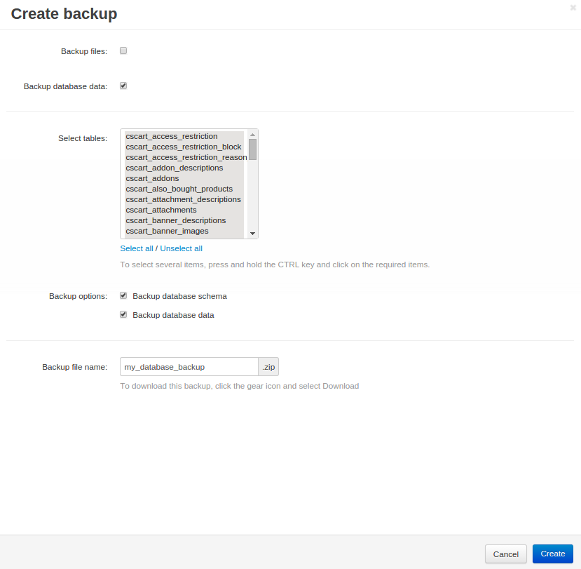
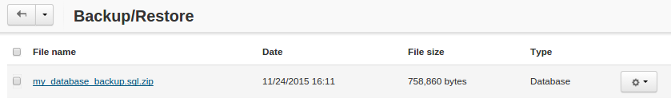
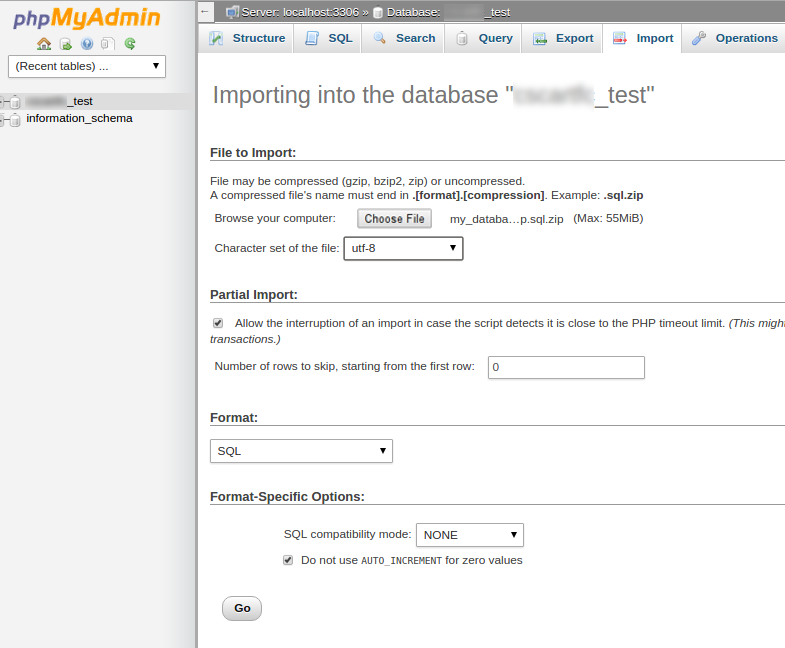
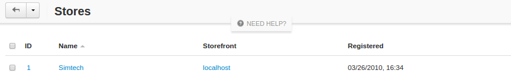
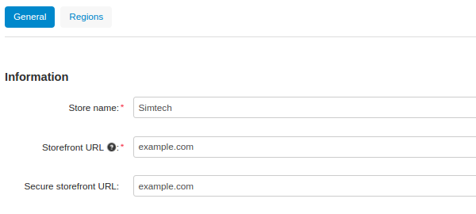

*****************************************
How To: Move Your Store to Another Server
*****************************************

.. note::

    **Tutorial Difficulty: 2 / 3**

This article provides the instructions on how to move your store to a different server. These instructions are useful, if you decide to change your hosting provider or upload your local installation to a remote server, or the other way round.

.. important::

    The details of some steps in this instruction depend on the servers you’re moving to and from. If you have never installed CS-Cart or Multi-Vendor before, please :doc:`read the installation instructions <index>` and learn about the :doc:`3 steps to make your store more secure <security>`.

===================================================
Step 1. Back Up the Database of Your Existing Store
===================================================

To back up the database of your existing store, complete the following steps:

1.1. Log in to the **Administration panel** of your store.

1.2. Go to **Administration → Backup/Restore**.

1.3. Press the **+ button** to create a new backup file.

1.4. Configure the backup settings:

* Leave the **Backup files** checkbox unticked.

.. note::

    The **Backup files** checkbox doesn't back up all the files of your store: we will copy the files manually in **Step 2**.

* Tick the **Backup database** data checkbox.

* Tlick **Select all** under the **Select tables** list.

* Tick the **Backup database data** and **Backup database schema** checkboxes.

* Name your backup file, for example **my_database_backup**.

* Click the **Create** button.

1.5. Click the backup name to download it to your local machine. You’ll need that backup file for Step 5.

======================================================
Step 2. Copy the Files of Your Store to the New Server
======================================================

2.1. Make an archive with all the files of your store. The way you make an archive depends on your installation:

* If your old store is installed on a host with **cPanel**, go to **cPanel → Files → File Manager**, select all the files of your store, and click **Compress**. Then select the newly created archive and click **Download**.

.. important::

    **cPanel File Manager** may not show hidden files like **.htaccess**. Before you try to create an archive, go to **Settings** (top right corner of the screen) and tick the **Show hidden files (.dotfiles)** checkbox. That way you’ll make sure that all files of your store are in the archive.

* If your old store is installed on a local machine, find the installation directory and make an archive with your favourite file archiver.

.. important::

    The path to the installation directory depends on your web server and operating system. For example, *c:/xampp/htdocs* is the default path for **XAMPP** on a **Windows** machine.

2.2. Copy the archive with your store to the document root of the new server.

2.3. Unpack the archive on the new server.

=============================
Step 3. Edit config.local.php
=============================

After you unpack the archive with your store, make some changes the **config.local.php** file:

.. important::

    You must have a database on your new server before you proceed. Contact your hosting provider or server administrator for database credentials, or :doc:`read the installation instructions <index>` to learn how to create databases on various servers.

3.1. Open **config.local.php** in an FTP client or the file manager of your host’s control panel.

3.2. Edit the following lines according to the instructions:

.. list-table::
    :header-rows: 1
    :stub-columns: 1
    :widths: 25 35

    *   -   What should I change?
        -   How should I change it?
    *   -   ``$config['db_host'] = 'DB_host';``
        -   If the database and the website are stored on the same server (as they usually are), replace **DB_host** with **localhost**.
    *   -   ``$config['db_name'] = 'DB_name';``
        -   Replace **DB_name** with the name of the new server’s database.
    *   -   ``$config['db_user'] = 'DB_username';``
        -   Replace **DB_username** with the name of the user of the new server’s database.
    *   -   ``$config['db_password'] = 'DB_password';``
        -   Replace **DB_password** with the database user’s password.
    *   -   ``$config['http_host'] = 'example.com';``
        -   Replace **example.com** with your store’s domain name. Make sure this domain name points to your new server, or you won’t be able to access your website by using it.
    *   -   ``$config['http_path'] = '';``
        -   If the files of your store are located in the server’s document root, leave it as is. If you want your store to be available at *domain.com/cs-cart*, put all the files of your store into the **cs-cart** folder in your website’s document root and change the line to this: ``$config['http_path'] = '/cs-cart';``.
    *   -   ``$config['https_host'] = 'example.com';``
        -   Replace **example.com** with the name of the secure server host. Usually it is the same as your domain name.
    *   -   ``$config['https_path'] = '/subfolder';``
        -   If the files of your store are located in the server’s document root, leave it as is. If you want your store to be available at *domain.com/cs-cart*, put all the files of your store into the **cs-cart** folder in your website’s document root and change the line to this: ``$config['http_path'] = '/cs-cart';``.

=======================================================
Step 4. Clear the Cache of Your Store on the New Server
=======================================================

After you unpack the files of your store, make sure to clear the cache by deleting or renaming the **cache** folder in the **var** directory of your store on the new server.

==============================================
Step 5. Restore the Database on the New Server
==============================================

The way you restore the database depends on the server you’re moving to. In this tutorial we describe 2 ways to do it—use the method that suits you best.

.. important::

    You will need a new empty database on your new server: restoring the database backup will overwrite all data in the database.

    If your new server uses **cPanel**, create a database and database user as described :doc:`in the Step 1 of this tutorial <cpanel>`. To create a database on a **VPS/VDS**, :doc:`use Step 3 of this tutorial <apache>`. 

-----------------
Way 1. PhpMyAdmin
-----------------

To restore a database backup with **phpMyAdmin**, complete the following steps:

* Log in to **phpMyAdmin**.

.. hint::

    If your new server uses **cPanel**, you can find **phpMyAdmin** under **Databases → phpMyAdmin**. Some servers may require you to enter your login and password. Contact your hosting provider or server administrator for details.

* Select your database from the list on the right.

* Click **Export** in the top menu.

* Click **Choose File** and select the database you downloaded during **Step 1.5**.

* Set **Character set** to **utf-8**.

* Set **Format** to **SQL**.

* Click **Go**.

* Wait until the import is completed. You’ll see a message when it’s done.

.. image:: img/moving_to_another_server/import_successful.png
    :align: center
    :alt: To restore the database in phpMyAdmin, select your backup file and settings, then click Go.

--------------------
Way 2. SSH and MySQL
--------------------

To restore a database backup via SSH, complete the following steps:

* Connect to your server via SSH.

.. code-block:: bash

    ssh username@host

.. note::

    Contact your hosting provider or server administrator for the **username** and **host** credentials, as well as your **password**.

* Enter your SSH password.

.. note::

    Your cursor won’t move and you won’t see any changes while you type your password. That is normal.

* Upload your database backup to the *var/backups* directory on the remote server.

.. code-block:: bash

    scp path/to/my_database_backup.sql.zip username@host:/root/folder/of/your/store/var/backups

* Unpack the .zip archive with your database backup on the remote server.

.. code-block:: bash

    cd root/folder/of/your/store/var/backups
    unzip my_database_backup.sql.zip

* Import the database.

.. code-block:: bash

    mysql -u[username] -p DB_name < my_database_backup.sql

* Enter your MySQL password.

Make sure to replace **[username]** with your **MySQL username**, and replace **DB_name** with the name of your database from the Step 3.2. For example, if your username is **root**, and the database is called **test**, the command will look like this:

.. code-block:: bash

    mysql -uroot -p test < my_database_backup.sql

=================================
Step 6. Update the Storefront URL
=================================

.. note::

    Skip this step if you use **Multi-Vendor**.

This is an optional step. You need to update the URL of your storefront, if the URL of your store has changed. You also need to do this, if you moved the store from the local machine to a remote server, or the other way round:

6.1. Access the **Administration panel** of your store on the new server.

.. important::

    The way you access the admin panel may be different, depending on whether you followed :doc:`the 3 steps to make your store more secure <security>` before attempting to move your store to a new server.

6.2. Go to **Administration → Stores**.

6.3. Click the name of your storefront.

6.4. Change the **Storefront URL** and **Secure storefront URL** to the ones you specified in **Step 3.2** as **$config['http_host']** and **$config['https_host']**.

