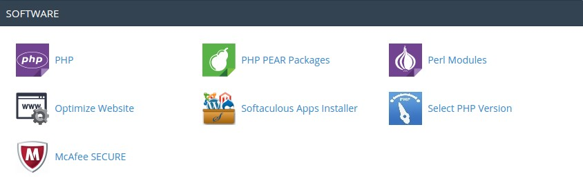
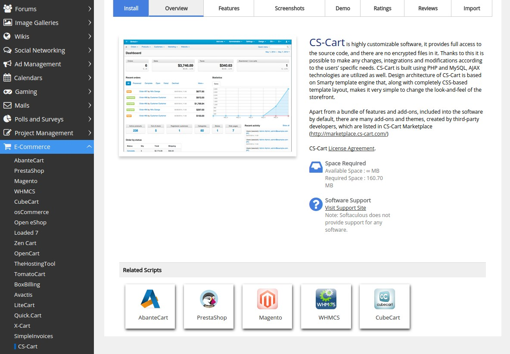
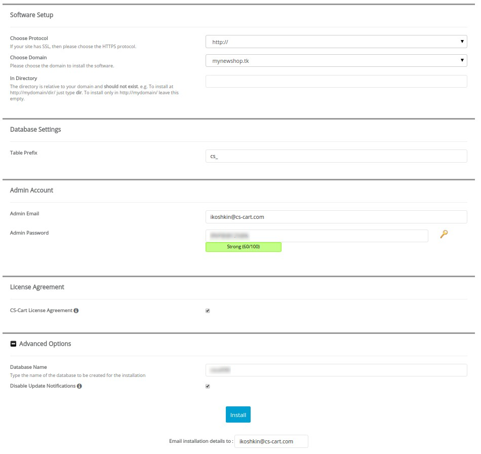
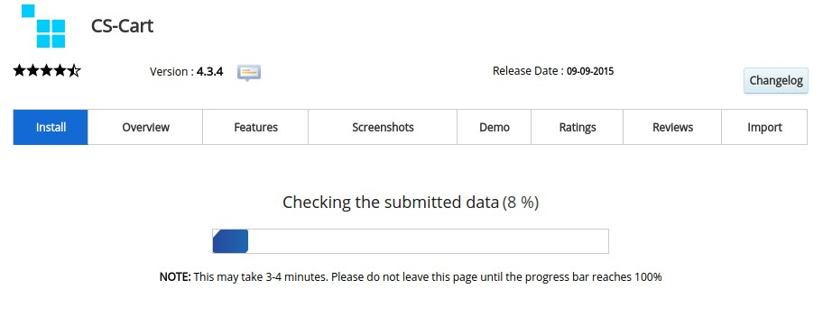
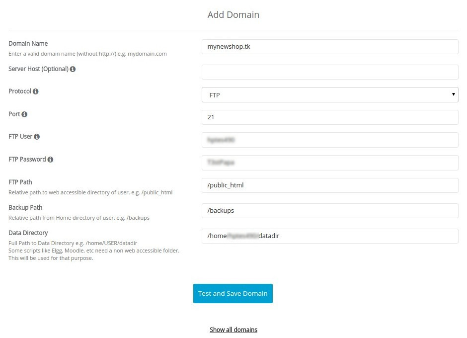
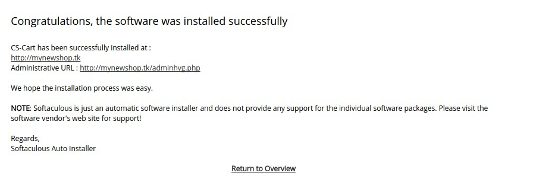

****************************************
How To: Install CS-Cart with Softaculous
****************************************

First, check if Softaculous is installed on your server. Log into your control panel and look for **Softaculous Apps Installer**. For example, in **cPanel** it is in the **Software** section.
 
Some hosts may have Softaculous App Installer as a separate section in the control panel, while others may not include it at all. If you found Softaculous, use Way 1; if you couldn’t find it, use Way 2.

.. note::
    You need `FTP or SSH access <http://kb.cs-cart.com/ftp-account>`_ to your server. Contact your hosting provider for more details. To learn about FTP access in **cPanel** go to **Files → FTP Accounts** and click **Configure**.

Way 1. Softaculous is Installed on Your Server
==============================================

.. note::
    **Tutorial Difficulty: 1/3**

1. Log into your control panel and find Softaculous in the list of software. For example, in cPanel go to **Software → Softaculous Apps Installer**.

2. Enter *cs-cart* in the search box in the top left corner of the page below the Softaculous logo, or go to **E-Commerce → CS-Cart** and click on it.
 

.. important::
    First, associate a domain name with your host’s IP: find out what name servers your host uses for your domain, then use your domain registrar’s control panel to associate your domain name with the name servers. We suggest you read `this article <http://www.thesitewizard.com/domain/point-domain-name-website.shtml>`_ to learn more.

3. Switch to the **Install** tab, and you’ll see a form. Fill it in:

=================================  ==============================================
**Choose Protocol**                \*http://* (choose \*https://* if your site has SSL)
**Choose Domain**                  Select your domain from the dropdown menu. In our case it’s mynewshop.tk.
**In Directory**                   Leave empty if you want to access your store by the original URL, such as *mynewshop.tk*. 
                                   Or you can enter the name of a new directory to be created. E.g., if you type *dir*, CS-Cart will be installed to *mynewshop.tk/dir*
**Table Prefix**                   Leave it as is.
**Admin Email**                    Enter your email here. CS-Cart will use it to notify you about new orders, call requests, and other important events in your store.
**Admin Password**                 Enter the password you will use to access the CS-Cart administration panel.
**CS-Cart License Agreement**      Tick the checkbox to accept the СS-Cart License Agreement. Hover your mouse over the grey **i** icon to find the link to the license agreement in Softaculous.
**Database Name**                  Leave it as is or enter another name for the database.
**Disable Update Notifications**   Tick the checkbox, if you don’t want to receive the notifications about CS-Cart updates.
**Email installation details to**  Enter the email where Softaculous will send the installation details, such as CS-Cart admin credentials, MySQL database name, user and password, and other data. You may leave the field empty, but **we highly recommend you to enter your e-mail**.
=================================  ==============================================

4. After you press **Install**, you’ll see the progress bar running. Please, don’t close the page during the installation.

5. When the installation is complete you’ll see a message with 2 links to your store: use the first link to view the storefront, and the second link to enter the administrator panel.

.. image:: img/softaculous/5_complete.png
    :align: center
    :alt: Once the installation is complete, you can view your store and manage it.

Way 2. Softaculous is not Installed on Your Server
==================================================

.. note::

    **Tutorial Difficulty: 2/3**

1. `Register <https://www.softaculous.com/board/index.php?act=register>`_ at the Softaculous forums, if you haven’t done it yet.

.. image:: img/softaculous/6_registration.png
    :align: center
    :alt: The registration form at Softaculous forums.
 
2. After the registration, check your email for an activation link for your account.

3. Softaculous Remote is available from `Softaculous forums <http://www.softaculous.com/board/>`_. Click the Softaculous Remote link at the top of the page.

.. image:: img/softaculous/7_softaculous_remote.png
    :align: center
    :alt: The link to Softaculous Remote at the top of Softaculous forums page.

4. `This link <http://remote.softaculous.com/>`_ will take you directly to Softaculous Remote. If necessary, log in with Softaculous forum account.

.. image:: img/softaculous/8_remote_login.png
    :align: center
    :alt: If you haven't logged in at the forums and just went to Softaculous Remote directly, you will need to log in now.

5. Enter *cs-cart* in the search box in the top left corner of the page below Softaculous emblem or go to **E-Commerce → CS-Cart** and click on it.

6. You need to add a domain. Fill in the form:

.. important::
    First, associate a domain name with your host’s IP: find out what name servers your host uses for your domain, then use your domain registrar’s control panel to associate your domain name with the name servers. We suggest you read `this article <http://www.thesitewizard.com/domain/point-domain-name-website.shtml>`_ to learn more.

==========================  ================================================================
**Domain Name**             Must be a valid domain name without \http://
                            E.g.: *mynewshop.tk*
**Server Host (Optional)**  Leave empty, unless your domain name and server host are different.
**Protocol**                Select the protocol by which Softaculous will communicate: FTP, FTPS or SFTP.
**Port**                    Enter the port to connect. To find the port in cPanel go to Files → FTP Accounts and click Configure.
**FTP User**                Enter the username of your FTP Account. To find it in cPanel go to Files → FTP Accounts and click Configure.
**FTP Password**            Enter the password of your FTP account.
**FTP Path**                Relative path to user’s web accessible directory, e.g. */public_html*
**Backup Path**             Relative path to the backup folder from Home directory, e.g. */backups*
**Data Directory**          The full path to Data Directory, e.g. */home/USERNAME/datadir*. Unless you fill it in, the domain won’t be added. CS-Cart installs into the catalogue specified in FTP Path and won’t use this field. 
==========================  ================================================================

7. Click **Test and Save Domain**. If all the data is correct, the domain will be successfully saved. If something is wrong, you will see an error notice on the top of the page.

8. Fill in the form:

.. important::
    Before you proceed, create a MySQL database and add a user with all privileges to it. See Step 1 of :doc:`this tutorial <cpanel>` for more details.

=================================  ===============================================================
**Choose Protocol**                \*http://* (choose *https://* if your site has SSL)
**Choose Domain**                  Select the name of your domain from the dropdown menu. In our case it’s *mynewshop.tk*.
**In Directory**                   Leave empty if you want to access your store by the original URL, such as *mynewshop.tk*.
                                   Or you can enter the name of a new directory to be created. E.g., if you type *dir*, CS-Cart will be installed to *mynewshop.tk/dir*
**Database Name**                  Enter the name of the MySQL database you created before the installation. See Step 1.2 of :doc:`this tutorial <cpanel>` for more details.
**Database Username**              Enter the MySQL username. This user must have all privileges. See Step 1.3 of :doc:`this tutorial <cpanel>` for more details.
**Database Password**              Enter the MySQL user password. See Step 1.3 of :doc:`this tutorial <cpanel>` for more details.
**Table Prefix**                   Leave it as is. 
**Admin Email**                    Enter your email here. CS-Cart will use it to notify you about new orders, call requests, and other important events in your store.
**Admin Password**                 Enter the password you will use to access the CS-Cart administration panel.
**CS-Cart License Agreement**      Tick the checkbox to accept the СS-Cart License Agreement. Hover your mouse over the grey **i** icon to get the license agreement link in Softaculous.
**Disable Update Notifications**   Tick the checkbox, if you don’t want to receive the notifications about CS-Cart updates.
**Email installation details to**  Enter the email where Softaculous will send the installation details, such as CS-Cart admin credentials, MySQL database name, user and password, and other data. You may leave this field empty, but we highly recommend you to enter your e-mail.
=================================  ===============================================================

.. image:: img/softaculous/10_installation.png
    :align: center
    :alt: Enter the information that CS-Cart requires to install properly.

9. After you press **Install** you’ll see the progress bar running. Please, don’t close the page during the installation.

.. image:: img/softaculous/11_progress_bar.png
    :align: center
    :alt: Don't close the installation page while the progress bar is running. It may take several minutes.

10. When the installation is complete you’ll see a message with 2 links to your store: use the first link to view the storefront, and the second link to enter the administrator panel.

