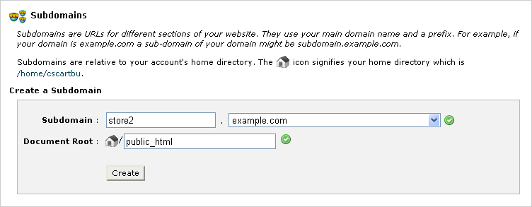
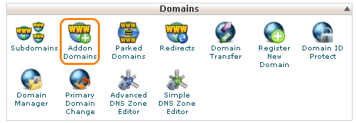
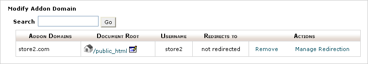

************************************************
How To: Configure Multiple Storefronts in cPanel
************************************************

.. note::
    If you want to manage multiple stores, you’ll need to `purchase additional storefront licenses <http://www.cs-cart.com/cs-cart-storefront-license.html>`_ or specify the desired number of storefronts when you `buy a CS-Cart license <http://www.cs-cart.com/cs-cart-license.html>`_.

This article describes how to create a storefront in CS-Cart and configure a hosting account with cPanel to support it.

.. important:: 

    You only need one CS-Cart installation to manage all your storefronts.

CS-Cart supports additional storefronts 

* in a web subdirectory (*example.com/store2*)

* on a subdomain (*store2.example.com*)

* on a different domain (*store2.com*)

.. note::

    We assume that you have already :doc:`installed CS-Cart <../cpanel>` on the *example.com* website, and its web root directory on the server is */home/account_name/public_html*.

================================
Create New Storefront in CS-Cart
================================

1. Open the administration panel of your store.

2. Go to **Administration → Stores**.

3. Click the **+ button**.

.. note::

    If you do not see the **+ button**, make sure that the **All stores** value is selected to the right of the company name in the top left corner of the page.

4. Fill in the following fields in the opened section:

* **Store name**—name of a storefront.

* **Storefront URL**—URL of the storefront (without the *http://* prefix) via which the store will be available, like *example.com/store2* (a subdirectory), *store2.example.com* (a subdomain), or *store2.com* (a different domain).

.. image:: img/cpanel_storefront_url.png
    :align: center
    :alt: Enter the URL of your storefront in the corresponding field.

* **Secure storefront URL** (optional)—secure URL of the storefront (HTTP protocol protected by SSL).

* **Settings: Company** fields—company emails and company details that will be displayed to store customers in invoices, etc.

.. hint::

    You can also select an existing store in the **Copy existing store configuration** section and tick the checkboxes of the entities (**settings**, **layouts**, **languages**, etc) that you want to copy to the new storefront.

5. Click the **Create and close** button.

The storefront will be created. To make the storefront easier to distinguish from the other storefronts at this stage, select a unique theme for it on the **Design → Themes** page.

.. important:: 

    The new storefront will be accessible by its URL only after you configure your hosting account.

==============================
Configure Your Hosting Account
==============================

It's time to configure your hosting account in cPanel. Choose one of the following ways, depending on the **Storefront URL** you specified.

----------------------------------------
Way 1. Subdirectory (example.com/store2)
----------------------------------------

If CS-Cart is installed on a website (like *example.com*), and its additional storefront should be accessible via a web subdirectory (like *example.com/store2*), follow the instructions below:

1. Create a subdirectory (e.g. *store2*) in the web root directory on your server (in our case it is */home/account_name/public_html*). You can do it via cPanel File Manager, by FTP, SSH, etc.

2. In the new subdirectory, create a **.htaccess** file with the following content:

::

  <IfModule mod_rewrite.c>
    RewriteEngine on
    RewriteRule ^(.*)$ ../$1 [L,QSA,E=DOCUMENT_ROOT:/home/account_name/public_html/store2]
  </IfModule>

.. note::

    Remember to replace **/home/account_name/public_html/store2** with the appropriate path on your server.

3. Open *http://example.com/store2* in your browser. You should see the appropriate storefront of your CS-Cart installation.

-------------------------------------
Way 2. Subdomain (store2.example.com)
-------------------------------------

1. Open the cPanel of the *example.com* website, if this is where CS-Cart is installed.

2. Click on the **Subdomains** icon in the **Domains** section.

.. image:: img/subdomains.png
    :align: center
    :alt: Open the Subdomains page in cPanel.

3. Fill in the following fields in the opened section:

   * **Subdomain** - type the name of the subdomain which you wish to create, for example, store2.

   * **Domain** - select the desired domain you wish to create this subdomain for from the drop-down menu on the right of the **Subdomain** input field (in our case, *example.com*).

   * **Document Root** - when you click on this field, it should be filled with a cPanel suggested location automatically. Change it to *public_html* (taking into account that the home directory is */home/account_name*), so that the subdomain points to the directory, where CS-Cart is installed (*/home/account_name/public_html*).

4. Click the **Create** button. The new subdomain will be created and displayed in the subdomains table on the page.

.. image:: img/subdomain_list.png
    :align: center
    :alt: Now you should see the new subdomain on the list.

5. Open the store URL (*http://store2.example.com* in this example) in your browser. You should see the appropriate storefront of your CS-Cart installation.

------------------------------------
Way 3. Different Domain (store2.com)
------------------------------------

If CS-Cart is installed on one website (e.g., *example.com*) and its additional storefront should be accessible via a different domain name (e.g., *store2.com*), then the second domain name (*store2.com*) must point to nameservers of the first website (*example.com*). The second domain name (*store2.com*) must be added as an additional domain to the hosting account of the first website (*example.com*).

Follow the instructions below to set it up:

1. Find out nameservers of *the example.com* domain name (change **example.com** to the domain name of your website, on which CS-Cart is installed). This information can be provided by the domain name registrar or it can be viewed via a network tool, for example, `www.network-tools.com <http://network-tools.com/default.asp?prog=dnsrec&host=example.com>`_.

.. image:: img/network-tools.png
    :align: center
    :alt: Now you should see the new subdomain on the list.

2. Log in to the registrar account for the *store2.com* domain name and enter new nameservers. If you are unable to change your name server settings, contact your domain registrar's customer service for further assistance.

.. note::

    Once you have updated your nameservers, allow up to 48 hours for the new information to propagate through the Internet.

3. Now open cPanel of the *example.com* website and click on the Addon Domains icon in the Domains section.

4. Fill in the following fields in the opened section:

 * **New Domain Name** - type the name of the domain which nameservers were changed at step 2, for example, *store2.com* (do not enter **'www'** or **'http://'** into the field).

 * **Document Root** - when you click on this field, it should be filled with a cPanel suggested location automatically. Change it to *public_html* (taking into account that the home directory is */home/account_name*), so that the different domain points to the directory with CS-Cart installed (*/home/account_name/public_html*).

.. image:: img/create_addon_domain.png
    :align: center
    :alt: Fill in the form to create a new addon domain.

5. Come up with a password and click the **Add Domain** button. The addon domain will be created and displayed in the table on the page.

.. note:: 

    If you receive an error from park wrapper stating that *"the domain is pointed to an IP address that does not appear to use DNS servers associated with this server"*, it may mean that:

    * you have not changed nameservers for *store2.com* properly, or

    * the DNS propagation process is not finished yet. It can take up to 48 hours.

6. Open the store URL (*http://store2.com* in this example) in your browser. You should see the appropriate storefront of your CS-Cart installation.
