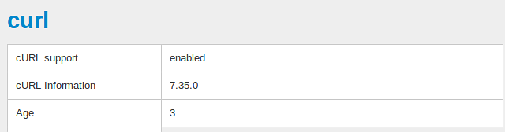

***************************************
Check the Server for PHP's cURL Support
***************************************

To check whether PHP's cURL support is installed on your server, complete the following steps:

1. Log in to your administration panel.

2. Open this link in your browser: *http://www.your_domain.com/your_cscart_directory/admin.php?debug*

    Replace **www.your_domain.com** with the name of your domain, **your_cscart_directory** with the name of the directory where CS-Cart is installed on your server; if your site is available directly at **www.your_domain.com**, remove **your_cscart_directroy** from the link entirely. For example, if your store is available at *www.example.com*, then the link will be *http://www.example.com/admin.php?debug*

3. Click on the **bug icon**, that will appear in the upper right corner of the page. The debugger panel will open.

4. Click on the **Server** section.

5. On the opened page, look for the box that is titled **curl**. It should look like:

6. If cURL support is disabled, contact your server administrator.

