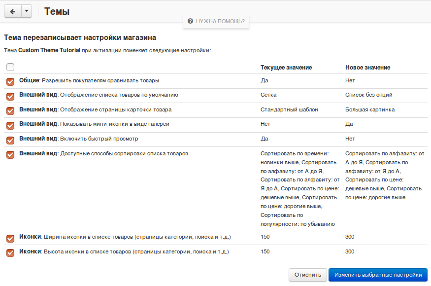

******************************************
Изменение настроек магазина с помощью темы
******************************************

.. note::

    Эта возможность впервые появилась в версии **CS-Cart 4.3.6**.

Тема может быть создана с расчетом на то, что в магазине некоторые настройки (например, размер иконок товаров, количество колонок в списках или шаблон, используемый для отображения товаров) выставлены определенным образом. Разработчик темы может сделать так, что тема будет менять значения настроек при активации.

================
Как это работает
================

Если тема меняет настройки, то при активации темы пользователь увидит список настроек, которые будут изменены, и их новые значения:

Чтобы разрешить изменение настроек, нужно поставить галочку напротив соответствующих пунктов в колонке **Перезаписать** и нажать **Изменить выбранные настройки**. Поменяются только те настройки, для которых была разрешена перезапись. Если разрешить перезапись не для всех настроек, тема может функционировать или выглядеть не так, как предусмотрено ее разработчиком.

========================================
Как задать необходимые значения настроек
========================================

Чтобы задать значения настроек, добавьте секцию ``settings_overrides`` в файл **manifest.json** темы::

  "Settings_section_name": {  // секция настроек
    "setting_name": value     // настройка: значение
    ...
  }

Секции настроек находятся в поле **name** таблицы ``cscart_settings_sections``:

.. image:: img/cscart_settings_sections.png
    :align: center
    :alt: Секции настроек CS-Cart в таблице БД cscart_settings_sections.

Настройки и их значения находятся в полях **name** и **value** таблицы ``cscart_settings_objects``:

.. image:: img/cscart_settings_objects.png
    :align: center
    :alt: Список настроек CS-Cart в таблице БД cscart_settings_objects.

Некоторые настройки, значения которых нужно переопределить, являются чекбоксами (например, **Внешний вид → Включить быстрый просмотр**). Чтобы поставить галочку, нужно указать в схеме ``true``, а чтобы убрать — ``false``, как показано в примере ниже.

Вот пример секции ``settings_overrides`` из `файла manifest.json нашей темы-примера <https://github.com/cscart/custom-theme-tutorial/blob/master/manifest.json>`_::

  "settings_overrides": {
    "General": {
      "enable_compare_products": false
    },
    "Appearance": {
      "default_products_view": "products_without_options",
      "default_product_details_view": "bigpicture_template",
      "thumbnails_gallery": true,
      "enable_quick_view": false,
      "available_product_list_sortings": [
        "product-asc",
        "product-desc",
        "price-asc",
        "price-desc"
      ]
    },
    "Thumbnails": {
      "product_lists_thumbnail_width": 300,
      "product_lists_thumbnail_height": 300
    }
  }

Тема с таким **manifest.json** при активации выполнит следующие действия:

* Выключит сравнение товаров.

  *(Общие → Разрешить покупателям сравнивать товары)*

* Выберет **Список без опций** в качестве шаблона списков товаров.

  *(Внешний вид →  Отображение списка товаров по умолчанию)*

* Выберет **Большую картинку** в качестве шаблона детальной страницы товара.

  *(Внешний вид →  Отображение страницы карточки товара)*

* Включит галерею иконок.

  *(Внешний вид → Показывать мини-иконки в виде галереи)*

* Выключит быстрый просмотр.

  *(Внешний вид → Включить быстрый просмотр)*

* Выберет только следующие способы сортировки списка товаров: *Сортировать по алфавиту: от А до Я*, *Сортировать по алфавиту: от Я до А*, *Сортировать по цене: дешевые выше*, *Сортировать по цене: дорогие выше*.

  *(Внешний вид → Доступные способы сортировки списка товаров)

* Установит ширину и высоту иконок товаров в 300 пикселей.

  *(Иконки → Ширина иконки в списке товаров)*

  *(Иконки → Высота иконки в списке товаров)*
