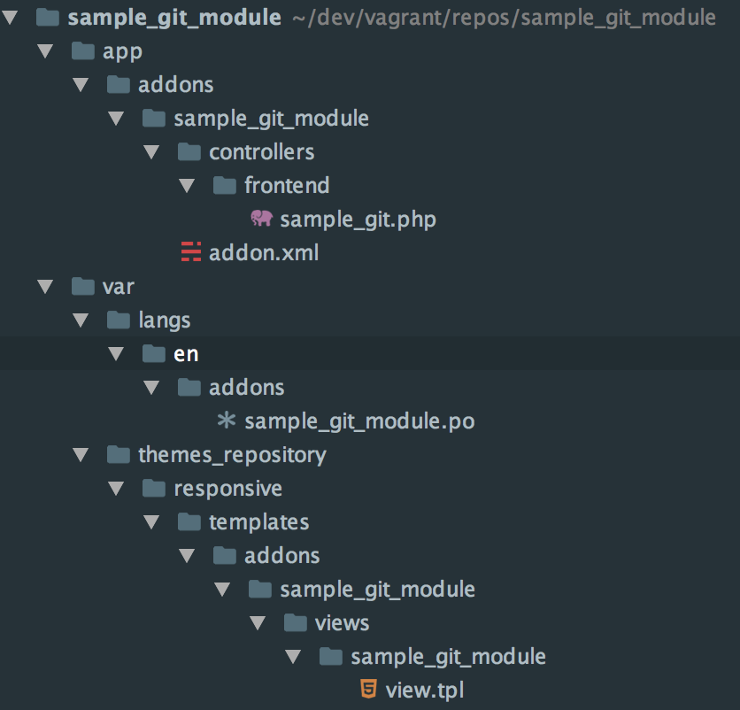

***********************************
Разработка модуля в Git-репозитории
***********************************

Командная разработка немыслима без использования VCS (`систем управления версиями <https://ru.wikipedia.org/wiki/Система_управления_версиями>`_), позволяющих безопасно вносить изменения в проект десятками и сотнями разработчиков. А сервисы вроде GitHub привлекают к разработке проектов целые сообщества заинтересованных людей.

В контексте разработки модулей для CS-Cart, использование VCS и хранение файлов модуля в отдельном каталоге, помимо вышеописанных преимуществ, облегчает разработку и тестирование модуля для разных версий CS-Cart.

В этой статье мы поделимся с вами лучшими практиками разработки модулей в отдельном репозитории. В силу популярности и распространённости Git относительно других VCS, речь пойдёт о Git-репозиториях.

По ходу статьи мы будем использовать консольный инструментарий **cscart-sdk**, облегчающий выполнение рутинных задач. Перед прочтением статьи рекомендуется установить этот инструментарий `по инструкции <https://github.com/cscart/sdk#installing>`_.

.. note::

    Все примеры в статье ориентированы на использование командной строки Unix. Их можно повторить в системах MacOS или Linux.

В нашем примере мы создадим модуль **sample_git_module** в отдельном каталоге, инициализируем в нём Git-репозиторий и создадим символические ссылки для файлов модуля внутри каталога с установленной системой. Итак, приступим.

============================================
1. Отделение файлов модуля от файлов системы
============================================

Из-за особенностей архитектуры, в CS-Cart файлы модуля разнесены по разным каталогам:

* PHP-файлы хранятся в *app/addons*; 

* шаблоны административной части — в *design/backend/templates/addons*; 

* шаблоны клиентской части — в *var/themes_repository/\*\/templates/addons*;

* файлы переводов — в *var/langs/\*\/addons*.

Подробнее о структуре файлов и каталогов модуля вы можете прочитать в статье :doc:`Add-on Directories </developer_guide/addons/directories>`.

Наша задача — воссоздать структуру каталогов CS-Cart с файлами модуля внутри них отдельно от самого CS-Cart.

Создадим каталог **sample_git_module**, внутри него расположим все файлы нашего модуля-примера:

* обязательный файл *app/addons/sample_git_module/addon.xml*;
    
* файл с переводами языковых переменных модуля *var/langs/en/addons/sample_git_module.po*;

* файл контроллера *app/addons/sample_git_module/controllers/frontend/sample_git.php*;

* шаблон контроллера *var/themes_repository/responsive/templates/addons/sample_git_module/views/sample_git_module/view.tpl*.

В примере каталог **sample_git_module** лежит в *~/dev/vagrant/repos*, однако вы можете поместить его в любом удобном для вас каталоге.

Теперь, когда все файлы модуля расположены в отдельном каталоге, мы можем при необходимости инициализировать Git-репозиторий в этом каталоге и хранить в нём только файлы модуля.

Однако, встаёт вопрос об удобстве разработки при подобном отделении файлов модуля от файлов CS-Cart: проверка внесённых в код изменений каждый раз требует создания архива с файлами модуля и повторной установки его через графический интерфейс панели администрирования. К счастью, этого можно избежать, сделав процесс разработки и отладки удобным и прозрачным - об этом мы сейчас и поговорим.

Если у вас уже есть разработанный модуль, хранящийся вместе с файлами CS-Cart, вы можете легко скопировать или перенести все файлы модуля в отдельный каталог с помощью инструментария **cscart-sdk**, выполнив всего одну команду в консоли:

.. code-block:: bash

    $ cscart-sdk addon:export addon_name /path/to/directory /path/to/cscart

.. important::

    Команда скопирует файлы шаблонов модуля из каталога *design* в каталог *var/themes_repository*.

.. hint::

    `Узнать подробнее о команде addon:export <https://github.com/cscart/sdk#addonexport>`_ в документации по **cscart-sdk**.

=====================
2. Процесс разработки
=====================

Мы рекомендуем вести разработку модуля прямо в каталоге с установленным CS-Cart, однако файлы модуля теперь расположены отдельно. Для упрощения процесса разработки мы создадим символические ссылки на файлы модуля в соответствующих подкаталогах в папке с установленным CS-Cart.

В этом примере CS-Cart установлен в каталоге *~/dev/vagrant/vhosts/cs-cart*.

Создадим символическую ссылку для каталога с основными файлами модуля:

.. code-block:: bash

    $ ln -s ~/dev/vagrant/repos/sample_git_module/app/addons/sample_git_module ~/dev/vagrant/vhosts/cs-cart/app/addons/sample_git_module

В результате в каталоге с установленным CS-Cart появится каталог *app/addons/sample_git_module*, который содержит ранее созданные файлы **addon.xml** и **controllers/frontend/sample_git.php**, при этом являясь лишь символической ссылкой на оригинальный каталог, расположенный по пути *~/dev/vagrant/repos/sample_git_module/app/addons/sample_git_module*.

Вы можете редактировать файлы внутри этого каталога-ссылки своим любимым редактором кода, по сути редактируя файлы в оригинальном каталоге. Кроме того, этот модуль появится в списке доступных для установки модулей в панели администрирования:

.. image:: img/addon_in_admin_panel.png
    :align: center
    :alt: Новый модуль появится в списке наряду с другими.

Как видно на скриншоте, языковые переменные модуля не используются — ведь мы создали символическую ссылку только для каталога *app/addons/sample_git_module*, в то время как остальные файлы — в том числе файл с языковыми переменными — не были синхронизированы с каталогом, в котором установлен CS-Cart.

Мы можем вручную создать ссылки для каждого из требуемых каталогов и файлов в отдельности используя команду ``ln -s``, однако для этой цели в инструментарии **cscart-sdk** есть отдельная команда - ``addon:symlink``. Она автоматически создаст символические ссылки для всех каталогов и файлов модуля в каталоге с установленным CS-Cart, принимая в качестве первого аргумента путь до каталога с файлами модуля, а в качестве второго — путь до каталога с установленным CS-Cart:

.. code-block:: bash

    $ cscart-sdk addon:symlink ~/dev/vagrant/repos/sample_git_module ~/dev/vagrant/vhosts/cs-cart

.. important:: 

    Команда создаст ссылки для файлов шаблонов модуля из каталога *var/themes_repository* в каталоге *design*.

.. hint::

    `Узнать подробнее о команде addon:symlink <https://github.com/cscart/sdk#addonsymlink>`_ в документации по **cscart-sdk**.

========================================
3. Синхронизация файлов между каталогами
========================================

Мы рассмотрели две полезные команды из инструментария - ``addon:export`` и ``addon:symlink``. Существует ещё одна полезная команда - ``addon:sync``. По сути, она выполняет команды ``addon:export`` и ``addon:symlink`` по очереди. Она полезна, когда при разработке модуля вы создали новый файл модуля в папке с установленным CS-Cart. Команда перенёсёт этот файл в каталог с репозиторием и создаст символическую ссылку на его месте.

.. hint::

    `Узнать подробнее о команде addon:sync <https://github.com/cscart/sdk#addonsync>`_ в документации по **cscart-sdk**.
