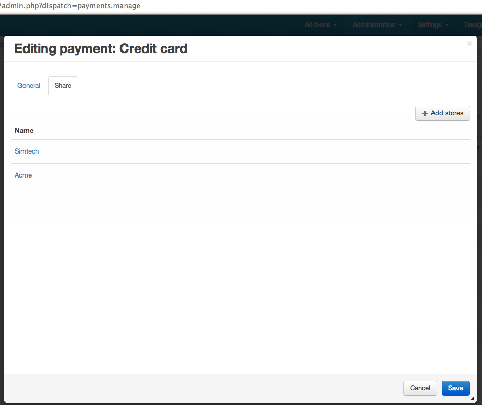

**************************************
Что такое Sharing и для чего он нужен
**************************************

**Sharing (Шаринг)** - это механизм, реализованный в CS-Cart продукте, который разграничивает права для объектов для разных витрин (Storefronts). Иными словами - мы можем создать объект на одной витрине и сделать его доступным для другой.

В Multi-Vendor данный механизм разграничения прав недоступен.

.. contents::
   :backlinks: none
   :local:

==============
Схема шаринга
==============

Существует 2 вида объектов шаринга:

* Объекты, которые имеют владельца (owned)
* Объекты без владельца (not owned)

К объектам относятся сущности, описанные схемой: *app/schemas/sharing/schema.php*:

* ``currencies`` (not owned)
* ``languages`` (not owned)
* ``profile_fields`` (not owned)
* ``pages`` (owned)
* ``product_options`` (owned)
* ``shippings`` (owned)
* ``payments`` (owned)
* ``promotions`` (owned)
* ``product_filters`` (owned)
* ``product_features`` (owned)

Общее описание объекта задается примерно так::

  'shippings' => array(
      'controller' => 'shippings',
      'api' => 'shippings',
      'mode' => 'update',
      'type' => 'tpl_tabs',
      'params' => array(
          'object_id' => '@shipping_id',
          'object' => 'shippings'
      ),
      'table' => array(
          'name' => 'shippings',
          'key_field' => 'shipping_id',
      ),
      'buttons' => array(
          'type' => 'save_cancel',
          'but_name' => 'dispatch[shippings.update_shipping]',
      ),
      'request_object' => 'shipping_data',
      'have_owner' => true,
  ),

* **controller, mode** - обязательные поля.
* **api** - сущности api, строчные буквы.
* **type** - показывает тип. Доступные значения: ``tpl_tabs``, ``tools``.
* **tpl_tabs** - добавить новую вкладку непосредственно в темплейты.
* **tools** - не выполняется.

* **params** - необходимы для установления принадлежности объекта к определенным компаниям.

::

  Example request: ?dispatch=currencies.update&currency_code=USD  
  Checking controller and mode.  
  Build URL to get companies for the object:  
  ?dispatch=companies.get_object_share&object=currencies&object_id=USD (get from REQUEST @currency_code)  

* **button** - чтобы добавить персональные кнопки на новую вкладку, необходимо указать тип кнопки и её имя.

::

  Example: see shipping update page.

* **table** - данные таблицы для объекта.

::

  name - table name
  key_field - primary key

* **request_object** - необходима для парсирования запросов и установления идентификатора компании-владельца при добавлении новой записи. (Только *для добавления* объектов, но *не для обновления*).

* **conditions** - дополнительные условия для отображения расшаренной вкладки, также может использоваться для добавления расшаренного условия к запросу ``SELECT``.

::

      display_condition
              'group_type' => 'A' // or array('C', 'A') - for 2 and more values

      skip_selction - Do not modify SELECT query for this object
          Example: skip_selection => true // For all queries
          Or: 'skip_selection' => array( // By condition
                  'a.type' => array(
                      'value' => 'C',  // or array('C', 'A') - for 2 and more values
                      'condition' => 'equal', //or "not_equal"
                  ),
              ),
              If query has condition like ...WHERE a.type = 'C' OR ..., the additional JOIN will not be added (if any condition will be found, JOIN will not be added)

* **no_item_text** - данная языковая переменная будет отображаться вместо *No items*, если для объекта не расшарена никакая компания.

::

  Example: 'no_item_text' => 'all_stores'

* **pre/post_processing** - функции исполняемые до или после обновления шаринга данных.

::

  Example: 'post_processing' => 'fn_object_sharing'

* **have_owner** - становится ``true``, если таблица объекта содержит поле ``company_id``. Также следует указать, что после создания объект должен быть расшарен для всех компаний.

* **skip_checking_status** - если ``true``, шаринг схема не будет использоваться для изменяемого статуса объекта.

===========================
Пользовательский интерфейс
===========================

Для того, чтобы расшарить объект, например, ``Payments``, необходимо перейти на детальную страницу объекта. Если этот объект описан в шаринг схеме, то на детальную страницу будет добавлен новый таб *Sharing*, в котором будут перечислены все компании, для которых этот объект будет доступен.

Несмотря на то, что объект может быть доступен для многих витрин, управлять его данными, изменять, сохранять и т.д. сможет только компания-владелец. Для всех остальных этот объект будет доступен в режиме *read-only* (для объектов типа "Owned")

Если объект относится к типу "Not owned", то такой объект не может быть изменен под витриной. Только root-администратор может изменять данные объекта.

==============
Код и запросы
==============

Записи о том, кому и какие объекты доступны хранятся в таблице ``cscart_ult_objects_sharing``. Схема хранения очень проста:

* Company ID (``share_company_id``)
* Object ID (``share_object_id``)
* Object Type (``share_object_type``)

Записи в эту таблицу добавляются и удаляются АВТОМАТИЧЕСКИ, исходя из шаринг-схемы, описанной выше. Не нужно дополнительно вставлять записи в эту таблицу.

Механизм шаринга использует *core-hooks (link!)* для того, чтобы проверять запросы к БД и автоматически расширять их, для разграничивания прав использования объектов.

Для расширения запросов используется хук ``db_query_process``. Если запрос идет к таблице, описанной в шаринг-схеме, то он будет изменен. В запрос будет добавлена таблица ``cscart_ult_objects_sharing``. 
Пример::

  // We are under the company with ID = 2
  Registry::get('runtime.company_id') // 2

  before: SELECT ?:pages.page_id FROM ?:pages WHERE page_id = 2
  after:  SELECT ?:pages.page_id FROM ?:pages INNER JOIN ?:ult_objects_sharing ON (?:ult_objects_sharing.share_object_id = ?:pages.page_id AND ?:ult_objects_sharing.share_company_id = ?:pages.company_id) WHERE page_id = 2

Такие изменения будут добавляться во все ``SELECT`` запросы, которые относятся к шаринг объектам.

====================
Другие типы шаринга
====================

В корзине существует так называемый третий вид шаринга. Это шаринг значений. К таким видам шаринга относятся:

* Products
* Settings
* Language variables

Для данных типов объектов возможно редактирование данных под витринами, и каждая витрина может иметь свои наборы данных.

Например, один и тот же продукт, расшаренный на несколько витрин, может иметь различное название и описание для каждой из них, или значение настройки, например *Enable secure connection at checkout*, может иметь различные значения для разных витрин.

Каждый объект реализует данный механизм по-своему и не использует шаринг-схему.

