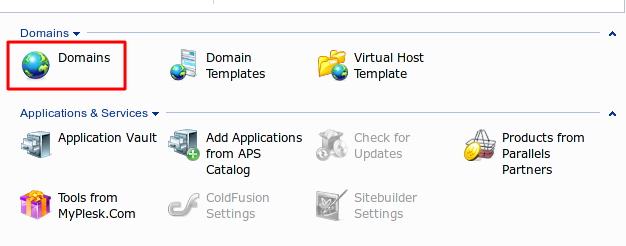
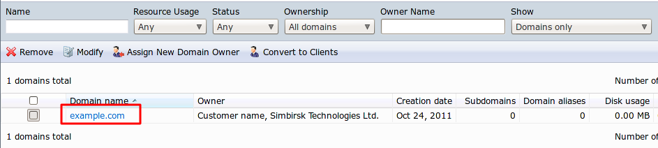
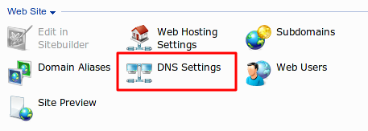
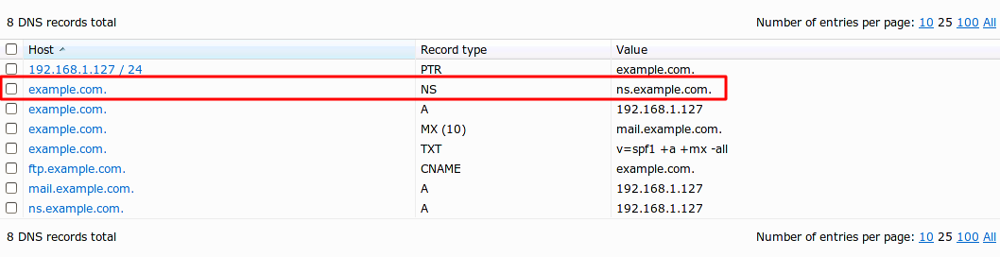
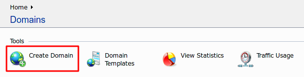

**************************************
Настройка мультивитринности в Plesk 9
**************************************

.. contents::
   :backlinks: none
   :local:

===============================================
Установка Multi-Store используя доменные имена
===============================================

В примере ниже мы создадим 2 магазина: 

* *example.com* 
* *example-store.com*

------------------------
Шаг 1. Привязка доменов
------------------------

Если у вас уже имеются зарегистрированные домены, то их нужно привязать к вашему существующему аккаунту. В примере мы привяжем домен *example-store.com* к *example.com*.

Первым шагом необходимо сменить **Name Servers** у регистратора доменного имени *example-store.com*.

Необходимо зайти на страницу управления доменными именами у регистратора, которого был зарегистрирован *example-store.com* домен. Там мы должны указать те **Name Servers**, которые сейчас соответствуют *example.com*.

Найти информацию о **Name Servers** для *example.com* можно следующим образом: 

Кликаем по ссылке **Domains** на главной странице Plesk панели.

Если вы управляете несколькими сайтами через Plesk 9, то выберите тот, на который мы делаем привязку. В нашем случае - *это example.com*. 

Кликаем по ссылке.

​Кликаем иконку **DNS Settings**

Мы увидим страницу DNS настроек текущего домена.

Значение настройки **NameServers** будет храниться в записи с типом **NS**.

Магазин будет установлен на *example.com*. Полный путь будет выглядеть примерно так **/var/www/vhosts/example.com**. Т.е. магазин установлен в корень *example.com*.

Находим ссылку **Create Domain**.

В форме вводим новое доменное имя (в нашем случае *example-store.com*) в поле **Domain name**.

Остальные поля заполняем в зависимости от желаемых настроек нового домена.

Нажимаем **Finish**

Теперь необходимо настроить новый домен, чтобы его **DocumentRoot** ссылался на *example.com*. 

Для этого нам нужнен будет **SSH** доступ с **root** привелегиями.

Переходим в **/var/www/vhosts/**.

Там вы должны увидеть несколько папок, в том числе *example.com* и *example-store.com*. 

Переходим в **example-store.com/conf/**.

И создаем файл **vhost.conf** со следующим содержимым::

  ServerName   example-store.com:80
             SuexecUserGroup         example psacln # example - это группа, которой принадлежит example.com
             ServerAdmin  "admin@example-store.com"
             DocumentRoot /var/www/vhosts/example.com/httpdocs
             CustomLog  /var/www/vhosts/example-store.com/statistics/logs/access_log plesklog
             ErrorLog  /var/www/vhosts/example-store.com/statistics/logs/error_log

  #       <IfModule mod_ssl.c>
  #               SSLEngine off
  #       </IfModule>
             <Directory /var/www/vhosts/example.com/httpdocs>
  #       <IfModule mod_perl.c>
  #       <Files ~ (\.pl$)>
  #               SetHandler perl-script
  #               PerlHandler ModPerl::Registry
  #               Options ExecCGI
  #               allow from all
  #               PerlSendHeader On
  #       </Files>
  #       </IfModule>
             <IfModule sapi_apache2.c>
                     php_admin_flag engine on
                     php_admin_flag safe_mode off
                     php_admin_value open_basedir "/var/www/vhosts/example.com/httpdocs:/tmp"
             </IfModule>
             <IfModule mod_php5.c>
  php_admin_flag engine on
                  php_admin_flag safe_mode off
                  php_admin_value open_basedir "/var/www/vhosts/example.com/httpdocs:/tmp"
          </IfModule>
  #    <IfModule mod_fcgid.c>
  #               <Files ~ (\.fcgi)>
  #                       SetHandler fcgid-script
  #                       Options +FollowSymLinks +ExecCGI
  #               </Files>
  #    </IfModule>
                  Options -Includes +ExecCGI
          </Directory>

Если вы используете **SSL**, **FastCGI** и проч. - расскоментируйте соотв. значения.

Чтобы изменения вступили в силу необходимо сообщить новую информацию Plesk, перезапустив **httpd service**.

::

  /usr/local/psa/admin/sbin/websrvmng -a
  service httpd restart

Перезапуск сервиса **httpd** приведен на примере **CentOS**. 

Если ваша система отличается: см. соотв. документацию для вашей операционной системы, как перезапустить веб сервер.

--------------------------
Шаг 2. Настройка магазина
--------------------------

Создаем 2 магазина, для одного из них в поле **Storefront URL** указываем *example.com*. Для другого магазина в поле **Storefront URL** указываем *example-store.com*.

-------------
Тестирование
-------------

Открываем *example-store.com*. У нас должен открыться магазин, у которого в поле **Storefront URL** указан *example-store.com*.

