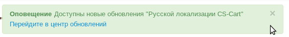

**********************
Установка и обновление
**********************

Мастер установки
================

Мастер установки "Русской локализации CS-Cart" и "Русской локализации Multi-Vendor" включен в дистрибутивы доступные на сайте `www.cs-cart.ru <https://www.cs-cart.ru/download.html>`_ .

1.  Установите CS-Cart или Multi-Vendor (см. :doc:`Инструкции по установке </manager/install/index>`).

2.  После завершения установки международной сборки, появится окно активации "Русской локализации". 

    .. fancybox:: img/install_19.png
        :alt: Установка "Русской локализации CS-Cart"

    Вам доступны два режима работы:

    *   Активация лицензионного ключа.

    *   Пробная версия на 30 дней.

        .. note::

            Для активации пробной версии Вам необходимо зарегистрироваться на сайте разработчика `www.simtechdev.com <https://www.simtechdev.com/index.php?dispatch=profiles.add>`_  и ввести email регистрации.

        Вам будет сгенерирован пробный лицензионный ключ, который будет автоматически выключен через 30 дней.

    Выберите режим работы и нажмите "Активировать".

3.  Мастер установки проверит версию платформы и предложит для установки актуальные версии модулей. 

    Выберите необходимые Вам модули и нажмите кнопку "Следующий шаг".

    .. fancybox:: img/install_20.png
        :alt: Установка "Русской локализации CS-Cart"

    .. note::

        Вы сможете установить модули в любое время на данной странице.

4.  Мастер установки загрузит выбранные вами модули на веб-сервер.

    .. fancybox:: img/install_22.png
        :alt: Установка "Русской локализации CS-Cart"

5.  Мастер установки выполнит проверку прав и установит модули.

    .. fancybox:: img/install_23.png
        :alt: Установка "Русской локализации CS-Cart"

    .. note:: 

        Если прав недостаточно, Вы получите сообщение об этом и список файлов. Также Вы сможете предоставить FTP доступ для продолжения установки.

    .. fancybox:: img/install_24.png
        :alt: Установка "Русской локализации CS-Cart"

    Нажмите "Следующий шаг".

    .. fancybox:: img/install_25.png
        :alt: Установка "Русской локализации CS-Cart"

6.  Вам будет доступна страница "Установка функций", где Вы сможете:

    *   Установить валюту "Российский рубль"

        *Будет создана новая валюта Российский рубль ("RUB"). Российский рубль будет установлен как основная валюта магазина. Это необходимо для корректной работы способов оплаты, доставки и интеграции с Яндекс*

    *   Установить методы оплаты
    
        *Будут установлены платёжные процессоры для следующих способов оплаты: Robokassa, RBK Money, Qiwi, Сбербанк, Webmoney, PlatiDoma, Assist, Купи в кредит, Всё в кредит, YesCredit*
    
    *   Установить методы доставки

        *Будут установлены способы доставки Почта РФ и EMS. Это позволит расчитывать стоимость доставки в режиме онлайн*

    Нажмите "Продолжить установку"

    .. fancybox:: img/install_26.png
        :alt: Установка "Русской локализации CS-Cart"

7.  Готово!

    .. fancybox:: img/install_27.png
        :alt: Установка "Русской локализации CS-Cart"

Обновление модулей
==================

Проверка обновлении осуществляется автоматически. Когда будут доступны обновления модулей Вы получите уведомление в панели администратора.

.. note::

    Оповещение! Доступны новые обновления "Русской локализации CS-Cart"

    Перейдите в центр обновлений

Пройдите в центр обновлений "Русской локализации".

Панель управления → Модули → Русская локализация → Центр обновлений

.. fancybox:: img/install_21.png
    :alt: Установка "Русской локализации CS-Cart"

Выполните пошаговое обновление необходимых модулей.

.. fancybox:: img/install_29.png
    :alt: Установка "Русской локализации CS-Cart"

.. hint::

    Для безопасности сделайте резервную копию базы данных.

Выключить автоматическую проверку обновлений вы можете в настройках модуля "Русская локализация".

.. fancybox:: img/install_30.png
    :alt: Установка "Русской локализации CS-Cart"

.. fancybox:: img/install_31.png
    :alt: Установка "Русской локализации CS-Cart"

Обновление платформы
====================

После выхода новой версии платформы CS-Cart или Multi-Vendor, специалисты компании Simtech Development выполняют проверку и адаптацию модулей. Обычно этот процесс занимает 1-2 недели. Вы получите уведомление в панели администратора о доступности обновлений платформы. 

Рекомендуем обновлять платформу после готовности модулей.

Платформа и модули "Русской локализации" обновляются отдельно. Обновление платформы затрагивает большое количество файлов и разделов базы данных, поэтому рекомендуем выключить модули "Русской локализации" на время обновления платформы. 

Перед обновлением платформы обязательно делайте резервную копию базы данных.

Ручная установка и обновление
=============================

Ручная установка может понадобится, если ваш веб-сервер не позволяет обновлять файлы используя FTP.

1.  Вы полните первый шаг автоматической установки или обновления модулей. Файлы модулей будут загружены на ваш веб-сервер в папку ``/var/rus_build_pack``. Вам будут показаны пути расположения файлов и папок модулей. 

    .. fancybox:: img/install_22.png
        :alt: Установка "Русской локализации CS-Cart"

2.  Перенесите файлы в основной каталог платформы.

3.  Завершите установку в панели администратора на странице "Управление модулями" (см. :doc:`Установка модулей </manager/addons/install/index>`).

Что-то пошло не так!?
=====================

Просто напишите в HelpDesk компании `Simtech Development <https://www.simtechdev.com/>`_ . Специалисты оперативно помогут в решении конфликта.

