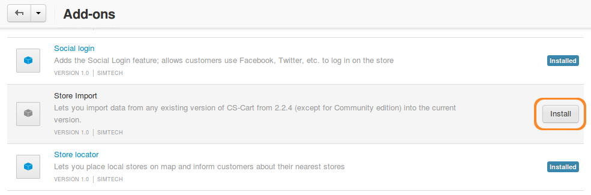
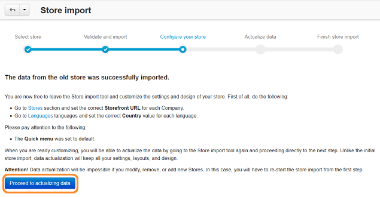

************************************************
Обновление магазина с помощью "Импорта магазина"
************************************************

.. important::

    Прежде чем начинать процесс обновления магазина, убедитесь, что на вашем сервере достаточно места.

==============================
Шаг 1. Установка CS-Cart 4.3.x
==============================

1.1. Загрузите CS-Cart/Multi-Vendor версии 4.3.x (одна из версий, до которой можно обновиться). Убедитесь, что "Импорт магазина" может импортировать данные из вашей версии. Информацию об этом вы можете найти :doc:`здесь <about_store_import>`.

1.2. :doc:`Установите CSCart/Multi-Vendor <../install/index>` в отдельную подпапку вашей старой установки.

    Например, если ваш первоначальный магазин доступен по адресу *example.com*, создайте папку ``/store`` в корне *example.com*. Затем распакуйте архив установки вашего магазина 4.3.x в эту папку. После этого вы сможете установить CS-Cart/Multi-Vendor 4.3.x, используя данный адрес: *example.com/store*.

.. important::

    "Импорт магазина" не может переносить данные между CS-Cart и Multi-Vendor, а также — напрямую импортировать магазины, созданные сообществом CS-Cart.

.. note::

    Если в вашем старом магазине было установлено несколько языков, возможно, вы захотите использовать те же языки в вашем новом CS-Cart версии 4.3.x. Вы можете добавить языки, перейдя в секцию **Администрирование → Языки → Языки** на панели администратора.

===================================
Шаг 2. Установка "Импорта магазина"
===================================

.. important::

    **Начиная с CS-Cart версии 4.3.7, модуль "Импорт магазина" не идёт в комплекте с пакетом установки CS-Cart**. Для версии 4.3.7 и выше `модуль "Импорт магазина" доступен на сайте CS-Cart Marketplace <http://marketplace.cs-cart.com/add-ons/store-import.html>`_. Для CS-Cart 4.3.6, мы также рекоммендуем использовать модуль "Импорт магазина", загруженный с Marketplace, так как в него включены все последние улучшения. В случае с 4.3.6, прежде чем устанавливать версию, загруженную с Marketplace, удалите встроенный модуль "Импорта". 

    Для загрузки модуля "Импорта" с Marketplace `откройте страницу модуля на Marketplace <http://marketplace.cs-cart.com/add-ons/store-import.html>`_, введите ваш e-mail в поле **E-mail** и нажмите **СКАЧАТЬ**. На ваш почтовый ящик будет отправлена ссылка для загрузки модуля. Затем установите "Импорт магазина" так же, как вы устанавливали другие сторонние модули. 

2.1. В панели администратора, перейдите в **Модули → Управление модулями** и щёлкните кнопку **+** в правом верхнем углу.

2.2. Загрузите zip-архив, содержащий модуль "Импорта".

2.3. Нажмите **Загрузить и установить**.

2.4. Переключитесь на вкладку **Просмотреть все доступные модули**.

2.5. Найдите "Импорт магазина" и нажмите кнопку **Установить** рядом с ним. 

====================
Шаг 3. Импорт данных
====================

3.1. Перейдите в **Модули → Импорт магазина**.

3.2. На открывшейся странице введите путь к старому магазину на сервере.

     Это путь, указывающий на расположение магазина на сервере. Например, на UNIX-подобных системах путь должен выглядеть примерно так — */var/www/examplestore*, а на Windows он выглядит примерно так — *C:/examplestore*.

3.3. Щёлкните по кнопке **Проверить путь**. Если путь введён верно, вы будете перенаправлены на следующий шаг — **Проверка и импорт**. 

.. image:: img/validate_store.png
    :align: center
    :alt: Укажите путь до вашего старого магазина и нажмите кнопку "Проверить путь".

3.4. Вы увидите две таблицы с информацией об импортируемом магазине и магазине, в который данные необходимо импортировать. Нажмите кнопку **Импортировать данные** для запуска процесса импорта.

.. image:: img/validate_and_import.png
    :align: center
    :alt: Когда будете готовы к импорту базы данных, нажмите кнопку "Импортировать данные".

3.5. На экране отобразиться полоска загрузки. Время, требуемое на импорт данных, зависит от объёма базы данных: процесс может занять от нескольких минут до нескольких часов.

.. important::

     Модуль импортирует все данные из 3.0.x, но не импортирует некоторые настройки и большинство макетов из 2.2.4/2.2.5. :doc:`Узнать об импорте данных больше можно в документе "Об импорте магазина" <about_store_import>`. 

================================
Шаг 4. Настройка нового магазина
================================

Вы достигли шага **Настройки магазина**. Теперь вы можете уйти со страницы импорта магазина и настроить ваш новый магазин. Процесс настройки CSS-стилей, макетов, расположения и т.д. может занять определённое время. Однако, пока вы настраиваете свой новый магазин, старый продолжает работать в обычном режиме.

**Шаги 5 и 6 необязательны**. Вам не обязательно оставлять ваш старый магазин открытым, пока вы настраиваете новый. Затем, если данных для импорта больше нет, можно перейти сразу к шагу 7.

.. note::

    Пользователям CS-Cart необходимо перейти в **Администрирование → Магазины**, щёлкнуть по названию витрины и ввести верный **URL витрины**.

.. important::

    Не используйте старый и новый магазин одновременно с одной лицензии. Закройте новый магазин (**Настройки → Общие → Закрыть витрину**), пока настраиваете его. Закройте витрину старого магазина, как только откроете новый магазин. :doc:`Узнайте больше о том, как закрыть витрину здесь <../user_guide/look_and_feel/changing_attributes/store_closed>`.

        
==========================================
Шаг 5. Актуализация данных (необязательно)
==========================================

Когда ваш новый магазин готов к открытию, вы можете импортировать данные, накопленные в старом магазине, пока вы настраивали новый.

5.1. Перейдите в **Модули → Импорт магазина**.

5.2. Щёлкните **Перейти к актуализации данных**. Вы увидите информацию о последнем импорте магазина.

5.3. Щёлкните кнопку **Актуализация данных** для импорта данных из старого магазина.

.. important::

    Данный шаг перезаписывает все данные, но не импортирует настройки и шаблоны. Если вы хотите исключить определённые данные из импорта, информация об этом изложена в :doc:`соответствующей статье <store_import_technical_details>`.

Для пропуска шага актуализации, нажмите кнопку **Завершить импорт магазина**.

====================================
Шаг 6. Финальный шаг (необязательно)
====================================

После успешного импорта данных вы перейдёте к **Финальному шагу**. Теперь магазин можно открывать. Вы всегда можете вернуться к **Настройке магазина** и **Актуализации данных**, перейдя по соответствующим ссылкам.

.. image:: img/store_import_complete.png
    :align: center
    :alt: Вы можете покинуть страницу импорта магазина и настроить ваш магазин, прежде чем переходит к актуализации данных.

Если вы хотите запустить процесс импорта снова, нажмите кнопку **Начать новый импорт магазина**.

======================
Шаг 7. Запуск магазина
======================

После того, как вы импортировали все данные и настроили ваш новый магазин, вы можете заменить старый магазин на новый.

7.1. Создайте резервную копию файлов и базы данных вашего старого магазина. Узнать больше о резервном копировании данных в старых версиях CS-Cart/Multi-Vendor можно в `соответствующей статье <http://kb.cs-cart.com/backup>`_.

7.2. Удалите все файлы в корневой папке вашего старого магазина, расположенной на сервере. Оставьте только папку с вашим новым магазином (в нашем случае это */examplestore*).

7.3. Переместите ваш новый магазин из папки */examplestore* в корневую папку вашего старого магазина. Узнать больше о том, как перемещать магазин в другую папку можно в :doc:`соответствующей статье <../install/useful_info/moving_to_different_folder>`.
