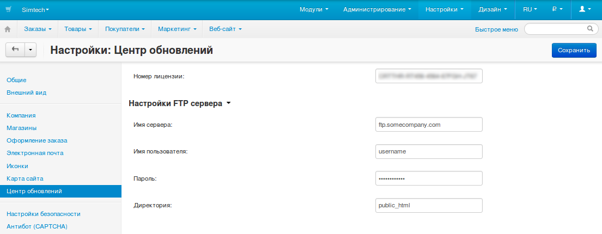
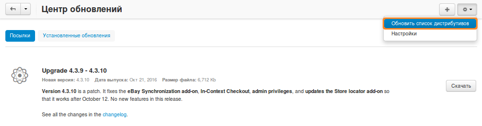
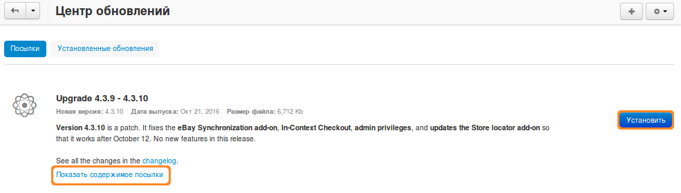
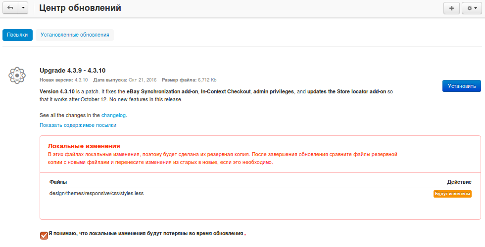

********************
Как обновить CS-Cart
********************

**Центр обновлений** автоматически получает информацию с серверов CS-Cart обо всех доступных обновлениях, уведомляет об этом администраторов и позволяет обновить CS-Cart.

Если вы не знакомы с процессом обновления и с техническими особенностями CS-Cart, вы можете:

* `нанять специалиста для обновления вашего магазина; <http://marketplace.cs-cart.com/developers-catalog.html?services=M>`_

* `обратиться в нашу техподдержку. <https://www.cs-cart.com/index.php?dispatch=communication.tickets&submit_ticket=Y>`_

=====================================
Шаг 1. Настраиваем "Центр обновлений"
=====================================

1.1. Откройте панель администратора вашего магазина.

1.2. Откройте страницу **Настройки → Центр обновлений**.

1.3. Заполните следующие поля:

     * **Номер лицензии** — лицензионный ключ, прикрепленный к вашему доменному имени. Данный ключ можно найти на странице **Licenses** в вашей `учетной записи в Help Desk. <https://www.cs-cart.com/helpdesk>`_ Обновление невозможно при использовании пробной версии.

     Если у веб-пользователя нет прав на обновление файлов на вашем сервере, введите данные вашего FTP-сервера.

     * **Имя сервера** — имя вашего FTP сервера.

     * **Имя пользователя** — пользователь FTP-сервера.

     * **Пароль** — пароль пользователя.

     * **Директория** — директория на FTP-сервере, в которой установлен CS-Cart.

1.4. Нажмите кнопку **Сохранить**, чтобы применить изменения.

========================
Шаг 2. Обновляем CS-Cart
========================

.. note::

    Обновление — это сложный процесс. Поэтому рекомендуем сначала создать и обновить тестовую копию магазина, чтобы убедиться, что все пройдет гладко.

    Рекомендуем отключить все модули сторонних разработчиков перед обновлением. После обновления нужно проверить, нормально ли работают модули.

2.1. Откройте страницу **Администрирование → Центр обновлений**.

2.2. Нажмите кнопку с изображением **шестеренки**. Из выпадающего меню выберите **Обновить список дистрибутивов**. После этого на экране появятся все обновления, доступные на данный момент. В центре страницы показывается подробная информация по доступным обновлениям.

2.3. Нажмите кнопку **Скачать** для загрузки пакета обновлений.

2.4. Когда загрузка закончится, пользователь получит извещение о том, что обновление готово к установке. Для того, чтобы перед обновлением просмотреть список изменений, перейдите по ссылке **Показать содержимое посылки**.

2.5. Нажмите кнопку **Установить** для запуска процесса обновления.

2.6. По умолчанию, перед обновлением в папке *var/backups* с установленным CS-Cart автоматически создается архив с резервной копией. В резервную копию входят база данных и файлы магазина, **кроме изображений**.

Создание резервной копии можно пропустить. Это полезно, если создать резервную копию не получается из-за неподходящих настроек сервера.

.. warning::

    Если вы решите не создавать резервную копию автоматически, то перед обновлением **обязательно сделайте резервную копию файлов и базы данных вручную**. Тогда вы не потеряете свои данные, даже если что-то пойдет не так.

Чтобы пропустить автоматическое обновление:

* `Включите режим разработчика <https://www.cs-cart.ru/docs/4.2.x/developer/instruments/debug/#id2>`_  в файле **local_conf.php** перед тем, как начнете устанавливать обновление.

* После шага 2.5 в появившемся окне поставьте галочку **Не делать резервную копию файлов и базы данных**.

.. image:: img/skip_backup.png
    :align: center
    :alt: Режим разработчика позволяет пропустить автоматическое создание резервной копии.

2.7. При обновлении вы увидите список файлов, которые в вашем магазине были изменены вручную. Эти файлы будут зарезервированы, :doc:`чтобы потом вы могли внести свои изменения вручную <resolve_conflicts>`. Поставьте галочку **Я понимаю, что локальные изменения будут потеряны во время обновления** и нажмите кнопку **Установить**.

2.8. Также на данном шаге отображаются файлы, требующие права на *запись*. Для настройки прав нажмите кнопку **Установить права автоматически через FTP**.

2.9. Если обновление прошло успешно, вы увидите соответствующее уведомление. На ваш почтовый ящик будет отправлено письмо со информацией по обновлению. Если после обновления вы не можете зайти в свою панель администратора, используйте ссылку из письма, чтобы восстановить магазин из резервной копии.

========================
Шаг 3. Открываем магазин
========================

.. important::

    Во время обновления :doc:`витрина автоматически закрывается <../user_guide/look_and_feel/changing_attributes/store_closed>`. После обновления ее нужно открыть вручную.

Перед тем как открывать витрину, рекомендуем проверить основные функции вашего магазина:

* Просмотрите самые важные страницы магазина: страницы товаров, страницу оформления заказа, контакты и т.д.

* Оформите тестовый заказ от лица тестового покупателя.

* Проверьте данные в панели администратора: товары, заказы и т. д.
