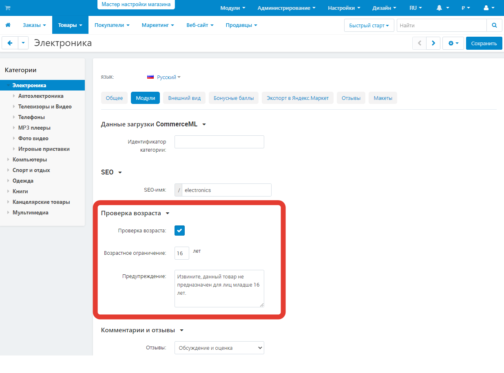

*************************************************
Как установить ограничение по возрасту покупателя
*************************************************

С помощью модуля **Ограничение по возрасту** можно ограничить доступ к категориям и товарам по возрасту покупателя.

Как установить модуль:

*   В панели администратора откройте страницу **Модули → Управление модулями**.
*   Найдите модуль **Ограничение по возрасту** и нажмите **Установить**.

Если у вас уже установлен данный модуль, убедитесь, что он включен.

Теперь вы можете ограничить доступ к категориям и товарам по возрасту покупателя:

*   Выберите страницу **Товары → Товары** или **Товары → Категории**.
*   Выберите категорию или товар, для которых нужно задать ограничение. Откройте вкладку **Модули**.
*   Заполните следующие поля в разделе **Проверка возраста**:

    *   **Проверка возраста** — поставьте галочку, чтобы ввести возрастные ограничения.
    *   **Возрастное ограничение** — укажите нижнюю границу возраста покупателей, которым можно будет просматривать категории или товары.
    *   **Предупреждение** — введите текст, который увидит покупатель, если его возраст меньше допустимого.

*   Нажмите кнопку **Сохранить**.

Теперь, чтобы открыть эту категорию или товар, покупателю нужно будет указать свой возраст.

.. note::

    Также в профиль покупателя будет добавлено поле **День рождения**. Если покупатель зарегистрирован, то его возраст считается автоматически из профиля.
