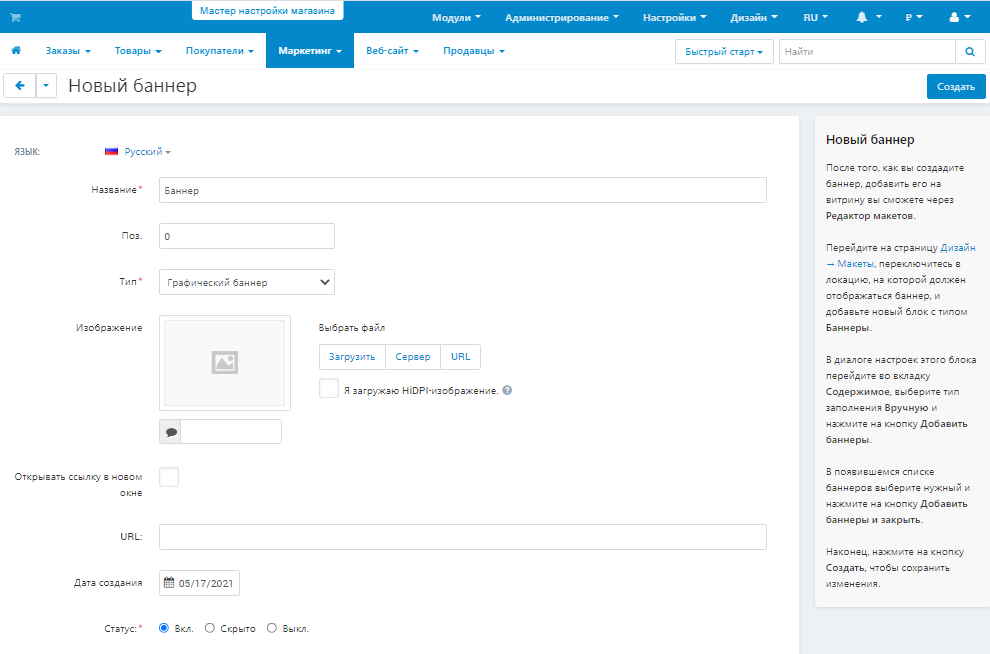

*****************************
Как добавить баннер в витрину
*****************************

=======================
Шаг 1. Создание баннера
=======================

1.1. В панели администратора перейдите на страницу **Маркетинг → Баннеры**.

.. note::

    Если такой секции нет, перейдите на страницу **Модули → Управление модулями** и убедитесь, что модуль **Баннеры** установлен и активен.

1.2. Нажмите справа кнопку **+**, чтобы добавить баннер.

1.3. Введите название баннера в поле **Название**.

1.4. Выберите **Тип** баннера:

     * Для *Текстового баннера* введите текст, который будет на баннере, в поле **Описание**.

     * Для *Графического баннера* загрузите изображение и укажите URL страницы, на которую будет вести баннер. Здесь также можно выбрать, открывать ли ссылку на эту странцу в новом окне.

1.5. Нажмите **Создать**.

====================================
Шаг 2. Добавление баннера на витрину
====================================

2.1. Перейдите на страницу **Дизайн → Макеты**.

2.2. Выберите :doc:`страницу макета </user_guide/look_and_feel/layouts/layout_pages/index>` для вашего баннера, переключившись на соответствующую вкладку. Например, чтобы добавить баннер на страницу с корзиной, переключитесь на вкладку *Корзина*.

2.3. Выберите секцию, где вы хотите разместить баннер, затем нажмите кнопку **+** и выберите **Добавить блок**. 

2.4. Откроется страница добавления блока. Переключитесь на вкладку **Создать новый блок** и выберите **Баннеры**.

2.5. Введите название баннера в поле **Название** (например, *Мой баннер*).

     .. image:: img/add_banner_02_ru.png
         :align: center
         :alt: Creating a block for banners: the General tab.

2.6. Перейдите на вкладку **Контент**, в поле **Заполнение** выберите *Вручную* и нажмите кнопку **Добавить баннеры**, чтобы выбрать баннеры, которые будут отображаться в этом блоке.

     .. note::

         Если необходимо добавить несколько баннеров и ваша версия CS-Cart или Multi-Vendor 4.7.1 или новее, используйте встроенный поиск, чтобы найти нужные баннеры.

    .. image:: img/add_banner_03_ru.png
        :align: center
        :alt: Creating a block for banners: the Content tab.

2.7. После добавления необходимых баннеров, задайте номера позиций, в соответствии с которыми они будут располагаться. Эта функция доступна в CS-Cart и Multi-Vendor, начиная с версии 4.7.1.

2.8. Нажмите **Создать**, чтобы добавить блок с баннером на витрину.

     .. important::

         После создания или изменения блока убедитесь, что он корректно отображается на витрине, так как не все шаблоны подходят под формат блока.