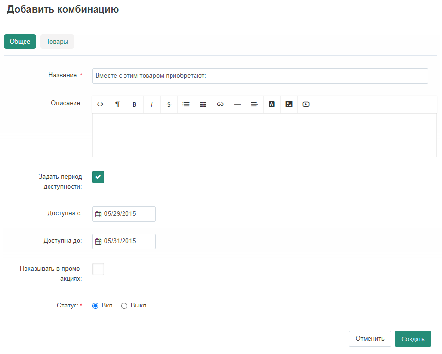
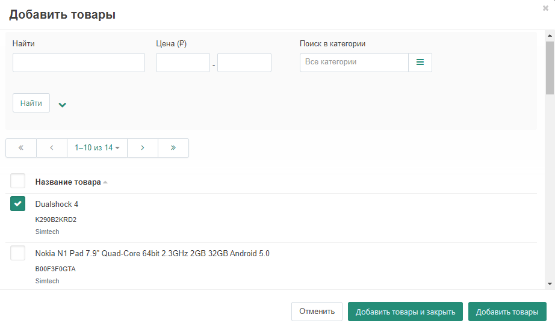
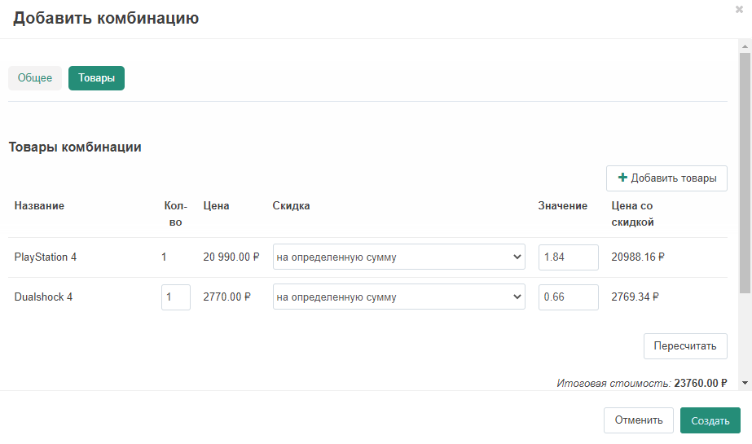
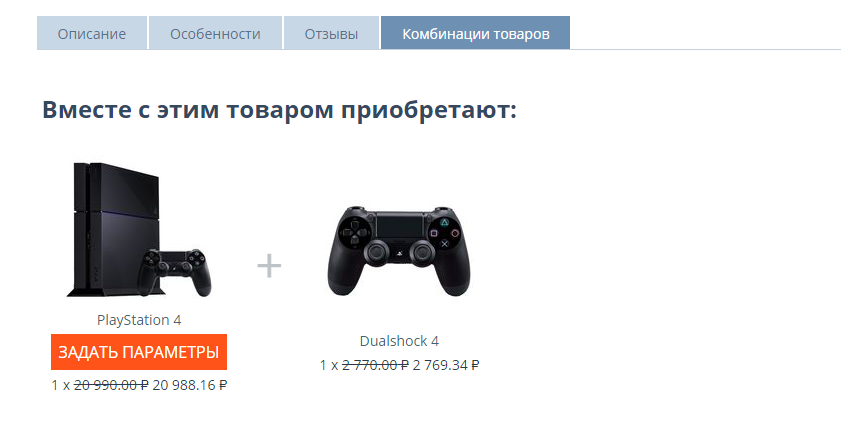

*****************************************
Как настроить модуль "Комбинации товаров"
*****************************************

Чтобы настроить модуль **"Комбинации товаров"**:

*   Перейдите в панель администратора, на страницу **Модули → Управление модулями**
*   Убедитесь, что модуль **Комбинации товаров** установлен и включен.

.. note ::

    Обратите внимание, что создавать комбинации товаров может только продавец. Для доступа к данной функции вы должны войти в панель продавца.

Чтобы добавить комбинацию к товару:

*   Перейдите на страницу **Товары → Товары**.
*   Выберите из списка товар, для которого вы хотите настроить отображение доступных комбинаций и кликните на его название.
*   Перейдите на вкладку **Комбинации товаров**.
*   Нажмите на кнопку **Добавить комбинацию**.
*   В поле **Название** введите название новой комбинации. Можно также заполнить поле **Описание**. В полях **Доступна с** и **Доступна до** вы можете задать временной промежуток, в течение которого будет доступна созданная комбинация. Отметьте галочкой поле **Показывать в промо-акциях**, если хотите, чтобы новая комбинация отображалась в списке текущих акций.

*   Перейдите на вкладку **Товары**. Нажмите на кнопку **Добавить товары**.
*   Выберите товар(ы) для создания комбинации с основным товаром. Затем нажмите на кнопку **Добавить товары и закрыть**.

*   Вы также можете установить **количество** товара, вид доступной **скидки** и её **значение**.
*   Нажмите на кнопку **Пересчитать** в правой нижней части страницы, установите значение скидки в поле **Общая скидка ($)** и нажмите кнопку **Применить**.

*  Для завершения нажмите кнопку **Создать**. Теперь созданная комбинация будет доступна на странице товара.

